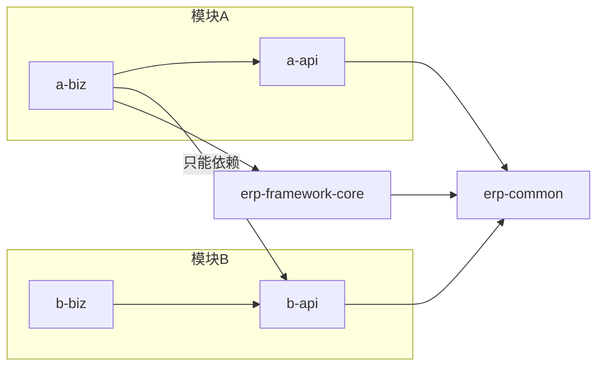

# 后端架构设计

## 1. 技术栈

| 层 | 选型 | 说明 |
|---|---|---|
| 语言 / 运行时 | Java 21 | LTS |
| 框架 | Spring Boot 3.3 | Web、Validation、Security、Cache |
| 持久层 | MyBatis-Plus 3.5 | 分页、乐观锁、逻辑删除、审计字段自动填充 |
| 数据库 | MySQL 8（生产） / H2 MySQL 模式（本地体验与测试） | |
| 数据库版本管理 | Flyway（按模块独立迁移） | 见第 6 节 |
| 认证 | Spring Security + JWT（jjwt） | 无状态，accessToken 2h + refreshToken 7d |
| 缓存 | Caffeine（单机） | 多实例部署时替换为 Redis CacheManager，业务代码不变 |
| API 文档 | springdoc-openapi | `/swagger-ui.html` |
| 架构守护 | ArchUnit | CI 中检查模块边界 |
| 前端 | Vue 3 + Vite + TypeScript + Element Plus + Pinia | 见 `erp-ui/` |

## 2. 总体结构：模块化单体

系统是一个**模块化单体**（Modular Monolith）：一个进程部署，但代码按业务模块严格隔离。这样既保留单体部署和事务的简单，又能在将来按模块拆成微服务。

```
erp/
├── erp-framework/
│   ├── erp-common/            纯 Java：CommonResult、BizException、ErrorCode、状态机、DomainEvent、Decimals
│   └── erp-framework-core/    Spring 基础设施：Web、MyBatis、Security、缓存、按模块迁移、事件发布
├── erp-modules/
│   └── erp-module-<code>/
│       ├── erp-module-<code>-api/   对外契约：接口、DTO、事件、错误码（只依赖 erp-common）
│       └── erp-module-<code>-biz/   实现：controller / service / dal / apiimpl / listener / 迁移脚本
├── erp-server/                启动模块：组装所有 biz、配置文件、集成测试、ArchUnit 测试
└── erp-ui/                    前端
```

### 2.1 模块清单

| code | 模块 | 表前缀 | API 前缀 | 错误码号段 | 迁移顺序 |
|---|---|---|---|---|---|
| system | 系统管理 | `sys_` / `wf_` | `/api/system/` | 1_001 | 10 |
| engineering | 研发工程 | `eng_` | `/api/engineering/` | 1_005 | 110 |
| inventory | 仓库 | `inv_` | `/api/inventory/` | 1_008 | 120 |
| crm | CRM | `crm_` | `/api/crm/` | 1_003 | 200 |
| sales | 销售 | `sal_` | `/api/sales/` | 1_004 | 210 |
| purchase | 资材 | `pur_` | `/api/purchase/` | 1_007 | 220 |
| pmc | PMC | `pmc_` | `/api/pmc/` | 1_006 | 230 |
| production | 生产 | `mfg_` | `/api/production/` | 1_009 | 240 |
| quality | 品质 | `qc_` | `/api/quality/` | 1_010 | 250 |
| shipping | 出货 | `shp_` | `/api/shipping/` | 1_011 | 260 |
| finance | 财务 | `fin_` | `/api/finance/` | 1_012 | 300 |
| bi | BI/AI | `bi_` / `ai_` | `/api/bi/` | 1_013 | 400 |
| workbench | 工作台 | `wb_` | `/api/workbench/` | 1_002 | 410 |

## 3. 依赖规则（由 Maven 与 ArchUnit 双重保证）



1. `xxx-biz` 只能依赖：`erp-framework-core`、本模块 `api`、其他模块的 `api`。**禁止依赖其他模块的 biz**。
2. `xxx-api` 只能依赖 `erp-common`，不能出现 Spring、MyBatis 等框架类型。
3. 框架（`erp-common`、`erp-framework-core`）不能依赖任何业务模块。扩展点用接口 + 业务模块实现（如 `LoginUserLoader`）。
4. Controller 不能直接调用 Mapper。
5. 模块只能读写自己前缀的表。跨模块取数通过对方的 api 接口。

`erp-server/src/test/java/com/erp/architecture/ModuleBoundaryTest.java` 在每次构建时检查以上规则，违反即构建失败。

### 3.1 跨模块交互方式

| 场景 | 方式 | 示例 |
|---|---|---|
| 上层模块需要下层数据/能力（同步、需要返回值） | 调用对方 `api` 接口 | 销售下单时 `CustomerApi.validateCanOrder()`、`MaterialApi.validateUsable()` |
| 下层通知上层 / 同层互相通知 | 发布领域事件（定义在发布方 api 中） | 出货审核发布 `ShipmentApprovedEvent`，销售回写已出货数量，财务生成应收 |
| 需要在同一事务中完成（数量回写、库存扣减） | 同步 api 调用或 `@EventListener`（同事务） | 采购入库审核 → `InventoryApi.post()` |
| 不要求同一事务（通知、统计、待办） | `@TransactionalEventListener(phase = AFTER_COMMIT)` | 工作台生成待办、BI 更新汇总 |

依赖方向参见需求文档 00 第 2.3 节：平台层 ← 基础层 ← 业务层 ← 财务层 ← 分析层。

## 4. 分层与包结构（每个 biz 模块相同）

```
com.erp.module.<code>
├── config/          模块配置：@Bean ErpModule、CodeRuleDefinition 等
├── controller/      REST 接口；vo/ 下放请求与响应对象
├── service/         业务逻辑与事务边界
├── dal/
│   ├── dataobject/  表实体（XxxDO），继承 BaseDO 或 BaseDocDO
│   └── mapper/      MyBatis Mapper，继承 BaseMapperX，并标注 @Mapper
├── apiimpl/         实现本模块 api 中的接口
└── listener/        监听其他模块的领域事件
```

参考实现：`erp-module-engineering-biz` 的物料（`MaterialController` → `MaterialService` → `MaterialMapper`，以及 `MaterialApiImpl`）。

## 5. 健壮性设计

| 问题 | 机制 | 位置 |
|---|---|---|
| 并发修改覆盖 | 所有表带 `version`；`updateByIdOrFail()` 更新 0 行时抛出“数据已被他人修改” | `BaseDO`、`BaseMapperX` |
| 非法状态流转 | 所有状态变更通过 `StateMachine.fire()` 计算，非法流转统一报错；前端可用 `allowedActions()` 控制按钮 | `erp-common/statemachine` |
| 重复数据 | 数据库唯一索引兜底 + 业务层预检查；`DuplicateKeyException` 统一转换为友好提示 | `GlobalExceptionHandler` |
| 编号重号 | 流水号在独立事务中原子自增，只跳号不重号（有并发测试） | `CodeSeqAllocator` |
| 金额精度 | 一律 `BigDecimal`，统一精度与舍入 `Decimals`；数据库 `DECIMAL` | `erp-common/util/Decimals` |
| JS 精度丢失 | Long 序列化为字符串 | `JacksonConfig` |
| 未知异常泄露 | 未知异常只返回 traceId，堆栈记日志 | `GlobalExceptionHandler` |
| 问题定位 | 每个请求生成 traceId，写入日志 MDC 与响应头 `X-Trace-Id` | `TraceIdFilter` |
| 参数错误 | Bean Validation；统一 400 + 字段级提示 | VO 注解 + `GlobalExceptionHandler` |
| 误删数据 | 逻辑删除；已启用主数据只能停用 | `BaseDO.deleted` |
| 全表更新/删除 | MyBatis-Plus BlockAttack 插件拦截 | `MybatisPlusConfig` |
| 分页过大 | 单页上限 500 | `PageParam`、分页插件 |
| 登录暴力破解 | 连续失败锁定；用户不存在时也做一次哈希比较，防止通过耗时探测账号 | `AuthService` |
| 权限即时生效 | JWT 只存用户 ID，权限每次从缓存/数据库加载（缓存 10 分钟兜底） | `JwtAuthenticationFilter`、`LoginUserLoaderImpl` |
| 库存超扣 | 条件更新 `qty - reserved >= ?`（仓库模块实现时遵守） | `InventoryApi` 契约说明 |
| 数据库结构漂移 | Flyway 管理，已合并脚本禁止修改；任一模块迁移失败则启动失败 | `ModuleMigrationRunner` |

### 5.1 事务约定

- 事务边界在 Service 公共方法上：`@Transactional(rollbackFor = Exception.class)`。
- 单据审核这类“一次操作改多张表/多个模块”的动作，必须在同一个事务内完成（审核 + 库存过账 + 上游数量回写）。
- 编号生成、登录失败计数等需要“即使业务失败也要保留”的操作使用独立事务或不加事务。
- 事务内禁止远程调用（HTTP、邮件、MQ），这类动作放到 `AFTER_COMMIT` 事件监听器中。

## 6. 数据库迁移：按模块独立

- 每个模块的脚本放在 `erp-module-<code>-biz/src/main/resources/db/migration/<code>/`。
- 每个模块有自己的迁移历史表 `flyway_history_<code>`，**版本号只在模块内部递增**（每个模块都从 `V1__` 开始）。
- 启动时 `ModuleMigrationRunner` 按模块 `order` 依次迁移。
- 好处：多个分支同时新增脚本不会出现版本号冲突；删除/拆分模块也不影响其他模块。
- 规则：已合并到 main 的脚本禁止修改；表结构变更只能新增脚本。
- SQL 要兼容 MySQL 8 与 H2 MySQL 模式（测试使用 H2）：避免 `ENGINE=`、`CHARSET=` 等 MySQL 专有表选项，列注释用 `COMMENT '...'`。

## 7. 扩展点

| 扩展点 | 用法 |
|---|---|
| 新增业务模块 | 复制任一模块目录结构，在 `erp-modules/pom.xml`、根 `pom.xml`、`erp-server/pom.xml` 注册（骨架已注册全部 13 个模块，一般不需要） |
| 编码规则 | 模块声明 `@Bean CodeRuleDefinition`，首次使用自动入库 |
| 登录用户与权限来源 | 实现 `LoginUserLoader`（如接入 LDAP/SSO） |
| 单据状态 | 模块自定义状态枚举 + `StateMachine.builder()` |
| 跨模块通知 | 在发布方 api 中定义 `DomainEvent` 子类；将来拆微服务时替换 `DomainEventPublisher` 实现为 MQ |
| 缓存后端 | 替换 `CacheConfig` 中的 `CacheManager` |
| 设备、外部系统对接 | 在对应模块中定义适配器接口，每个外部系统一个实现类 |

## 8. 接口约定

- 路径：`/api/<模块code>/<资源复数>`，如 `/api/engineering/materials`。
- 方法：`GET` 查询、`POST` 新建与动作（`/{id}/approve`、`/{id}/enable`）、`PUT` 修改、`DELETE` 删除。
- 响应：统一 `CommonResult { code, msg, data }`，`code = 0` 成功；分页 `data = { list, total }`。
- 业务错误返回 HTTP 200 + 业务错误码；认证失败 401；无权限 403；参数错误 400；系统异常 500。
- 权限：Controller 方法上声明 `@PreAuthorize("@ss.has('模块:资源:动作')")`，标识与需求文档“权限点”一致。
- 修改接口必须回传 `version`（乐观锁）。
- ID 在 JSON 中为字符串。

## 9. 测试策略

| 层级 | 位置 | 内容 |
|---|---|---|
| 单元测试 | 各模块 `src/test` | 纯业务规则、计算（如 MRP 计算、价格计算、状态机） |
| 集成测试 | `erp-server/src/test/java/com/erp/it` | 完整上下文 + H2 + 所有模块迁移，通过 HTTP 验证业务流程 |
| 架构测试 | `erp-server/src/test/java/com/erp/architecture` | 模块边界 |
| 前端 | `npm run build` | vue-tsc 类型检查 + 构建 |

## 10. 部署

- 后端：`mvn -B package` 生成 `erp-server/target/erp-server.jar`，`java -jar` 运行；配置通过环境变量（`ERP_DB_HOST`、`ERP_DB_USER`、`ERP_DB_PASSWORD`、`ERP_JWT_SECRET` 等）。
- 前端：`npm run build` 生成 `erp-ui/dist`，由 Nginx 托管并把 `/api` 反向代理到后端。
- 多实例：后端无状态，可水平扩展；需要把缓存切换为 Redis。
