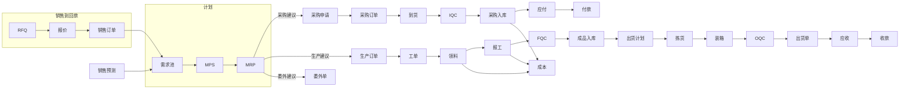
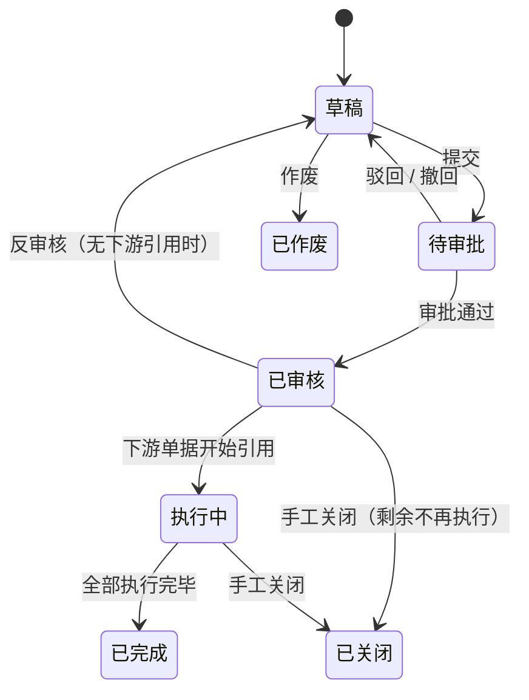

# 00 总体需求与通用规范

> 本文是所有模块需求文档的公共前提。各模块文档只描述本模块特有的内容，凡本文已规定的通用规则（单据、审批、编码、权限、审计、多币种等），各模块默认遵守，不再重复。

## 1. 项目背景与目标

### 1.1 目标企业画像

- 离散制造型工厂，按订单生产（MTO）为主，兼顾按库存生产（MTS）。
- 有外销业务：客户以海外为主，需要 RFQ、多币种报价、PI、Packing List、Commercial Invoice、报关。
- 有研发/工程能力：新产品导入（NPI）、样品、BOM、工程变更（ECN）、产品认证。
- 规模：用户数 50～500，单据量年 10 万～100 万级，物料 1 万～20 万级。

### 1.2 建设目标

| 目标 | 衡量指标 |
|---|---|
| 业务流程线上化、单据可追溯 | 核心单据 100% 系统内流转，任一成品批次可在 3 次点击内追溯到原材料批次和供应商 |
| 库存准确 | 盘点差异率 < 0.5%，账实一致 |
| 交期可控 | 订单交期达成率可统计，缺料和延期提前预警 |
| 成本可算 | 月度可输出产品实际成本与订单毛利 |
| 系统可扩展 | 新增业务模块不修改已有模块代码；可按模块拆分为微服务 |

### 1.3 范围

**纳入范围**：系统管理、工作台、CRM、销售、研发工程、PMC、资材（采购）、仓库、生产、品质、出货、财务、BI/AI。

**暂不纳入**（预留扩展点）：HR/薪资、设备管理（TPM）、完整 MES 工序数据采集、WMS 硬件对接（PDA/RFID 预留接口）、多工厂合并报表、供应商门户、客户门户。

## 2. 模块总览与端到端流程

### 2.1 模块清单

| 编号 | 模块 | 负责的主数据 | 负责的主要单据 |
|---|---|---|---|
| 01 | 系统管理 | 组织、用户、角色、菜单、字典、编码规则、币别汇率、计量单位 | 审批实例 |
| 02 | 工作台 | — | 待办、消息、预警（聚合展示） |
| 03 | CRM | 客户、联系人 | 商机、跟进记录 |
| 04 | 销售 | 价格表 | RFQ、报价单、销售订单、销售预测、销售退货、回款计划 |
| 05 | 研发工程 | 物料、BOM、工艺路线、工作中心、工装 | 研发项目、ECN、样品单、认证记录 |
| 06 | PMC | — | 需求池、MPS、MRP 运算结果、排产计划、出货计划 |
| 07 | 资材 | 供应商、供应商物料价格 | 采购申请、询价单、采购订单、到货单、委外单、采购退货 |
| 08 | 仓库 | 仓库、库位 | 入库单、出库单、调拨单、盘点单、库存流水 |
| 09 | 生产 | — | 生产订单、工单、领料单、退料单、报工单、不良登记 |
| 10 | 品质 | 检验标准、抽样方案、缺陷代码 | IQC/IPQC/FQC/OQC 检验单、NCR、CAPA、客诉、SCAR |
| 11 | 出货 | — | 拣货单、装箱单、Packing List、Invoice、报关单、出货单 |
| 12 | 财务 | 会计科目、会计期间 | 应收单、应付单、收款单、付款单、凭证、成本计算单 |
| 13 | BI/AI | 指标定义 | 分析报表（只读） |

**主数据唯一归属原则**：每类主数据只由一个模块负责维护，其他模块只能引用和查询，不能修改。例如“客户”只在 CRM 维护，销售模块下单时引用客户 ID。

### 2.2 端到端主流程



### 2.3 模块依赖方向

依赖只能单向，由下往上（上层可调用下层的 API，下层通过**领域事件**通知上层）：

```
L4 分析层： BI/AI、工作台
L3 财务层： 财务
L2 业务层： 销售、PMC、资材、生产、品质、出货、CRM
L1 基础层： 研发工程（物料/BOM）、仓库（库存）
L0 平台层： 系统管理、框架
```

同层模块之间如需交互，优先使用领域事件；确需同步调用时，只能调用对方的 `api` 模块，禁止直接访问对方数据表。

## 3. 用户角色

| 角色 | 典型岗位 | 主要使用模块 |
|---|---|---|
| 系统管理员 | IT | 系统管理 |
| 管理层 | 总经理、厂长 | 工作台、BI |
| 业务员 / 业务主管 | 外贸业务、跟单 | CRM、销售、出货 |
| 研发工程师 / 工程主管 | 研发、NPI、工艺 | 研发工程 |
| 计划员 / PMC 主管 | 生管、物控 | PMC |
| 采购员 / 采购主管 | 采购 | 资材 |
| 仓管员 / 仓库主管 | 仓库 | 仓库 |
| 生产组长 / 生产主管 | 车间 | 生产 |
| 品检员 / 品质工程师 / 品质主管 | IQC、IPQC、QE | 品质 |
| 船务 / 单证员 | 船务 | 出货 |
| 会计 / 出纳 / 财务主管 | 财务 | 财务 |

角色只是权限模板，一个用户可以同时拥有多个角色。

## 4. 通用业务规范

### 4.1 单据通用结构

所有业务单据统一采用“单头 + 明细行”结构。

**单头通用字段**

| 字段 | 说明 |
|---|---|
| id | 主键，雪花算法生成的 64 位整数 |
| doc_no | 单据编号，由编码规则生成，全局唯一 |
| doc_date | 单据日期（业务日期，可与创建时间不同） |
| status | 单据状态，见 4.2 |
| org_id | 所属组织（公司/工厂），用于数据隔离 |
| dept_id | 经办部门 |
| owner_id | 经办人 |
| remark | 备注 |
| source_type / source_id / source_no | 来源单据（上游单据）类型、ID、编号 |
| attachments | 附件（关联文件表） |
| version | 乐观锁版本号 |
| created_by / created_at / updated_by / updated_at | 审计字段 |
| deleted | 逻辑删除标记 |

**明细行通用字段**：id、header_id、line_no（行号）、source_line_id（来源行）、remark、审计字段。

### 4.2 单据通用状态机



**通用规则**

1. 只有 **草稿** 状态的单据可以编辑和删除。
2. **已审核** 后单据数据锁定；如需修改，必须先反审核。存在下游单据引用时不允许反审核，需先删除或作废下游单据。
3. **已关闭** 表示剩余数量不再执行（如订单 100 件只出 90 件后关闭），关闭需填写原因。
4. **已作废** 的单据保留记录，不参与任何统计，编号不回收。
5. 各模块可以在通用状态之外扩展业务状态（例如检验单的“待检/检验中/已判定”），但必须在需求文档中给出完整状态图。
6. 所有状态变更写入**单据操作日志**（谁、何时、从什么状态到什么状态、原因）。

### 4.3 上下游关联与数量回写

- 下游单据通过 `source_type + source_id + source_line_id` 关联上游。
- 上游明细行维护“已执行数量”字段（如销售订单行的已出货数量、采购订单行的已到货数量），由下游单据**审核时**回写，**反审核时**扣回。
- 回写必须与下游单据的审核在同一事务内完成，并通过乐观锁防止并发超量。
- 默认不允许超量执行；允许超量的场景（如采购允许超收 5%）由参数控制。
- 支持“下推”（从上游生成下游）和“选单”（在下游引用上游）两种操作方式，结果一致。

### 4.4 编码规则

- 所有单据编号、物料编码、客户编码、供应商编码由**编码规则**统一生成，规则在系统管理中配置。
- 规则片段：固定前缀、日期（yyyy / yyyyMM / yyyyMMdd）、流水号（位数、重置周期：不重置/按年/按月/按日）、组织代码、自定义字段值。
- 示例：销售订单 `SO-202609-00001`，采购订单 `PO-20260924-0001`。
- 流水号生成必须保证**并发下不重复**；允许出现跳号（事务回滚导致），不要求连续。
- 主数据编码可配置为“手工输入”或“自动生成”。

### 4.5 审批流

- 每类单据可在系统管理中配置是否需要审批，以及审批流模板。
- 审批节点支持：指定人、指定角色、部门主管、上级主管；会签（全部通过）/ 或签（任一通过）。
- 支持条件分支，条件可引用单据字段（例如“订单金额 > 50 万 USD 需总经理审批”，“采购单价高于历史最低价 10% 需主管审批”）。
- 审批动作：通过、驳回（到发起人或到上一节点）、转交、加签。审批意见必填（驳回时）。
- 未配置审批流的单据，“提交”即直接变为“已审核”。
- 待审批事项推送到工作台待办。

### 4.6 数量与单位

- 每个物料有一个**基本单位**（库存单位）；可配置多个辅助单位及换算率（如 1 箱 = 100 PCS）。
- 业务单据可用辅助单位录入，系统同时保存 **业务数量 + 业务单位** 和 **基本单位数量**，库存一律按基本单位记账。
- 数量精度：默认 4 位小数，按单位配置（PCS 为 0 位，KG 为 3 位）。
- 数量字段一律使用 `DECIMAL(18,4)`，禁止使用浮点类型。

### 4.7 金额、币别、汇率、税

- 金额字段使用 `DECIMAL(18,2)`，单价使用 `DECIMAL(18,6)`。
- 每张涉及金额的单据有：币别、汇率、原币金额、本位币金额。本位币默认 CNY。
- 汇率来源：系统汇率表（按日或按月维护），单据可手工修改汇率。
- 税：单据行上有税率、不含税单价、含税单价、税额。外销订单税率通常为 0。
- 舍入规则：行金额四舍五入到 2 位，单头金额 = 行金额之和（不对单头重新计算税额，避免尾差）。

### 4.8 批次与序列号

- 物料可配置管理方式：不管理 / 批次管理 / 序列号管理。
- 批次号在入库时生成（按规则自动生成或录入供应商批号）。
- 批次属性：生产日期、有效期、供应商批号、来源单据、质量状态（合格/待检/不合格/冻结）。
- 出库时按规则推荐批次：先进先出（FIFO）、先到期先出（FEFO）、指定批次。

### 4.9 数据权限

- **功能权限**：菜单、按钮、API 三级，按角色授予。
- **数据权限**：按角色配置数据范围：全部 / 本组织 / 本部门及下级 / 本部门 / 仅本人 / 自定义部门。
- **字段权限**（P1）：敏感字段（成本价、采购价、利润）按角色隐藏或脱敏。
- 业务员默认只看自己负责的客户和订单；采购员默认只看自己负责的供应商。

### 4.10 审计与日志

- 登录日志：账号、IP、时间、结果。
- 操作日志：所有写操作记录接口、参数摘要、操作人、耗时、结果。
- 单据操作日志：见 4.2。
- 主数据变更历史（P1）：客户、供应商、物料、BOM、价格的字段级变更记录。

### 4.11 附件

- 任意单据、主数据可上传附件，支持图片、PDF、Office、CAD 文件。
- 单个附件上限默认 50MB，可配置。
- 存储后端可切换：本地磁盘 / MinIO / 阿里云 OSS / S3。

### 4.12 打印与导入导出

- 所有单据支持打印，打印模板可配置（中英文两套）。
- 所有列表支持导出 Excel（按当前查询条件，受数据权限控制）。
- 主数据和期初数据支持 Excel 模板导入，导入先校验后入库，错误行给出原因并可下载错误报告。
- 超过 1 万行的导出改为异步任务，完成后通过工作台消息通知下载。

### 4.13 国际化

- 界面支持中文、英文。
- 对外单据（报价单、PI、Invoice、Packing List）默认英文模板。
- 客户、物料可维护英文名称和英文描述，对外单据取英文字段。

## 5. 非功能需求

| 类别 | 要求 |
|---|---|
| 性能 | 列表查询 P95 < 1s（100 万级单据表）；单据保存/审核 P95 < 2s；MRP 运算 1 万物料 < 5 分钟 |
| 并发 | 支持 200 并发在线用户 |
| 可用性 | 工作时间可用性 99.5%；支持单机部署与多实例部署（无状态服务 + Redis 会话） |
| 数据一致性 | 库存、应收应付、执行数量回写必须强一致（同事务）；跨模块统计允许最终一致 |
| 安全 | 密码 BCrypt 加密；登录失败锁定；JWT 过期与刷新；全部接口鉴权；防 SQL 注入与 XSS；敏感操作二次确认 |
| 备份 | 数据库每日全量备份、binlog 实时备份，保留 30 天 |
| 可维护性 | 数据库结构由 Flyway 管理版本；所有配置外置；日志带 traceId 可串联一次请求 |
| 可扩展性 | 新增模块只需新增 Maven 模块和前端路由；关键业务点提供扩展接口（见架构文档） |
| 兼容性 | 浏览器：Chrome / Edge 最新两个版本；分辨率 ≥ 1366×768 |

## 6. 分期计划

| 阶段 | 内容 | 目标 |
|---|---|---|
| 一期 | 系统管理、研发工程（物料/BOM）、CRM（客户）、销售订单、资材（供应商/采购订单/到货）、仓库（出入库/库存）、工作台基础 | 让进销存跑通，库存数据准确 |
| 二期 | PMC（MPS/MRP/缺料）、生产（生产订单/工单/领料/报工）、品质（IQC/IPQC/FQC/OQC/NCR） | 计划和生产执行上线 |
| 三期 | 出货单证、财务（应收应付/收付款/成本）、RFQ/报价、ECN、样品、认证 | 业务财务一体化 |
| 四期 | BI 经营分析、AI 分析、CAPA/客诉/SCAR、排产优化 | 数据驱动决策 |

各模块文档中的功能按优先级标注：**P0** = 当期必须，**P1** = 当期应有，**P2** = 后续增强。

## 7. 术语表

| 术语 | 说明 |
|---|---|
| RFQ | Request for Quotation，客户询价 |
| PI | Proforma Invoice，形式发票 |
| MPS | Master Production Schedule，主生产计划 |
| MRP | Material Requirements Planning，物料需求计划 |
| BOM | Bill of Materials，物料清单 |
| ECN | Engineering Change Notice，工程变更通知 |
| NPI | New Product Introduction，新产品导入 |
| IQC / IPQC / FQC / OQC | 来料检验 / 制程检验 / 成品检验 / 出货检验 |
| NCR | Non-Conformance Report，不合格品报告 |
| CAPA | Corrective and Preventive Action，纠正预防措施 |
| SCAR | Supplier Corrective Action Request，供应商纠正措施要求 |
| AQL | Acceptable Quality Limit，接收质量限 |
| MOQ / MPQ | 最小起订量 / 最小包装量 |
| LT | Lead Time，提前期 |
| FIFO / FEFO | 先进先出 / 先到期先出 |
| RMA | Return Material Authorization，退货授权 |
