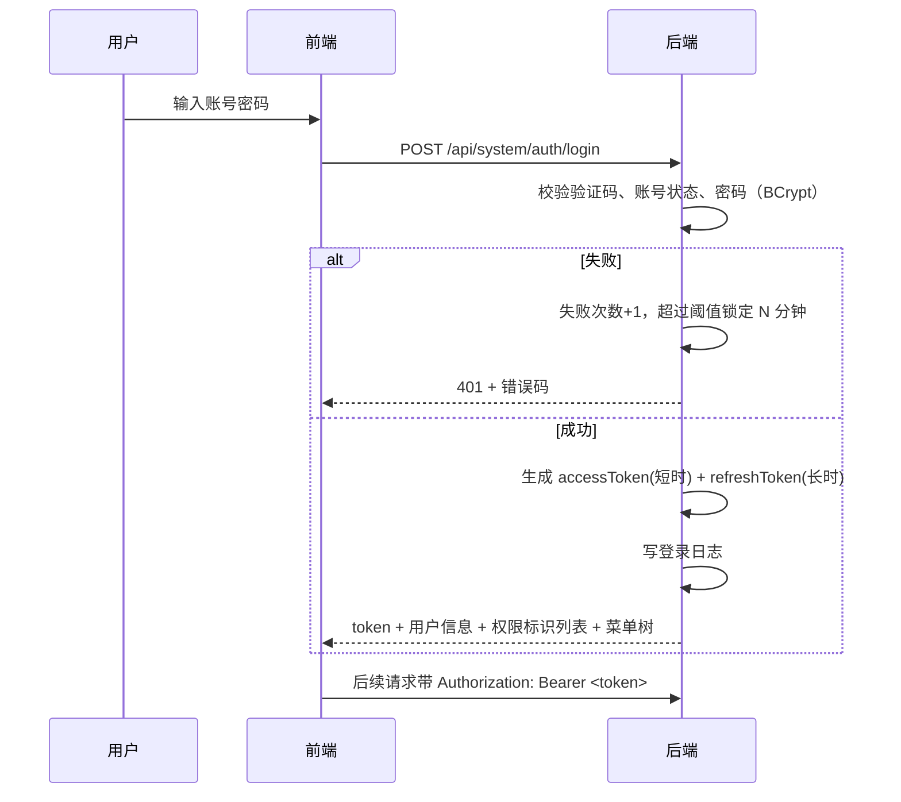

# 01 系统管理

## 1. 模块定位

系统管理是平台层，提供组织、用户、权限、审批流、编码规则、基础资料等所有业务模块共用的能力。它不依赖任何业务模块；业务模块通过它的 API 获取当前用户、生成编号、发起审批、读取字典。

## 2. 用户角色

- **系统管理员**：维护全部内容。
- **各部门主管**：维护本部门用户（可选授权）、配置本部门单据的审批流（可选授权）。
- **普通用户**：修改个人信息和密码、查看自己的登录日志。

## 3. 功能清单

| 子功能 | 功能点 | 优先级 |
|---|---|---|
| 组织架构 | 公司/工厂/部门树维护；部门主管；启用/停用 | P0 |
| 用户管理 | 新增、编辑、停用、重置密码、分配角色、分配部门（主部门 + 兼职部门）、解锁 | P0 |
| 角色管理 | 角色 CRUD；授予菜单/按钮权限；配置数据权限范围 | P0 |
| 菜单与权限点 | 菜单树维护（目录/菜单/按钮）；权限标识；图标；排序；显示/隐藏 | P0 |
| 数据字典 | 字典类型 + 字典项；支持多语言标签；业务模块只读引用 | P0 |
| 编码规则 | 按业务对象配置编号规则；预览；流水号当前值查看与调整 | P0 |
| 计量单位 | 单位、单位组、换算率、精度 | P0 |
| 币别与汇率 | 币别、本位币、汇率表（日汇率/月汇率） | P0 |
| 系统参数 | 按模块分组的业务参数（如允许超收比例、负库存开关） | P0 |
| 审批流 | 流程模板设计（节点、条件、会签/或签）、绑定单据类型、审批实例查询、流程监控 | P1 |
| 登录与安全 | 账号密码登录、验证码、失败锁定、密码策略、会话超时、强制下线 | P0 |
| 日志审计 | 登录日志、操作日志、单据操作日志查询 | P0 |
| 附件管理 | 存储配置、文件列表、清理孤儿文件 | P1 |
| 打印模板 | 按单据类型维护模板（中英文），在线预览 | P1 |
| 消息中心 | 站内信、邮件通道配置、消息模板 | P1 |
| 定时任务 | 任务列表、启停、手动触发、执行日志（如汇率同步、MRP 夜间运算） | P1 |
| 导入导出任务 | 异步任务列表、下载、失败原因 | P1 |
| 多组织 | 数据按 org_id 隔离；用户可切换当前组织 | P2 |
| 单点登录 | LDAP / 企业微信 / 钉钉 / 飞书登录 | P2 |

## 4. 核心流程

### 4.1 登录鉴权

### 4.2 权限判定

1. 请求进入 → 解析 JWT → 得到用户 ID。
2. 从缓存读取用户权限标识集合（如 `sales:order:approve`），无则从数据库加载。
3. 接口声明的权限标识不在集合中 → 返回 403。
4. 查询类接口按用户数据权限自动拼接数据范围条件（框架层实现，业务代码无需手写）。
5. 角色或权限变更时，清除相关用户的权限缓存。

### 4.3 编号生成

1. 业务模块调用 `CodeRuleApi.next("SALES_ORDER", context)`。
2. 读取规则 → 计算流水号的重置键（如按月重置：`SALES_ORDER:202609`）。
3. 在数据库中对该键做原子自增（`UPDATE ... SET current = current + 1 WHERE ...` 并读取结果，或通过 Redis INCR 加定期落库），保证并发安全。
4. 拼接各片段返回编号。

## 5. 数据实体

| 实体 | 关键字段 |
|---|---|
| sys_org 组织 | id, parent_id, code, name, type(公司/工厂/部门), leader_user_id, sort, status |
| sys_user 用户 | id, username, password_hash, real_name, email, mobile, main_org_id, status, lock_until, fail_count, last_login_at, language |
| sys_user_org 用户兼职部门 | user_id, org_id |
| sys_role 角色 | id, code, name, data_scope(ALL/ORG/DEPT_AND_CHILD/DEPT/SELF/CUSTOM), status |
| sys_role_data_org 自定义数据范围 | role_id, org_id |
| sys_user_role | user_id, role_id |
| sys_menu 菜单 | id, parent_id, type(DIR/MENU/BUTTON), name, path, component, permission, icon, sort, visible |
| sys_role_menu | role_id, menu_id |
| sys_dict_type / sys_dict_item | type_code, name / type_code, value, label, label_en, sort, status |
| sys_code_rule 编码规则 | biz_code, name, segments(JSON), reset_cycle, seq_length, manual_allowed |
| sys_code_seq 流水号 | biz_code, reset_key, current_value |
| sys_uom 计量单位 | code, name, precision, uom_group |
| sys_uom_conversion | from_uom, to_uom, rate |
| sys_currency 币别 | code, name, symbol, precision, is_base |
| sys_exchange_rate 汇率 | currency, base_currency, rate, effective_date, rate_type |
| sys_param 系统参数 | module, key, value, value_type, description |
| wf_definition / wf_node / wf_instance / wf_task | 审批流定义、节点、实例、任务 |
| sys_login_log / sys_oper_log / sys_doc_log | 各类日志 |
| sys_file 附件 | id, biz_type, biz_id, file_name, size, storage, path, hash |

## 6. 业务规则

1. 用户名全局唯一，不区分大小写；停用用户不能登录，但其历史单据保留。
2. 至少保留一个启用状态的超级管理员，不允许停用或删除最后一个超级管理员。
3. 密码策略可配置：最小长度（默认 8）、复杂度、有效期、历史密码不可重复次数。
4. 连续登录失败 5 次锁定 15 分钟（可配置）。
5. 删除角色前必须先解除所有用户关联。
6. 部门存在下级部门或用户时不允许删除，只能停用。
7. 字典项被业务数据引用后不允许删除，只能停用。
8. 编码规则修改只影响之后生成的编号；流水号当前值只能调大，不能调小（防止重号）。
9. 汇率：同一币别同一日期只能有一条同类汇率；单据取汇率时按“单据日期当天，没有则取最近一个更早日期”规则。
10. 本位币设定后，存在业务数据时不允许修改。
11. 审批流模板修改后，已发起的审批实例仍按旧版本执行（流程定义带版本号）。

## 7. 对其他模块提供的 API

| API | 用途 |
|---|---|
| `CurrentUserApi` | 获取当前用户、部门、角色、数据权限范围 |
| `CodeRuleApi.next(bizCode, ctx)` | 生成编号 |
| `DictApi` | 读取字典项、校验字典值合法性 |
| `UomApi` | 单位换算 |
| `CurrencyApi` | 查询汇率、本位币 |
| `ParamApi` | 读取系统参数 |
| `WorkflowApi.start / cancel` | 发起、撤回审批；审批结果以领域事件 `ApprovalCompletedEvent` 通知业务模块 |
| `FileApi` | 附件上传、下载、绑定业务 |
| `MessageApi` | 发送站内信 / 邮件 |

## 8. 权限点（示例）

`system:user:query / create / update / delete / reset-pwd`、`system:role:*`、`system:menu:*`、`system:dict:*`、`system:code-rule:*`、`system:param:update`、`system:workflow:design`、`system:log:query`

## 9. 异常与边界场景

- 用户在审批中途被停用：其待办自动转交给部门主管，并通知管理员。
- 审批节点找不到审批人（如部门没有主管）：按配置跳过或转给管理员，不允许流程卡死。
- 编码规则未配置：业务模块保存单据时给出明确错误“未配置编码规则 XXX”，而不是空指针异常。
- 权限缓存与数据库不一致：权限变更后主动失效缓存，缓存设置最长 30 分钟过期作为兜底。
- 多实例部署：登录锁定计数、权限缓存、流水号必须存放在共享存储（数据库/Redis），不能放在单实例内存中。
