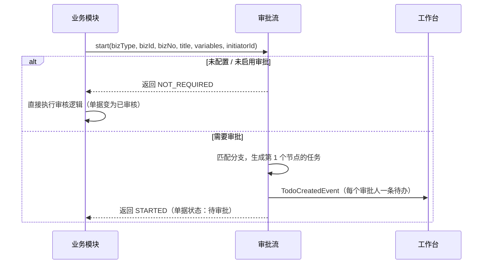

# 01-08 审批流

## 1. 功能说明

为业务单据配置审批流程：根据单据字段（金额、部门、客户等级等）选择不同的审批路径，每条路径由若干审批节点顺序组成。业务模块只需调用 `WorkflowApi.start()` 提交审批，并监听审批结果事件。

- 使用者：系统管理员（配置）、所有用户（审批）
- 优先级：P0（配置、审批、撤回、驳回、转交）；P1（实例监控、终止、批量审批）
- 设计取舍：采用“**条件分支 + 顺序节点**”模型，不做自由画布式的 BPMN 流程设计器。可以覆盖制造企业单据审批的绝大多数场景，且配置简单、不易出错。

### 1.1 概念

```
单据类型（销售订单）
 └─ 流程定义（版本 V3，已发布）
     ├─ 分支 1：金额(本位币) > 500,000       → [部门负责人] → [销售总监] → [总经理]
     ├─ 分支 2：客户等级 = D                 → [部门负责人] → [财务主管]
     └─ 其他情况（兜底，必须有）              → [部门负责人]
```

- 分支按优先级从上到下匹配，**命中第一个即停止**；都不命中走“其他情况”。
- 同一分支内的多个条件是“并且”关系。需要“或者”时配置两个分支。
- 节点按顺序执行，前一个节点通过后才进入下一个节点。

### 1.2 审批人类型

| 类型 | 编码 | 解析规则 |
|---|---|---|
| 指定人员 | USER | 配置的一个或多个用户（只取启用用户） |
| 指定角色 | ROLE | 拥有该角色的所有启用用户；可选“仅限发起人所在公司” |
| 部门负责人 | DEPT_LEADER | 发起人**主部门**的负责人；该部门没有负责人时向上找最近一级有负责人的部门 |
| 上级部门负责人 | UPPER_DEPT_LEADER | 发起人主部门的上级部门负责人（同样向上查找） |
| 直属上级 | SUPERIOR | 发起人的直属上级 |
| 单据指定字段 | BIZ_USER | 单据中的某个用户字段（由单据类型声明，如“业务员”“采购员”），例如出货前由业务员确认 |

### 1.3 多人审批方式

| 方式 | 编码 | 规则 |
|---|---|---|
| 或签 | ANY | 任一人通过即节点通过，其余人的任务自动取消；任一人驳回即整单驳回 |
| 会签 | ALL | 所有人都通过节点才通过；任一人驳回即整单驳回 |

## 2. 数据表

### wf_biz_type 可审批的单据类型（技术表，由 `ApprovalBizDefinition` 同步）

| 字段 | 类型 | 说明 |
|---|---|---|
| biz_type | str(64) 主键 | 单据类型编码，与编码规则的业务编码一致，如 `SAL_ORDER` |
| name | str(64) | 名称 |
| module_code | str(32) | 所属模块 |
| detail_route | str(128) | 前端详情页路由模板，如 `/sales/order/{id}` |
| fields | json | 可用于条件的字段：`[{code, name, type(NUMBER/STRING/ENUM/DICT/DEPT/USER/BOOL), options/dictType}]` |
| user_fields | json | 可作为“单据指定字段”审批人的用户字段：`[{code, name}]` |
| active | bool | 声明已从代码中移除时为 0 |

### wf_definition 流程定义（每个版本一行）

| 字段 | 类型 | 必填 | 默认 | 说明 |
|---|---|---|---|---|
| biz_type | str(64) | 是 | | |
| version | int | 是 | | 从 1 递增 |
| status | enum(DRAFT/ACTIVE/ARCHIVED) | 是 | DRAFT | 每个单据类型最多一个 DRAFT、一个 ACTIVE |
| enabled | bool | 是 | 1 | 是否启用审批；关闭时该单据提交即审核通过 |
| skip_initiator | bool | 是 | 1 | 审批人是发起人本人时自动通过 |
| skip_duplicate | bool | 是 | 1 | 同一审批人在相邻节点再次出现时自动通过 |
| empty_policy | enum(AUTO_PASS/TO_ADMIN) | 是 | TO_ADMIN | 节点找不到审批人时的处理：自动通过 / 转给流程管理员（系统参数 `sys.workflow.admin-user-ids`） |
| published_at | datetime | 否 | | 发布时间 |
| published_by | id | 否 | | |
| remark | str(256) | 否 | | 版本说明 |

### wf_branch 分支

| 字段 | 类型 | 必填 | 说明 |
|---|---|---|---|
| definition_id | id | 是 | |
| priority | int | 是 | 越小越先匹配；“其他情况”固定为 9999 |
| name | str(64) | 是 | 如“大额订单” |
| is_default | bool | 是 | 是否为“其他情况” |
| conditions | json | 是 | `[{field, op, value}]`；默认分支为 `[]` |

`op` 取值：NUMBER：`GT` `GE` `LT` `LE` `EQ` `BETWEEN`；STRING/ENUM/DICT：`EQ` `NE` `IN` `NOT_IN`；DEPT：`IN_TREE`（在所选部门及其下级中）；USER：`IN`；BOOL：`EQ`。

### wf_node 节点

| 字段 | 类型 | 必填 | 说明 |
|---|---|---|---|
| branch_id | id | 是 | |
| seq | int | 是 | 顺序，从 1 开始 |
| name | str(32) | 是 | 节点名称，如“财务审核” |
| approver_type | enum(USER/ROLE/DEPT_LEADER/UPPER_DEPT_LEADER/SUPERIOR/BIZ_USER) | 是 | |
| approver_value | json | 否 | USER：用户 ID 数组；ROLE：`{roleId, sameCompany}`；BIZ_USER：字段编码；其他为空 |
| multi_mode | enum(ANY/ALL) | 是 | 默认 ANY |

### wf_instance 审批实例

| 字段 | 类型 | 必填 | 说明 |
|---|---|---|---|
| biz_type | str(64) | 是 | |
| biz_id | id | 是 | |
| biz_no | str(64) | 是 | 单号 |
| title | str(128) | 是 | 待办标题，如“销售订单 SO-202609-0001 ABC Ltd USD 12,500.00” |
| definition_id | id | 是 | 发起时的流程版本 |
| branch_id | id | 是 | 命中的分支 |
| initiator_id | id | 是 | 发起人 |
| initiator_dept_id | id | 是 | 发起人主部门（发起时快照） |
| variables | json | 是 | 发起时的条件字段值快照 |
| status | enum(RUNNING/APPROVED/REJECTED/WITHDRAWN/TERMINATED) | 是 | |
| current_seq | int | 否 | 当前节点顺序 |
| started_at / finished_at | datetime | | |

索引：`idx_biz(biz_type, biz_id)`、`idx_initiator(initiator_id, status)`。

### wf_task 审批任务

| 字段 | 类型 | 必填 | 说明 |
|---|---|---|---|
| instance_id | id | 是 | |
| node_seq | int | 是 | |
| node_name | str(32) | 是 | |
| multi_mode | enum(ANY/ALL) | 是 | |
| assignee_id | id | 是 | 处理人 |
| status | enum(PENDING/APPROVED/REJECTED/TRANSFERRED/CANCELED/AUTO_PASSED) | 是 | |
| comment | str(500) | 否 | 意见 |
| transfer_to_id | id | 否 | 转交给谁（status=TRANSFERRED 时） |
| auto_reason | str(64) | 否 | 自动通过原因：发起人本人 / 重复审批人 / 无审批人 |
| handled_at | datetime | 否 | |

索引：`idx_assignee(assignee_id, status)`、`idx_instance(instance_id)`。

## 3. 审批过程

### 3.1 发起



- 业务模块在同一事务中调用 `start`，发起失败则单据提交失败。
- 生成节点任务时依次处理：解析审批人 → 无审批人则按 `empty_policy` → 审批人是发起人且 `skip_initiator` 则自动通过 → 审批人与上一节点通过人相同且 `skip_duplicate` 则自动通过。节点所有任务都自动通过时直接进入下一节点。所有节点都通过则实例直接完成（APPROVED）。

### 3.2 审批动作

| 动作 | 谁可以做 | 条件 | 结果 |
|---|---|---|---|
| 通过 | 任务处理人 | 任务 PENDING | 或签：节点通过，取消同节点其他任务；会签：全部通过后节点通过。节点通过后进入下一节点；最后节点通过 → 实例 APPROVED |
| 驳回 | 任务处理人 | 任务 PENDING，意见必填 | 实例 REJECTED，取消所有未处理任务；单据回到草稿 |
| 转交 | 任务处理人、流程管理员 | 任务 PENDING；目标为启用用户且不是当前处理人 | 原任务 TRANSFERRED，给目标用户生成新任务（同节点） |
| 撤回 | 发起人 | 实例 RUNNING | 实例 WITHDRAWN，取消所有未处理任务；单据回到草稿 |
| 终止 | 流程管理员（`system:workflow:monitor`） | 实例 RUNNING，原因必填 | 实例 TERMINATED；单据回到草稿 |

每个动作完成后，如实例状态发生变化，在**同一事务内**发布 `ApprovalCompletedEvent(bizType, bizId, instanceId, result, comment, operatorId)`，业务模块同步监听并更新单据状态。**业务模块的审核逻辑失败（抛出 BizException，例如库存不足）时，整个审批动作回滚**，审批人看到业务错误提示。

### 3.3 单据修改后重新提交

驳回、撤回、终止后单据回到草稿，修改后再次提交会创建**新的实例**；审批记录页签显示全部历史实例。

## 4. 页面

### 4.1 审批流配置

路由 `/system/workflow`，权限 `system:workflow:query`。

```
┌ 单据类型（260px）───┬ 销售订单（SAL_ORDER） ─────────────────────────────────────────────┐
│ [🔍 搜索]           │ 启用审批 [● 开]   当前版本 V3（2026-09-01 张三发布）                  │
│ ▾ 销售              │                              [历史版本] [编辑流程]                  │
│   销售订单   已启用 ●│ ─────────────────────────────────────────────────────────────── │
│   报价单     未配置  │ 规则：☑ 审批人是发起人时自动通过  ☑ 连续相同审批人自动通过           │
│   销售退货   已停用  │       找不到审批人时：转给流程管理员                                 │
│ ▾ 资材              │ ─────────────────────────────────────────────────────────────── │
│   采购订单   已启用  │ ① 大额订单   条件：金额(本位币) > 500,000                           │
│ ...                 │    发起人 → [部门负责人·或签] → [销售总监(角色)·或签] → [总经理] → 结束 │
│                     │ ② 其他情况                                                       │
│                     │    发起人 → [部门负责人·或签] → 结束                               │
└─────────────────────┴──────────────────────────────────────────────────────────────────┘
```

**左侧单据类型树**：按模块分组，显示状态标签：未配置（灰）/ 已启用（绿）/ 已停用（灰 plain）/ 有草稿（橙点）。

**右侧查看模式**

| 按钮 | 权限 | 显示条件 | 行为 |
|---|---|---|---|
| 启用审批开关 | `system:workflow:update` | 已有 ACTIVE 版本 | 切换 `enabled`，二次确认“关闭后该单据提交即审核通过，确定吗？”；立即生效，不影响进行中的实例 |
| 编辑流程 | `system:workflow:update` | 始终 | 进入编辑模式：有草稿则打开草稿，否则以当前 ACTIVE 版本复制一份草稿（无 ACTIVE 时新建空草稿，含一个“其他情况”分支） |
| 历史版本 | `system:workflow:query` | 有 ACTIVE 或 ARCHIVED 版本 | 抽屉：版本号、发布人、发布时间、说明、[查看]（只读展示） |

**右侧编辑模式**（页头显示“编辑草稿（基于 V3）”）

| 元素 | 说明 |
|---|---|
| 规则设置 | 三个选项（见 wf_definition） |
| 分支卡片 | 每个分支一个卡片，显示名称、条件、节点链；卡片右上角 [编辑条件] [删除] [↑] [↓]；“其他情况”分支固定在最后，不能删除、不能设置条件 |
| [+ 添加分支] | 在“其他情况”之前新增分支 |
| 节点 | 节点显示为标签块：名称 + 审批人摘要 + 或签/会签；点击打开节点表单；块之间有 [+] 插入节点；节点右上角 [×] 删除 |
| 页头按钮 | [放弃草稿]（确认后删除草稿）、[保存草稿]、[发布]（主按钮，需填写版本说明，R05 校验通过后发布，原 ACTIVE 版本变为 ARCHIVED） |

**分支条件表单（中弹窗）**

| 字段 | 控件 | 必填 | 说明 |
|---|---|---|---|
| 分支名称 | 输入框 | 是 | ≤64 |
| 条件行（可增删，至少 1 行） | 字段下拉（来自 wf_biz_type.fields）+ 运算符下拉（按字段类型）+ 值控件（NUMBER 数字框 / BETWEEN 两个数字框 / DICT 字典多选 / ENUM 多选 / DEPT OrgTreeSelect 多选 / USER UserSelect 多选 / BOOL 是否） | 是 | 条件间为“并且” |

**节点表单（中弹窗）**

| 字段 | 控件 | 必填 | 默认 | 说明 |
|---|---|---|---|---|
| 节点名称 | 输入框 | 是 | 按审批人类型自动填（如“部门负责人审批”） | ≤32 |
| 审批人类型 | 单选 | 是 | 部门负责人 | 见 1.2 |
| 指定人员 | UserSelect 多选 | 类型=USER 时 | | 最多 20 人 |
| 指定角色 | 角色下拉 | 类型=ROLE 时 | | |
| 仅限发起人所在公司 | 开关 | | 开 | 类型=ROLE 时显示 |
| 单据字段 | 下拉（wf_biz_type.user_fields） | 类型=BIZ_USER 时 | | |
| 多人审批方式 | 单选（或签/会签） | 是 | 或签 | 类型为 DEPT_LEADER/UPPER_DEPT_LEADER/SUPERIOR/BIZ_USER 时只有一人，隐藏此项 |

### 4.2 审批实例监控（T1）

路由 `/system/workflow-instance`，权限 `system:workflow:monitor`。

**查询条件**：单据类型、单号（前缀）、发起人、状态（默认“审批中”）、发起时间（日期范围，默认近 30 天）、当前处理人。

**列表列**：单据类型（120）、单号（160，链接到单据详情页）、标题（自适应）、发起人（100）、发起时间（150）、当前节点（120）、当前处理人（160，多人逗号分隔）、停留时长（100，当前节点已等待时间，超过 24 小时橙色、72 小时红色）、状态（80）、操作。

**按钮**

| 按钮 | 显示条件 | 行为 |
|---|---|---|
| 查看 | 始终 | 抽屉：ApprovalTimeline + 变量快照 |
| 转交 | 审批中 | 选择当前某个待处理任务 → 选择新处理人 → 填写说明 |
| 终止 | 审批中 | ReasonDialog，确认后终止 |

### 4.3 单据详情页上的审批操作（所有业务单据通用）

业务单据详情页（T5）在“待审批”状态下：

- 当前用户有该单据的待处理任务时，页头显示 [通过]（主按钮）、[驳回]、[转交]。通过/驳回打开 `ApproveDialog`；转交打开用户选择 + 说明。
- 当前用户是发起人时显示 [撤回]（确认后撤回）。
- 页头状态标签旁显示“审批中：财务审核（李四）”。
- “审批记录”页签显示 `ApprovalTimeline`：每个实例一组，按时间顺序列出：发起（发起人、时间）→ 每个任务（节点名、处理人、结论标签、意见、时间；自动通过显示原因）→ 结果。

我的待办、我已处理、我发起的列表在工作台模块中（见 02-工作台）。

## 5. 业务规则

| 编号 | 触发 | 规则 | 提示原文 |
|---|---|---|---|
| SYS-WF-R01 | 发起 | 同一单据同时只能有一个 RUNNING 实例 | `该单据正在审批中，不能重复提交` |
| SYS-WF-R02 | 发起 | 没有 ACTIVE 版本或 `enabled=0` 时返回 NOT_REQUIRED | — |
| SYS-WF-R03 | 发起 | 条件字段值由业务模块在 `variables` 中提供；缺少某条件所需字段时该条件视为不满足，并记录警告日志 | — |
| SYS-WF-R04 | 审批 | 只有任务处理人本人能处理 PENDING 任务（流程管理员可转交，不能代替审批） | `你不是该任务的处理人或任务已处理` |
| SYS-WF-R05 | 发布 | 校验：至少有“其他情况”分支；每个分支至少 1 个节点；条件行字段、运算符、值完整；指定人员/角色存在且启用；BIZ_USER 字段存在 | `分支「{name}」至少需要一个审批节点` / `节点「{name}」的审批人「{user}」已停用` 等 |
| SYS-WF-R06 | 驳回 | 意见必填，≤500 字 | `请填写驳回意见` |
| SYS-WF-R07 | 撤回 | 只有发起人可以撤回，且实例为 RUNNING | `只有发起人可以撤回` / `审批已结束，不能撤回` |
| SYS-WF-R08 | 转交 | 不能转给自己，不能转给当前节点已有待处理任务的人 | `不能转交给自己` / `{name} 已是该节点的审批人` |
| SYS-WF-R09 | 版本 | 进行中的实例始终按发起时的版本执行；发布新版本不影响它们 | — |
| SYS-WF-R10 | 并发 | 同一任务被重复提交（双击、两个页签）时，只有第一次生效，第二次返回 R04 提示（任务表乐观锁） | — |
| SYS-WF-R11 | 业务失败 | `ApprovalCompletedEvent` 的业务处理失败时整个审批动作回滚 | 显示业务模块的提示原文 |
| SYS-WF-R12 | 用户停用 | 用户被停用时，其 PENDING 任务自动转交给该用户主部门负责人（负责人即本人或为空时转给流程管理员），并记录“系统转交：原处理人已停用” | — |
| SYS-WF-R13 | 单据删除/作废 | 业务模块不能删除或作废“待审批”状态的单据，必须先撤回 | 由业务模块提示 `单据审批中，请先撤回` |

## 6. 接口

| 方法 | 路径 | 权限 | 说明 |
|---|---|---|---|
| GET | /system/workflow/biz-types | `system:workflow:query` | 单据类型树（含配置状态） |
| GET | /system/workflow/definitions?bizType= | `system:workflow:query` | 该类型的 ACTIVE 与 DRAFT 版本（含分支、节点） |
| GET | /system/workflow/definitions/{id} | `system:workflow:query` | 指定版本 |
| GET | /system/workflow/definitions/history?bizType= | `system:workflow:query` | 历史版本列表 |
| POST | /system/workflow/definitions/draft?bizType= | `system:workflow:update` | 创建或获取草稿 |
| PUT | /system/workflow/definitions/{id} | `system:workflow:update` | 保存草稿（整体覆盖分支和节点） |
| DELETE | /system/workflow/definitions/{id} | `system:workflow:update` | 放弃草稿 |
| POST | /system/workflow/definitions/{id}/publish | `system:workflow:update` | 发布（remark） |
| POST | /system/workflow/biz-types/{bizType}/enabled | `system:workflow:update` | 开关 |
| GET | /system/workflow/instances/by-biz?bizType=&bizId= | 登录即可（需对该单据有查看权限，由业务模块在详情接口中返回审批信息更佳；此接口只返回审批记录） | 该单据的全部实例和任务，以及当前用户的待处理任务 ID |
| POST | /system/workflow/tasks/{taskId}/approve | 登录即可（R04） | 通过（comment） |
| POST | /system/workflow/tasks/{taskId}/reject | 登录即可（R04） | 驳回（comment 必填） |
| POST | /system/workflow/tasks/{taskId}/transfer | 登录即可（R04）或 `system:workflow:monitor` | 转交（toUserId, comment） |
| POST | /system/workflow/instances/{id}/withdraw | 登录即可（R07） | 撤回 |
| POST | /system/workflow/instances/{id}/terminate | `system:workflow:monitor` | 终止（reason） |
| GET | /system/workflow/instances | `system:workflow:monitor` | 实例监控分页 |
| GET | /system/workflow/tasks/my?status= | 登录即可 | 我的待办 / 已处理（工作台使用） |
| GET | /system/workflow/instances/my | 登录即可 | 我发起的（工作台使用） |
| POST | /system/workflow/tasks/batch-approve | 登录即可 | 批量通过（taskIds, comment），逐条执行，返回每条结果（P1） |

**Java API**

```java
public interface WorkflowApi {
    /** 返回 NOT_REQUIRED（无需审批，调用方直接审核）或 STARTED */
    StartResult start(String bizType, Long bizId, String bizNo, String title,
                      Map<String, Object> variables, Map<String, Long> bizUsers, Long initiatorId);
    /** 业务单据查询当前审批状态，用于详情页显示 */
    Optional<ApprovalSummary> getRunning(String bizType, Long bizId);
}
// 事件（system-api 中定义）
public class ApprovalCompletedEvent extends DomainEvent {
    String bizType; Long bizId; Long instanceId;
    Result result; // APPROVED / REJECTED / WITHDRAWN / TERMINATED
    String comment; Long operatorId;
}
```

业务模块声明示例：

```java
@Bean
public ApprovalBizDefinition salesOrderApproval() {
    return ApprovalBizDefinition.of("SAL_ORDER", "销售订单", "sales", "/sales/order/{id}")
            .numberField("amountBase", "订单金额(本位币)")
            .dictField("customerLevel", "客户等级", "crm_customer_level")
            .deptField("deptId", "业务部门")
            .numberField("minMarginRate", "最低毛利率(%)")
            .userField("salespersonId", "业务员");
}
```

## 7. 与其他模块的交互

- 发布 `TodoCreatedEvent` / `TodoDoneEvent`（工作台监听，生成与消除待办）。
- 实例结束时发送消息给发起人：“你提交的销售订单 SO-… 已通过/被驳回（意见：…）”。
- 各业务模块在需求文档中列出本模块的可审批单据类型和条件字段。

## 8. 验收用例

| 编号 | 前置条件 | 操作 | 预期结果 |
|---|---|---|---|
| SYS-WF-T01 | 销售订单未配置审批 | 提交订单 | 订单直接变为“已审核” |
| SYS-WF-T02 | 配置：金额>50万 → 部门负责人 → 总经理；其他 → 部门负责人 | 提交 60 万订单 | 部门负责人收到待办；通过后总经理收到待办；总经理通过后订单“已审核”，发起人收到通知 |
| SYS-WF-T03 | 同上 | 提交 10 万订单 | 只经过部门负责人 |
| SYS-WF-T04 | 发起人就是部门负责人，skip_initiator 开 | 提交 10 万订单 | 该节点自动通过（审批记录显示“自动通过：发起人本人”），订单直接“已审核” |
| SYS-WF-T05 | 部门负责人驳回，意见为空 | 点确定 | 提示“请填写驳回意见” |
| SYS-WF-T06 | 部门负责人驳回并填写意见 | — | 订单回到草稿；发起人收到通知；审批记录显示驳回意见 |
| SYS-WF-T07 | 订单审批中 | 发起人撤回 | 实例 WITHDRAWN，待办消失，订单回到草稿 |
| SYS-WF-T08 | 会签节点两人 A、B | A 通过 | 节点仍在审批中；B 通过后进入下一节点 |
| SYS-WF-T09 | 或签节点两人 A、B | A 通过 | B 的待办自动消失 |
| SYS-WF-T10 | 审批中发布新版本（去掉总经理节点） | 旧实例继续 | 旧实例仍需总经理审批；新提交的订单按新版本 |
| SYS-WF-T11 | 出货单审核时库存不足（业务校验） | 最后一个审批人点通过 | 提示库存不足，任务仍为待处理，单据仍为待审批 |
| SYS-WF-T12 | 审批人被停用 | — | 其待办转交给部门负责人，审批记录显示系统转交 |
| SYS-WF-T13 | 同一任务在两个页签各点一次通过 | — | 第二次提示“你不是该任务的处理人或任务已处理” |
| SYS-WF-T14 | 草稿中某分支没有节点 | 发布 | 提示“分支「xxx」至少需要一个审批节点” |
