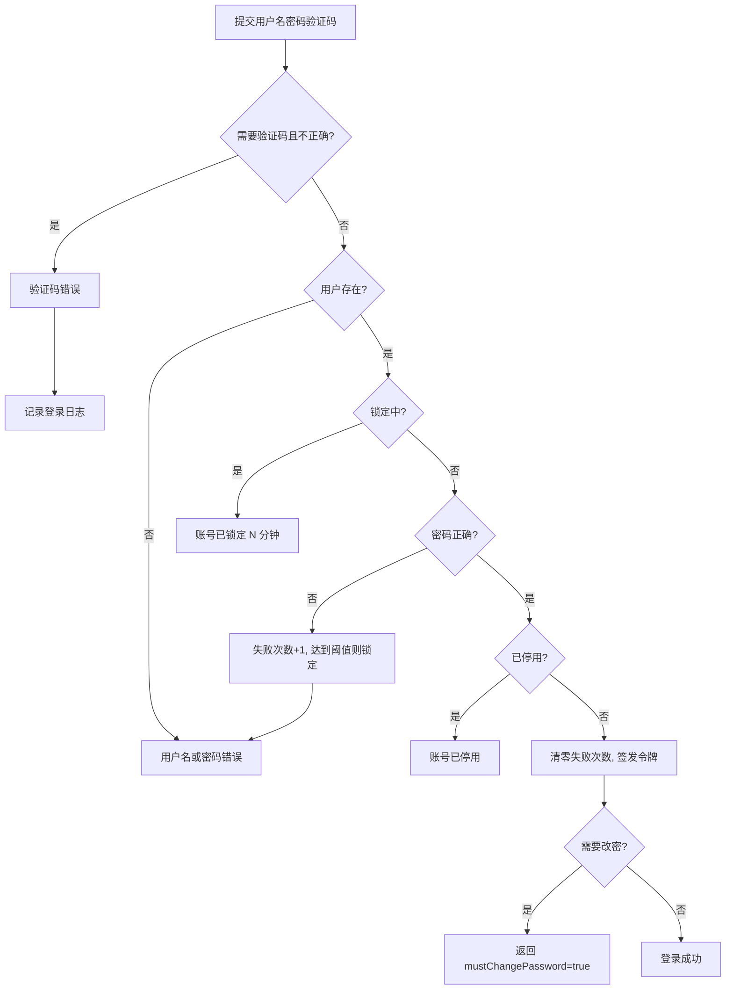

# 01-13 登录与个人中心

## 1. 功能说明

登录、验证码、首次登录/密码过期强制修改密码、个人信息、修改密码、退出登录。

- 使用者：所有用户
- 优先级：P0
- 已有实现：账号密码登录、失败锁定、JWT 访问令牌 + 刷新令牌、当前用户接口。本文档新增：验证码、强制修改密码、密码策略、令牌版本、个人中心。

## 2. 数据表

### sys_password_history 历史密码（技术表）

`user_id`、`password_hash`、`created_at`。用于“不能与最近 N 次密码相同”，每个用户只保留最近 10 条。

其余使用 sys_user（见 02-用户管理）和 sys_login_log。

## 3. 页面

### 3.1 登录页 `/login`

```
┌──────────────────────────────┐
│          ERP 系统             │  ← 系统名称（参数 sys.company.name）
│  👤 [用户名              ]    │
│  🔒 [密码                ]    │
│  🛡 [验证码   ] [ 7A3K ]      │  ← 需要时显示，点击图片刷新
│  ☐ 记住用户名                  │
│  [          登 录          ]  │
└──────────────────────────────┘
```

| 字段 | 控件 | 必填 | 说明 |
|---|---|---|---|
| 用户名 | 输入框 | 是 | 勾选“记住用户名”时自动填入上次用户名（localStorage） |
| 密码 | 密码框（可切换显示） | 是 | 大写锁定开启时在输入框下提示“大写锁定已打开” |
| 验证码 | 输入框 + 图片 | 条件 | 当该用户名连续失败次数 ≥ `sys.login.captcha-after-fails` 时显示（登录失败响应中返回 `captchaRequired: true`）；4 位字母数字，不区分大小写，有效期 2 分钟，一次性 |

- 回车提交；提交中按钮 loading。
- 登录成功：若 `must_change_password` 或密码已过期 → 进入“修改密码”页（3.2），不能访问其他页面；否则跳转 `redirect` 参数页面或工作台。
- 错误提示显示在登录按钮上方（红色文字），不使用弹出消息。

### 3.2 强制修改密码页 `/change-password`

- 标题：“首次登录，请修改密码” 或 “密码已过期，请修改密码”。
- 字段：原密码、新密码、确认新密码。新密码下方实时显示密码规则检查项（✓/✗）：长度 ≥ N、包含字母和数字（按策略）、与确认一致。
- 按钮：[确认修改]、[退出登录]。
- 修改成功：提示“密码修改成功，请重新登录”，清除令牌，回到登录页。

### 3.3 个人中心 `/profile`

两个页签：

**基本信息**：显示用户名、姓名、工号、部门、岗位、角色（只读）；可修改：手机号、邮箱、头像、界面语言。[保存]。

**修改密码**：原密码、新密码、确认新密码，规则同 3.2。修改成功后当前会话以外的其他登录全部失效（token_version + 1 后为当前会话重新签发令牌）。

头部用户菜单：个人中心、修改密码（直接打开个人中心“修改密码”页签）、切换语言、退出登录。

## 4. 登录流程与令牌



**令牌**

| 令牌 | 有效期 | 内容 | 用途 |
|---|---|---|---|
| accessToken | 参数 `sys.session.access-token-minutes`（默认 120 分钟） | 用户 ID、类型 access、tv（令牌版本）、签发/过期时间 | 所有接口 `Authorization: Bearer` |
| refreshToken | 7 天 | 用户 ID、类型 refresh、tv | 访问令牌过期后换取新令牌 |

- 每次请求校验令牌签名、有效期、类型，以及 `tv` 与用户当前 `token_version` 一致。
- `mustChangePassword=true` 的令牌只能访问：修改密码、退出、当前用户接口，其余接口返回 403 `请先修改密码`。
- 退出登录：前端清除令牌；后端记录登出日志（令牌无状态，退出不使旧令牌失效；需要全部失效时使用“强制下线”）。

## 5. 业务规则

| 编号 | 触发 | 规则 | 提示原文 |
|---|---|---|---|
| SYS-AUT-R01 | 登录 | 用户不存在或密码错误时提示相同 | `用户名或密码错误` |
| SYS-AUT-R02 | 登录 | 锁定中 | `密码错误次数过多，账号已锁定，请 {n} 分钟后再试` |
| SYS-AUT-R03 | 登录 | 停用 | `账号已停用，请联系管理员` |
| SYS-AUT-R04 | 登录 | 验证码错误或过期 | `验证码错误` / `验证码已过期，请刷新` |
| SYS-AUT-R05 | 改密 | 原密码错误 | `原密码不正确` |
| SYS-AUT-R06 | 改密 | 新密码不符合策略 | `密码长度不能少于 {n} 位` / `密码必须同时包含字母和数字` / `密码必须包含大写字母、小写字母、数字、特殊字符中的至少三种` |
| SYS-AUT-R07 | 改密 | 不能与最近 N 次密码相同（含当前密码） | `新密码不能与最近 {n} 次使用的密码相同` |
| SYS-AUT-R08 | 改密 | 新密码不能包含用户名 | `密码不能包含用户名` |
| SYS-AUT-R09 | 请求 | tv 不一致 → 401 | `登录已失效，请重新登录` |
| SYS-AUT-R10 | 请求 | 需要改密的令牌访问其他接口 → 403 | `请先修改密码` |
| SYS-AUT-R11 | 个人信息 | 手机号唯一（同 SYS-USR-R03） | `手机号已被用户「{name}」使用` |

## 6. 接口

| 方法 | 路径 | 权限 | 说明 |
|---|---|---|---|
| GET | /system/auth/captcha?username= | 公开 | 返回 `{captchaId, image(base64)}` |
| POST | /system/auth/login | 公开 | `{username, password, captchaId?, captchaCode?}` → `{accessToken, refreshToken, expiresIn, mustChangePassword, passwordExpired}`；失败时 data 中含 `captchaRequired` |
| POST | /system/auth/refresh | 公开 | 刷新 |
| POST | /system/auth/logout | 登录即可 | 记录登出日志 |
| GET | /system/auth/me | 登录即可 | 当前用户信息、权限、是否需要改密 |
| PUT | /system/profile | 登录即可 | 修改个人信息 |
| POST | /system/profile/change-password | 登录即可 | `{oldPassword, newPassword}`，返回新的令牌对 |
| GET | /system/auth/password-policy | 公开 | 密码策略（前端实时校验用） |

## 7. 验收用例

| 编号 | 前置条件 | 操作 | 预期结果 |
|---|---|---|---|
| SYS-AUT-T01 | 新用户首次登录 | 登录 | 进入强制修改密码页；访问其他地址被拦回；修改后需重新登录 |
| SYS-AUT-T02 | 已连续失败 3 次 | 再次打开登录页输入该用户名 | 显示验证码 |
| SYS-AUT-T03 | 连续失败 5 次 | 第 6 次用正确密码登录 | 提示账号已锁定 15 分钟 |
| SYS-AUT-T04 | 密码策略 LETTER_DIGIT、最小 8 位 | 新密码 `12345678` | 规则检查项“包含字母和数字”显示 ✗；提交返回 `密码必须同时包含字母和数字` |
| SYS-AUT-T05 | 历史密码 3 次 | 新密码与上一次密码相同 | 提示“新密码不能与最近 3 次使用的密码相同” |
| SYS-AUT-T06 | 用户在电脑 A、B 同时登录 | 在 A 修改密码 | A 继续可用（重新签发令牌），B 的下一次请求提示“登录已失效，请重新登录” |
| SYS-AUT-T07 | 访问令牌过期、刷新令牌有效 | 继续操作 | 前端自动刷新令牌，用户无感知 |
| SYS-AUT-T08 | 用户语言切换为 English | 刷新页面 | 界面为英文（国际化完成后） |
