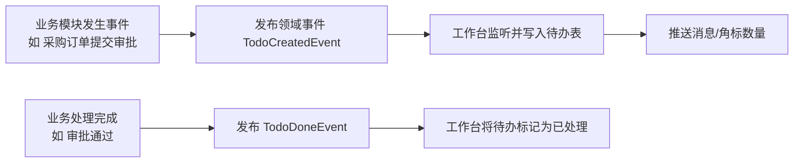

# 02 工作台

## 1. 模块定位

工作台是用户登录后的首页，把分散在各模块的“需要我处理的事”和“我需要关注的数”聚合到一个页面。工作台本身**不产生业务数据**，只读取各模块通过事件或查询接口提供的信息。

## 2. 用户角色

所有用户。不同角色看到不同的卡片组合（按角色配置默认布局，用户可自行调整）。

## 3. 功能清单

| 子功能 | 功能点 | 优先级 |
|---|---|---|
| 我的待办 | 待我审批的单据；分配给我的任务（如待检验、待收货、待领料、待回复 CAPA） | P0 |
| 我的发起 | 我提交的审批进度 | P0 |
| 消息通知 | 站内消息，已读/未读，按类型筛选，全部已读 | P0 |
| 预警中心 | 交期预警、缺料预警、库存上下限预警、证书到期预警、应收逾期预警、IQC 超时预警 | P1 |
| 快捷入口 | 常用功能（用户自定义）、最近访问 | P0 |
| 角色看板 | 按角色展示关键指标卡片（见第 5 节） | P1 |
| 公告 | 系统公告、公司通知 | P1 |
| 布局自定义 | 拖拽卡片、显示/隐藏卡片，布局按用户保存 | P2 |
| 移动端 | 待办审批、消息查看的移动端页面（H5） | P2 |

## 4. 核心流程

### 4.1 待办产生与消除

- 待办由业务模块产生、由业务模块消除，工作台只负责存储和展示。
- 点击待办直接跳转到对应单据页面（待办中存储前端路由和单据 ID）。

### 4.2 预警生成

- 预警规则由各模块提供（例如 PMC 提供“交期预警”规则），工作台提供统一的预警展示与订阅。
- 预警计算方式：定时任务（如每小时）或事件触发（如库存变动后检查安全库存）。
- 同一对象的同一预警类型未处理时不重复生成，只更新最新状态。

## 5. 角色看板卡片（默认配置）

| 角色 | 卡片 |
|---|---|
| 管理层 | 本月销售额/回款额/毛利、订单交期达成率、库存金额、良率趋势、应收逾期金额 |
| 业务员 | 我的待跟进客户、我的待报价 RFQ、我的在手订单及交期、我的应收逾期 |
| 计划员 | 缺料清单 Top10、即将延期订单、本周排产负荷 |
| 采购员 | 待下单采购申请、逾期未到货采购单、待回复询价 |
| 仓管员 | 待收货、待发料、待出库、库存预警 |
| 生产主管 | 今日工单进度、在制工单数、今日良率、异常停线 |
| 品质人员 | 待检单据、超时未检、未关闭 NCR/CAPA |
| 财务 | 待审核应收应付、本周应付到期、逾期应收 |

## 6. 数据实体

| 实体 | 关键字段 |
|---|---|
| wb_todo 待办 | id, user_id, biz_type, biz_id, biz_no, title, route, priority, due_time, status(待处理/已处理/已取消), created_at, done_at |
| wb_message 消息 | id, user_id, type, title, content, link, read_flag, created_at |
| wb_alert 预警 | id, alert_type, biz_type, biz_id, level(提示/警告/严重), content, status(未处理/已处理/已忽略), owner_id |
| wb_layout 布局 | user_id, layout_json |
| wb_shortcut 快捷入口 | user_id, menu_id, sort |
| wb_notice 公告 | id, title, content, publish_at, expire_at, scope |

## 7. 业务规则

1. 待办只对当前处理人可见；处理人变更（转交）时，原待办取消、新处理人生成新待办。
2. 待办数量角标实时更新（前端轮询 60 秒或 WebSocket 推送）。
3. 看板指标数据允许有延迟（≤ 15 分钟），由 BI 模块或各模块统计接口提供，工作台不直接做重计算。
4. 看板卡片中的数据同样受数据权限控制（业务员只能看到自己的数据）。
5. 消息保留 180 天，已处理待办保留 1 年，之后归档。

## 8. 集成

- **输入**：`TodoCreatedEvent`、`TodoDoneEvent`、`AlertRaisedEvent`、`MessageSendEvent`（来自所有模块）；各模块统计查询 API。
- **输出**：无业务输出。

## 9. 权限点

`workbench:view`、`workbench:notice:manage`、`workbench:alert:handle`
