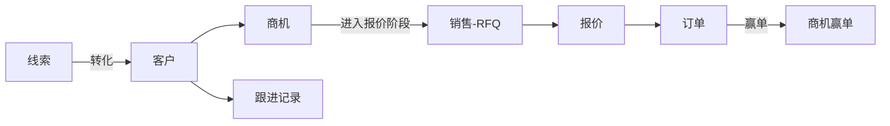

# 03 CRM（客户关系管理）

## 1. 模块定位

CRM 负责**客户主数据**和**售前过程**（线索、商机、跟进）。它是“客户”这类主数据的唯一维护方；销售、出货、财务、品质（客诉）等模块只引用客户。

## 2. 用户角色

- **业务员**：维护自己负责的客户、联系人、跟进记录、商机。
- **业务主管**：查看团队客户，分配/转移客户，审批新客户建档（可选）。
- **财务**：维护客户信用额度、结算条件（字段级权限）。

## 3. 功能清单

| 子功能 | 功能点 | 优先级 |
|---|---|---|
| 客户档案 | 新建、编辑、停用；基本信息、联系人、收货地址、开票信息、银行信息；客户分级；负责人 | P0 |
| 客户查重 | 新建时按名称、税号、邮箱域名、电话查重，提示疑似重复 | P0 |
| 客户分配 | 分配负责业务员；转移客户（含在途单据是否一并转移选项）；公海池 | P1 |
| 联系人 | 多联系人；角色（采购/工程/品质/财务）；主联系人 | P0 |
| 跟进记录 | 拜访、电话、邮件、展会、视频会议；下次跟进时间提醒 | P1 |
| 线索 | 展会/官网/阿里巴巴等渠道线索录入、转化为客户 | P2 |
| 商机 | 商机阶段（初步接触→需求确认→报价→谈判→赢单/输单）、预计金额、预计成交日期、赢率 | P1 |
| 信用管理 | 信用额度、信用期、结算方式；超额度下单控制 | P1 |
| 客户画像 | 360 视图：历史 RFQ、报价、订单、出货、回款、客诉、样品汇总 | P1 |
| 客户资质 | 客户审核文件（验厂报告、合同、NDA）及有效期 | P2 |
| 客户物料对照 | 客户料号 ↔ 本厂料号对照（下单时自动转换） | P1 |

## 4. 核心流程

**客户建档流程**

1. 业务员录入客户信息 → 系统查重 → 疑似重复时提示并要求确认。
2. （可选）提交审批 → 业务主管审核 → 财务补充信用额度和结算条件。
3. 审核通过后客户状态为“正式客户”，才能被销售订单引用；“潜在客户”只能用于 RFQ、报价、样品。

## 5. 数据实体

| 实体 | 关键字段 |
|---|---|
| crm_customer 客户 | id, code, name, name_en, short_name, type(终端/贸易商/代理), level(A/B/C/D), status(潜在/正式/停用/黑名单), country, region, industry, source, tax_no, website, owner_id, currency, payment_term_id, trade_term(FOB/CIF/EXW/DDP…), credit_limit, credit_days, settlement_method, tax_rate, remark |
| crm_contact 联系人 | id, customer_id, name, title, role, email, phone, mobile, is_primary, birthday |
| crm_address 地址 | id, customer_id, type(收货/开票/通知方), country, province, city, address, address_en, zip, contact, phone, is_default |
| crm_bank 银行信息 | customer_id, bank_name, account_name, account_no, swift |
| crm_followup 跟进记录 | id, customer_id, opportunity_id, type, content, followup_at, next_followup_at, user_id, attachments |
| crm_opportunity 商机 | id, code, customer_id, name, stage, amount, currency, expected_date, win_rate, owner_id, lost_reason, status |
| crm_lead 线索 | id, source, company, contact, email, phone, country, status, converted_customer_id |
| crm_customer_material 客户料号对照 | customer_id, customer_part_no, customer_part_desc, material_id |
| crm_transfer_log 客户转移记录 | customer_id, from_user_id, to_user_id, reason, transfer_at |

## 6. 状态机

**客户**：潜在 → 正式（审核通过）→ 停用 / 黑名单；停用 → 正式（重新启用）。

**商机**：初步接触 → 需求确认 → 报价 → 谈判 → 赢单 / 输单；任意阶段可“搁置”。输单必须选择原因（价格/交期/质量/竞争对手/项目取消）。

## 7. 业务规则

1. 客户编码按编码规则自动生成；客户名称 + 国家唯一。
2. 税号（国内客户）唯一；海外客户税号可为空。
3. 客户被销售订单引用后，客户编码、名称不允许修改（可修改简称、联系信息）；名称变更须走“客户变更”流程并记录历史。
4. 黑名单客户：禁止新建报价和订单；在途订单弹出警告。
5. 信用控制（参数可选：不控制/警告/禁止）：新订单金额 + 未收款应收 + 未出货订单金额 > 信用额度时触发。
6. 公海规则（P1）：客户超过 N 天无跟进记录且无订单，自动退回公海，其他业务员可领取。
7. 客户转移时，可选择同时转移未完成的报价、订单、应收的负责人。
8. 业务员只能看到自己负责的客户（数据权限：仅本人），主管看到本部门。

## 8. 集成

| 方向 | 对象 | 内容 |
|---|---|---|
| 提供 API | 销售、出货、财务、品质 | `CustomerApi.get / validateActive / getCreditStatus / getAddress / mapCustomerPartNo` |
| 监听事件 | 销售 | `QuotationCreatedEvent`（商机阶段推进）、`SalesOrderApprovedEvent`（商机赢单、客户升级为正式客户） |
| 监听事件 | 财务 | `ReceivableChangedEvent`（更新信用占用） |
| 发布事件 | — | `CustomerStatusChangedEvent`（停用/黑名单时通知销售） |

## 9. 报表

- 客户分布（国家/地区/等级/行业）
- 业务员客户数、新增客户数、跟进次数
- 商机漏斗（各阶段数量和金额）、赢单率、输单原因分析
- 沉睡客户清单（N 天无订单）

## 10. 权限点

`crm:customer:query / create / update / disable / transfer / export`、`crm:customer:credit`（信用字段）、`crm:opportunity:*`、`crm:followup:*`
