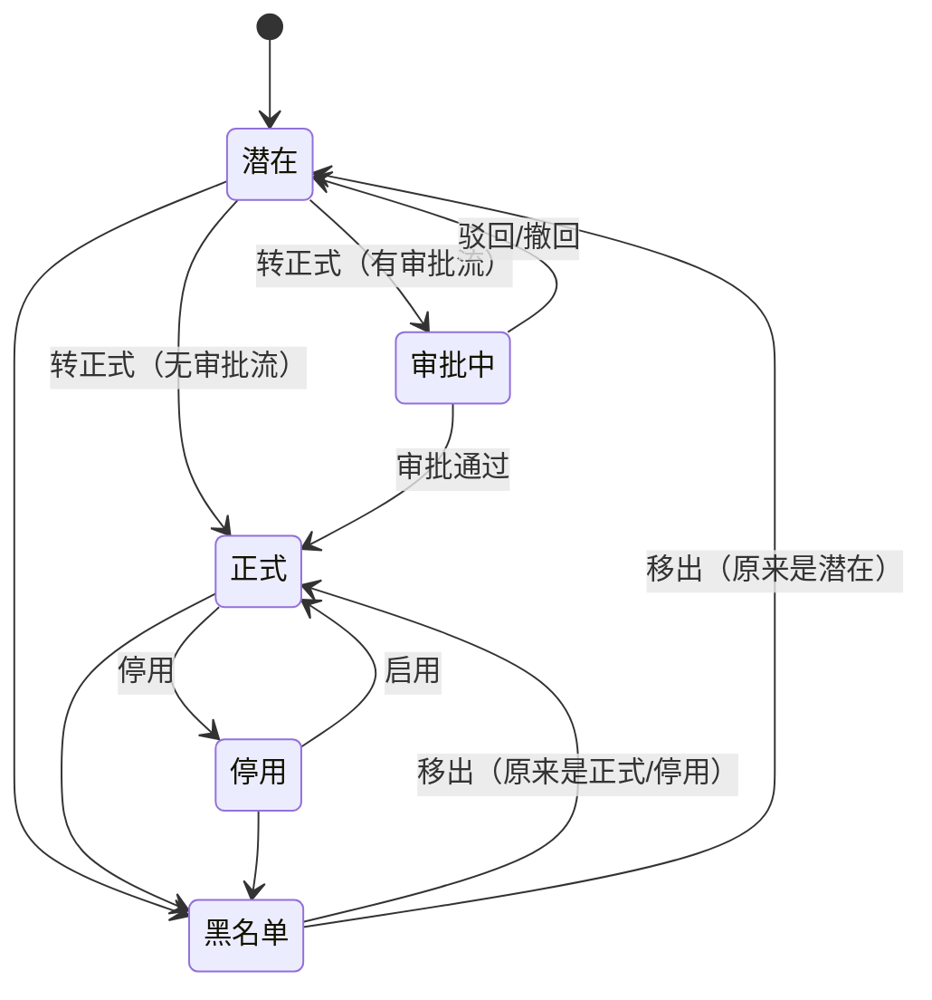

# 03-01 客户

## 1. 功能说明

维护客户档案（基本信息、交易信息、联系人、地址、银行信息），客户状态（潜在 → 正式 → 停用/黑名单），客户负责人与转移，以及客户 360 视图。

- 使用者：业务员、业务主管、财务
- 优先级：P0

## 2. 数据表

### crm_customer 客户

| 字段 | 类型 | 必填 | 默认 | 说明 |
|---|---|---|---|---|
| code | str(32) | 是 | | 客户编码，唯一（CRM_CUSTOMER） |
| name | str(128) | 是 | | 客户名称（中文或当地语言全称） |
| name_en | str(256) | 否 | | 英文名称（对外单据使用；外销客户必填，R02） |
| short_name | str(32) | 是 | | 简称（列表、报表显示） |
| customer_type | dict(crm_customer_type) | 是 | END_USER | |
| level | dict(crm_customer_level) | 是 | C | 等级 |
| customer_status | enum(PROSPECT/PENDING/ACTIVE/DISABLED/BLACKLIST) | 是 | PROSPECT | 潜在 / 审批中 / 正式 / 停用 / 黑名单 |
| is_foreign | bool | 是 | 0 | 外销客户（根据国家 ≠ 本国自动设置，可改） |
| country | str(2) | 是 | CN | 国家（ISO 代码） |
| province / city | str(64) | 否 | | |
| address | str(256) | 否 | | 公司地址 |
| industry | dict(crm_industry) | 否 | | |
| source | dict(crm_source) | 否 | | 来源 |
| website | str(128) | 否 | | |
| phone / email | str(64) / str(128) | 否 | | 公司电话 / 邮箱 |
| tax_no | str(32) | 条件 | | 税号：国内客户转正式时必填（R03） |
| owner_id | id | 是 | 当前用户 | 负责业务员 |
| dept_id | id | 是 | 负责人主部门 | 负责部门（数据权限） |
| currency | str(3) | 是 | 外销 USD / 内销 CNY | 默认交易币别 |
| payment_term_id | id | 否 | | 默认付款条件（usage 为 SALES 或 BOTH） |
| trade_term | dict(sys_trade_term) | 否 | | 默认贸易条款 |
| sales_tax_rate | pct | 是 | 外销 0 / 内销 0.13 | 默认销项税率 |
| credit_limit | amt | 否 | | 信用额度（本位币），字段权限 `crm:customer:credit`，只能通过信用调整修改（03-信用管理） |
| credit_days | int | 否 | | 信用期（天） |
| credit_control | enum(DEFAULT/NONE/WARN/BLOCK) | 是 | DEFAULT | 信用控制方式，DEFAULT 取系统参数 |
| blacklist_reason | str(512) | 否 | | |
| first_order_date | date | 否 | | 首次下单日期（系统回写） |
| last_order_date | date | 否 | | 最近下单日期（系统回写） |
| remark | str(1000) | 否 | | |

唯一：`uk_code(code)`；`uk_name_country(name, country)`。索引：`idx_owner(owner_id)`、`idx_short_name(short_name)`。

### crm_contact 联系人

| 字段 | 类型 | 必填 | 说明 |
|---|---|---|---|
| customer_id | id | 是 | |
| name | str(64) | 是 | |
| gender | enum(MALE/FEMALE/UNKNOWN) | 是 | |
| title | str(64) | 否 | 职位 |
| role | dict(crm_contact_role) | 否 | |
| email | str(128) | 否 | |
| phone / mobile | str(32) | 否 | |
| im | str(64) | 否 | 即时通讯（WhatsApp/微信/Skype） |
| birthday | date | 否 | |
| is_primary | bool | 是 | 主联系人，每个客户最多一个 |
| contact_status | enum(ACTIVE/LEFT) | 是 | 在职 / 已离职 |
| remark | str(256) | 否 | |

联系人至少填写邮箱、电话、手机其中之一（R05）。

### crm_address 地址

| 字段 | 类型 | 必填 | 说明 |
|---|---|---|---|
| customer_id | id | 是 | |
| address_type | enum(SHIP_TO/BILL_TO/NOTIFY) | 是 | 收货 / 开票 / 通知方 |
| company_name | str(256) | 是 | 抬头公司名（默认客户英文名或名称） |
| contact_name / phone | str(64) / str(32) | 否 | |
| country | str(2) | 是 | |
| province / city / zip | str(64) / str(64) / str(16) | 否 | |
| address_line | str(512) | 是 | 详细地址 |
| is_default | bool | 是 | 同类型默认地址，每类最多一个 |
| remark | str(256) | 否 | |

### crm_customer_bank 银行信息

`customer_id`、`bank_name`*、`account_name`*、`account_no`*、`swift`、`currency`、`remark`。

### crm_customer_transfer_log 转移记录

`customer_id`、`from_owner_id`、`to_owner_id`、`transfer_docs`（bool，是否同时转移未完成单据）、`reason`、`operator_id`、`created_at`。

## 3. 页面

### 3.1 客户列表（T1）

路由 `/crm/customer`，权限 `crm:customer:query`。

**查询条件**

| 条件 | 控件 | 匹配 | 默认 |
|---|---|---|---|
| 关键字 | 输入框（编码/名称/英文名/简称） | 模糊 | |
| 状态 | 下拉多选 | | 潜在、审批中、正式 |
| 等级 | DictSelect 多选 | | |
| 国家 | CountrySelect 多选 | | |
| 负责人 | UserSelect | | （展开区） |
| 客户类型 | DictSelect | | （展开区） |
| 来源 | DictSelect | | （展开区） |
| 最近下单 | 日期范围 | | （展开区） |
| 超过 N 天未下单 | 数字框 | last_order_date < 今天 − N | （展开区） |

**列表列**

| 列 | 字段 | 宽度 | 说明 |
|---|---|---|---|
| 编码 | code | 100 | 链接到详情 |
| 简称 | short_name | 120 | |
| 名称 | name | 200 | |
| 国家 | country | 80 | 显示国家中文名 |
| 类型 | customer_type | 90 | |
| 等级 | level | 60 | DictTag |
| 负责人 | owner_id | 90 | |
| 主联系人 | — | 140 | 姓名 + 邮箱悬停 |
| 币别 | currency | 60 | |
| 信用额度 | credit_limit | 110 | 右，字段权限 |
| 最近下单 | last_order_date | 100 | 可排序 |
| 状态 | customer_status | 80 | 潜在灰、审批中橙、正式绿、停用灰 plain、黑名单红 |
| 创建时间 | created_at | 150 | 可排序，默认隐藏 |
| 操作 | — | 180 | |

**按钮**

| 按钮 | 位置 | 权限 | 显示条件 | 行为 |
|---|---|---|---|---|
| 新建 | 工具栏 | `crm:customer:create` | 始终 | |
| 转移 | 工具栏 | `crm:customer:transfer` | 勾选 | 见 3.4 |
| 导入 / 导出 | 工具栏 | import / export | 始终 | 导入模板含客户主信息 + 主联系人 + 默认收货地址 |
| 编辑 | 行 | `crm:customer:update` | 非黑名单 | |
| 转正式 | 行 | `crm:customer:activate` | 潜在 | R03；有审批流时进入审批中 |
| 更多 → 停用 / 启用 | 行 | `crm:customer:disable` | 正式 / 停用 | |
| 更多 → 加入黑名单 / 移出黑名单 | 行 | `crm:customer:blacklist` | 非黑名单 / 黑名单 | 原因必填 |
| 更多 → 删除 | 行 | `crm:customer:delete` | 潜在且无任何业务数据 | R09 |

### 3.2 新建/编辑客户（T3）

分组卡片：

**基本信息**：客户名称*、英文名称（外销必填）、简称*（默认取名称前 10 个字，可改）、编码（留空自动生成）、客户类型*、等级*、国家*（CountrySelect，选择后自动设置“外销客户”和默认币别、税率）、省/市、公司地址、行业、来源、网址、电话、邮箱、税号、负责业务员*（UserSelect，默认当前用户；只有有 `crm:customer:transfer` 的人可以改成别人）、备注。
名称、税号、网址域名失焦查重（R01）。

**交易信息**：外销客户（开关）、默认币别*（CurrencySelect）、付款条件（下拉）、贸易条款（DictSelect）、销项税率*（百分比）、信用期（天）、信用控制方式（有 `crm:customer:credit` 才显示）。信用额度只读显示并提供 [调整额度] 链接（跳转信用管理）。

**联系人**（可编辑表格）：姓名*、性别、职位、角色、邮箱、电话、手机、即时通讯、主联系人（单选）、状态、备注。

**地址**（可编辑表格）：类型*、抬头公司名*、联系人、电话、国家*、省、市、邮编、详细地址*、默认、备注。

**银行信息**（可编辑表格）：开户行*、户名*、账号*、SWIFT、币别、备注。

**附件**：营业执照、合同、NDA 等。

页头：[取消] [保存]。

### 3.3 客户详情（T5，客户 360 视图）

路由 `/crm/customer/:id`。页头：简称 + 状态 + 等级；按钮：编辑、转正式、停用/启用、黑名单、转移、[新建报价]（跳转销售报价新建并带入客户，需要 `sales:quotation:create`）、[新建订单]（正式客户，需要 `sales:order:create`）。

单头：编码、名称、英文名、国家、类型、负责人、主联系人、币别、付款条件、贸易条款、信用额度 / 已用 / 可用（字段权限，已用超过 80% 橙色、超过 100% 红色）。

页签（每个页签懒加载，由前端直接调用对应模块的查询接口；用户没有对应模块权限时隐藏该页签）：

| 页签 | 数据来源 | 内容 |
|---|---|---|
| 联系人 / 地址 / 银行 | CRM | 列表 |
| 跟进记录 | CRM | 时间线，[新增跟进] |
| 商机 | CRM | 列表 |
| 客户料号 | CRM | 列表 |
| 报价 | 销售 | 该客户的 RFQ 与报价单 |
| 订单 | 销售 | 订单列表 + 汇总（在手订单金额、今年接单额） |
| 出货 | 出货 | 出货单列表 |
| 应收 | 财务 | 应收余额、账龄、逾期金额 |
| 客诉 | 品质 | 客诉列表 |
| 样品 | 研发工程 | 样品单列表 |
| 操作日志 / 附件 | 通用 | |

### 3.4 客户转移（小弹窗）

字段：新负责人*（UserSelect）、同时转移未完成的报价和订单的业务员（开关，默认开）、原因*。
确认后：更新 owner_id、dept_id（新负责人主部门）；写转移记录；开关打开时发布 `CustomerOwnerChangedEvent(customerIds, newOwnerId, transferDocs=true)`，销售模块将未完成报价、订单的业务员改为新负责人。

### 3.5 联系人查询（T1）

路由 `/crm/contact`：跨客户查询联系人。查询：姓名、邮箱、电话、客户、角色、状态；列：姓名、客户简称（链接）、职位、角色、邮箱、手机、电话、主联系人、状态。按客户数据权限过滤。

## 4. 状态与流转

| 状态 | 可报价/RFQ/样品 | 可下销售订单 | 可出货 |
|---|---|---|---|
| 潜在 | 是 | 否 | 否 |
| 审批中 | 是 | 否 | 否 |
| 正式 | 是 | 是 | 是 |
| 停用 | 否 | 否 | 在途订单可以出货（提示） |
| 黑名单 | 否 | 否 | 否（在途订单出货被阻止，需移出黑名单） |

## 5. 业务规则

| 编号 | 触发 | 规则 | 提示原文 |
|---|---|---|---|
| CRM-CUS-R01 | 保存 | 查重：名称相同（忽略大小写、空格、Co.,Ltd./有限公司等后缀）、税号相同、网址域名相同 | `发现疑似重复客户：{codes}`（参数 BLOCK 时阻止） |
| CRM-CUS-R02 | 保存 | 外销客户必须填写英文名称 | `外销客户必须填写英文名称` |
| CRM-CUS-R03 | 转正式 | 必须有：主联系人、默认收货地址、付款条件；国内客户必须有税号和默认开票地址 | `转正式客户需要：{缺少的项}` |
| CRM-CUS-R04 | 保存 | 客户名称 + 国家唯一 | `该国家已存在名称为「{name}」的客户` |
| CRM-CUS-R05 | 保存 | 联系人至少一种联系方式；主联系人最多一个；每类地址默认最多一个 | `联系人「{name}」至少需要填写邮箱、电话、手机中的一项` |
| CRM-CUS-R06 | 修改 | 正式客户修改名称、英文名称、税号时记录变更历史（操作日志中显示旧值新值），并提示“已有单据中的客户名称不会改变” | — |
| CRM-CUS-R07 | 加入黑名单 | 原因必填；发布 `CustomerStatusChangedEvent`；销售模块对该客户未完成订单打上提醒 | `请填写加入黑名单的原因` |
| CRM-CUS-R08 | 权限 | 业务员（仅本人范围）只能看到、编辑自己负责的客户；新建客户时负责人只能是自己（无转移权限时） | — |
| CRM-CUS-R09 | 删除 | 只有潜在客户且没有任何 RFQ、报价、样品、订单、跟进记录时可以删除 | `客户已有业务数据，不能删除` |
| CRM-CUS-R10 | 回写 | 监听 `SalesOrderApprovedEvent`：更新首次/最近下单日期 | — |

## 6. 接口

| 方法 | 路径 | 权限 |
|---|---|---|
| GET | /crm/customers | `crm:customer:query` |
| GET | /crm/customers/{id} | `crm:customer:query`（含联系人、地址、银行） |
| GET | /crm/customers/search?keyword=&statuses= | 登录即可（CustomerSelect，按数据权限） |
| POST | /crm/customers/duplicate-check | `crm:customer:create` |
| POST / PUT / DELETE | /crm/customers[/{id}] | create / update / delete |
| POST | /crm/customers/{id}/activate | `crm:customer:activate` |
| POST | /crm/customers/{id}/disable、/enable | `crm:customer:disable` |
| POST | /crm/customers/{id}/blacklist、/unblacklist | `crm:customer:blacklist` |
| POST | /crm/customers/transfer | `crm:customer:transfer`（customerIds、newOwnerId、transferDocs、reason） |
| GET | /crm/customers/{id}/addresses?type= | 登录即可 |
| GET | /crm/contacts | `crm:customer:query` |
| 导入导出 | /crm/customers/import-template、/import/check、/import、/export | import / export |

## 7. 验收用例

| 编号 | 前置条件 | 操作 | 预期结果 |
|---|---|---|---|
| CRM-CUS-T01 | — | 新建美国客户 ABC Inc. | 自动勾选外销、币别 USD、税率 0；编码 C00001；状态潜在 |
| CRM-CUS-T02 | 已有 ABC Inc.（美国） | 新建“abc inc”（美国） | 提示“该国家已存在名称为「ABC Inc.」的客户” |
| CRM-CUS-T03 | 潜在客户无收货地址 | 转正式 | 提示“转正式客户需要：默认收货地址” |
| CRM-CUS-T04 | 潜在客户 | 销售订单中选择该客户 | 下单的客户选择器不出现该客户；接口返回“客户「…」不是正式客户，不能下单” |
| CRM-CUS-T05 | 业务员 A、B 各有客户 | A 查询客户列表 | 只看到自己的客户 |
| CRM-CUS-T06 | A 的客户有 2 张未完成订单 | 主管把客户转移给 B（同时转移单据） | 客户负责人为 B；2 张订单的业务员变为 B；转移记录可查 |
| CRM-CUS-T07 | 正式客户 | 加入黑名单 | 该客户在途订单出货被阻止 |
| CRM-CUS-T08 | 客户有报价记录 | 删除 | 提示“客户已有业务数据，不能删除” |
| CRM-CUS-T09 | 有销售、财务权限 | 打开客户详情 | 显示订单、应收页签；无品质权限时不显示客诉页签 |
