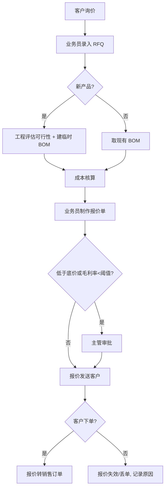
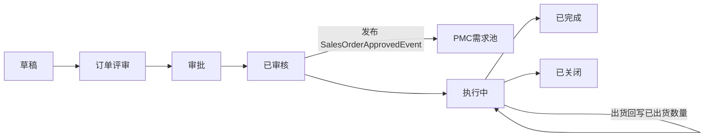

# 04 销售

## 1. 模块定位

销售模块覆盖从客户询价到订单确认、再到回款跟踪的**订单侧**业务：RFQ、报价、销售订单、销售预测、销售退货、回款跟踪。客户主数据归 CRM；实际出货归出货模块；应收与收款的账务归财务模块，销售只做**回款进度跟踪**。

## 2. 用户角色

- **业务员**：处理 RFQ、制作报价、录入订单、跟踪交期和回款。
- **业务主管**：审批报价（低于底价/毛利不足）、审批订单、查看团队业绩。
- **成本/报价工程师**：为 RFQ 提供成本核算（BOM 成本 + 加工费 + 费用）。
- **PMC**：订单评审时回复交期。

## 3. 功能清单

| 子功能 | 功能点 | 优先级 |
|---|---|---|
| 价格表 | 按客户/客户等级/币别维护标准售价；阶梯价（按数量）；有效期 | P1 |
| RFQ | 登记客户询价（客户料号、图纸、数量阶梯、目标价、要求交期）；分派给工程/成本核算；RFQ 转报价 | P1 |
| 报价核算 | 引用 BOM 计算材料成本 + 人工/制费 + 模具/工装分摊 + 管理费 + 利润率 → 建议报价 | P1 |
| 报价单 | 多行多阶梯报价；币别、贸易条款、付款条件、有效期；审批；输出英文报价单 PDF；版本管理（修订报价） | P1 |
| 销售订单 | 手工录入/报价转订单/客户 PO 导入；多交期分批；订单评审；审批；PI 打印 | P0 |
| 订单评审 | 订单提交后 PMC 回复可交期、工程确认技术可行、财务确认信用；全部通过后才能审核 | P1 |
| 订单变更 | 已审核订单的数量、交期、价格变更单（保留变更前后版本和原因），变更同样需审批 | P0 |
| 订单跟踪 | 订单执行全景：生产进度、已入库、已出货、已开票、已回款 | P0 |
| 销售预测 | 按客户/产品/月份录入预测量；预测版本；预测与实际订单冲销 | P1 |
| 销售退货 | 退货申请（RMA）→ 品质判定 → 退货入库 → 冲减应收或补货 | P1 |
| 回款计划 | 按订单付款条件生成回款计划（如 30% 定金 + 70% 见提单副本）；跟踪实际回款 | P0 |
| 订单关闭 | 剩余数量不再出货时手工关闭；自动关闭（全部出货且全部回款） | P0 |

## 4. 核心流程

### 4.1 RFQ → 报价 → 订单

### 4.2 销售订单生命周期

### 4.3 订单变更

1. 在已审核订单上发起“订单变更单”，填写变更行、变更前后值、原因（客户要求/内部原因）。
2. 变更单审批通过后，更新订单并使订单版本号 +1，保留历史版本快照。
3. 发布 `SalesOrderChangedEvent`，PMC 需求池和已下达的生产订单收到变更提醒（数量减少时提示是否取消多余生产订单）。
4. 已出货数量以下的数量不允许变更。

## 5. 数据实体

| 实体 | 关键字段 |
|---|---|
| sal_price_list 价格表 | id, name, customer_id / customer_level, currency, effective_from, effective_to, status |
| sal_price_list_item | price_list_id, material_id, min_qty, price, tax_included |
| sal_rfq RFQ | 通用单头 + customer_id, contact_id, currency, trade_term, required_date, reply_due_date, engineer_id, cost_engineer_id, status |
| sal_rfq_line | material_id(可空), customer_part_no, description, drawing_file_id, annual_qty, qty_breaks(JSON), target_price, remark |
| sal_quotation 报价单 | 通用单头 + customer_id, rfq_id, currency, exchange_rate, trade_term, payment_term_id, valid_until, revision, total_amount, gross_margin, lost_reason |
| sal_quotation_line | material_id, customer_part_no, qty_break, unit_price, cost_price, margin_rate, lead_time_days, moq, mpq, tooling_fee |
| sal_cost_sheet 成本核算单 | rfq_line_id, material_cost, labor_cost, overhead_cost, tooling_amortize, admin_rate, profit_rate, suggested_price, detail(JSON) |
| sal_order 销售订单 | 通用单头 + customer_id, customer_po_no, quotation_id, currency, exchange_rate, trade_term, payment_term_id, ship_to_address_id, salesperson_id, order_version, total_amount, total_tax, review_status |
| sal_order_line | material_id, customer_part_no, qty, uom, base_qty, unit_price, tax_rate, amount, tax_amount, required_date, promised_date, shipped_qty, returned_qty, invoiced_qty, line_status |
| sal_order_change 订单变更单 | 通用单头 + order_id, reason_type, reason |
| sal_order_change_line | order_line_id, field, old_value, new_value |
| sal_order_review 订单评审 | order_id, dept(PMC/工程/财务), reviewer_id, result, promised_date, comment |
| sal_forecast 销售预测 | 通用单头 + forecast_version, period_type(月/周) |
| sal_forecast_line | customer_id, material_id, period, qty, consumed_qty |
| sal_return 销售退货 | 通用单头 + customer_id, order_id, rma_no, reason, handling(退款/补货/维修) |
| sal_return_line | order_line_id, material_id, qty, inspect_result, received_qty |
| sal_payment_plan 回款计划 | order_id, seq, milestone(定金/出货前/见提单/到货后N天), percent, amount, due_date, received_amount, status |
| sal_payment_term 付款条件 | code, name, name_en, milestones(JSON) |

## 6. 业务规则

1. **客户校验**：订单只能引用“正式”状态客户；黑名单客户禁止下单；信用控制按 CRM 规则执行。
2. **价格取值顺序**：客户专属价格表 → 客户等级价格表 → 最近成交价 → 手工录入；手工价低于底价（成本 × (1 + 最低毛利率)）需审批。
3. **报价有效期**：过期报价不能转订单，需修订（revision + 1）。
4. **报价阶梯**：订单数量落入哪一档，自动带出对应单价。
5. **MOQ/MPQ**：订单数量低于 MOQ 警告；非 MPQ 整数倍提示是否向上取整。
6. **交期**：要求交期不得早于下单日期；承诺交期由订单评审中 PMC 回复。
7. **数量回写**：出货单审核回写 `shipped_qty`；退货回写 `returned_qty`；开票回写 `invoiced_qty`。
8. **反审核限制**：订单已被生产订单/出货单引用时不允许反审核，只能走订单变更。
9. **关闭**：关闭时如有已下达但未完工的生产订单，提示并通知 PMC。
10. **客户料号**：录入客户料号时通过 CRM 客户料号对照自动带出本厂料号；找不到时提示新建对照。
11. **销售预测冲销**：订单审核后按“客户 + 物料 + 期间”冲减预测剩余量，冲销规则（向前/向后 N 期）可配置。
12. **退货**：退货数量不能超过已出货数量 − 已退货数量；退货入库须经品质判定。

## 7. 集成

| 方向 | 对象 | 内容 |
|---|---|---|
| 调用 | CRM | 客户校验、信用检查、地址、客户料号对照 |
| 调用 | 研发工程 | 物料信息、BOM（成本核算） |
| 调用 | 仓库 | 可用库存查询（下单时展示） |
| 调用 | 系统管理 | 编码、汇率、审批 |
| 发布事件 | PMC | `SalesOrderApprovedEvent`、`SalesOrderChangedEvent`、`SalesOrderClosedEvent`、`ForecastPublishedEvent` |
| 发布事件 | CRM | `QuotationCreatedEvent`、`SalesOrderApprovedEvent` |
| 发布事件 | 财务 | `SalesReturnApprovedEvent`（生成红字应收） |
| 监听事件 | 出货 | `ShipmentApprovedEvent`（回写已出货数量） |
| 监听事件 | 财务 | `ReceiptVerifiedEvent`（更新回款计划的已收金额） |
| 监听事件 | 品质 | `ReturnInspectionCompletedEvent`（退货判定结果） |

## 8. 报表

- 订单明细查询（多维筛选：客户、业务员、物料、交期区间、状态）
- 订单执行跟踪表（订单行 → 生产 → 入库 → 出货 → 开票 → 回款）
- 报价成功率（按客户/业务员/产品）
- 业务员业绩（接单额、出货额、回款额，按月/季度/年）
- 未交订单明细、逾期未交订单
- 销售预测准确率（预测 vs 实际订单）

## 9. 权限点

`sales:rfq:*`、`sales:quotation:query / create / update / submit / approve / print`、`sales:quotation:cost`（查看成本与毛利）、`sales:order:query / create / update / submit / approve / unapprove / close / change / print / export`、`sales:forecast:*`、`sales:return:*`、`sales:price-list:*`

## 10. 异常场景

- 客户 PO 重复导入：以“客户 + 客户 PO 号”唯一校验，重复时提示。
- 汇率缺失：提示先维护汇率，不允许以 0 或空汇率保存。
- 订单评审中 PMC 回复交期晚于客户要求：订单仍可审核，但标记为“交期风险”，推送业务员待办与客户沟通。
- 订单变更与出货并发：订单行使用乐观锁；变更审核时重新校验“变更后数量 ≥ 已出货数量”。
