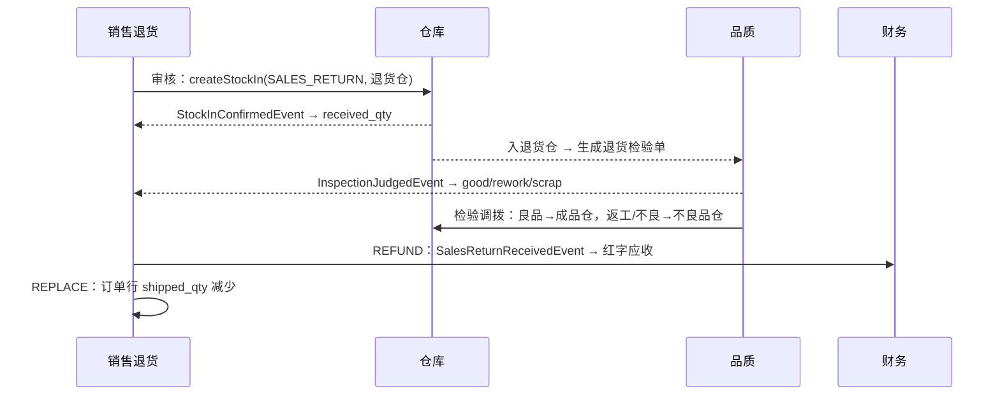

# 04-06 销售退货

## 1. 功能说明

客户退回已出货的产品（RMA）：业务员登记退货申请 → 审批 → 仓库收货入**退货仓** → 品质判定（良品 / 返工 / 不良）→ 按处理方式退款（红字应收）或换货（重新出货）。

- 使用者：业务员（申请）、仓管员（收货）、品质（判定）、财务（红字应收）
- 优先级：P1

### 1.1 处理方式

| 处理方式 | 编码 | 效果 |
|---|---|---|
| 退货退款 | REFUND | 退货入库确认后，财务生成红字应收（按原订单单价）；订单行 returned_qty 增加 |
| 退货换货 | REPLACE | 订单行 shipped_qty 减少（恢复未出货数量），由出货模块重新出货；不产生红字应收 |

## 2. 数据表

### sal_return 销售退货单（BaseDocDO，编码规则 SAL_RETURN）

| 字段 | 类型 | 必填 | 说明 |
|---|---|---|---|
| customer_id | id | 是 | |
| rma_no | str(64) | 否 | 客户 RMA 号 |
| return_reason | dict(sal_return_reason) | 是 | |
| handling | enum(REFUND/REPLACE) | 是 | |
| currency / exchange_rate | | 是 | 取原订单 |
| total_amount | amt | 是 | 退货金额（按原单价） |
| complaint_no | str(64) | 否 | 关联客诉单号 |
| stock_in_id | id | 否 | 生成的退货入库单 |
| expected_arrival_date | date | 否 | 预计到货日期 |

状态：草稿 → 待审批 → 已审核（已生成入库单）→ 已完成（入库并判定完成）；可作废（入库单未确认前）。

### sal_return_line

| 字段 | 类型 | 必填 | 说明 |
|---|---|---|---|
| line_no | int | 是 | |
| order_line_id | id | 是 | 原订单行 |
| shipment_line_id | id | 否 | 原出货单行（追溯批次） |
| material_id | id | 是 | |
| batch_no | str(64) | 否 | 原出货批次 |
| serial_nos | text | 否 | |
| qty | qty | 是 | 退货数量（基本单位） |
| price_incl_tax / tax_rate / total_amount | | 是 | 取原订单行 |
| received_qty | qty | 是 | 已收货入库（回写） |
| good_qty / rework_qty / scrap_qty | qty | 是 | 品质判定：良品 / 返工 / 不良（回写） |
| remark | str(256) | 否 | 问题描述 |

## 3. 页面

### 3.1 退货单列表（T1）

查询：单号、客户、RMA 号、原因、处理方式、状态、物料、日期。列：单号、客户、RMA 号、原因、处理方式、物料摘要、数量、金额、收货状态、判定状态、状态、业务员、日期。

### 3.2 编辑页（T4）

单头：客户*、RMA 号、退货原因*、处理方式*、关联客诉、预计到货日期、问题描述（备注）、附件（客户照片、报告）。
明细：[选择出货记录]（SourceDocPicker：该客户已出货的订单行 / 出货单行：出货单号、订单号、物料、批次、出货数量、已退数量、可退数量、出货日期）。列：出货单号、订单号、物料、批次、序列号、可退数量、退货数量*、单价（原订单）、金额、问题描述。

### 3.3 详情页（T5）

按钮：编辑/删除/提交（草稿）、审批、作废（已审核且入库单未确认，原因）、打印。
页签：明细（含已收货、判定结果）、关联单据（原订单、出货单、退货入库单、检验单、检验调拨单、红字应收、客诉）、审批记录、操作日志、附件。

## 4. 处理流程

## 5. 业务规则

| 编号 | 触发 | 规则 | 提示原文 |
|---|---|---|---|
| SAL-SR-R01 | 保存 | 退货数量 ≤ 原出货数量 − 已退货数量（含未完成退货单占用） | `第 {n} 行退货数量超过可退数量 {qty}` |
| SAL-SR-R02 | 审核 | 生成退货入库单（入库仓：默认退货仓） | — |
| SAL-SR-R03 | 入库确认 | 回写 received_qty；REFUND：订单行 returned_qty += 数量，发布 `SalesReturnReceivedEvent(returnId, lines, amount)`（财务红字应收）；REPLACE：订单行 shipped_qty −= 数量，订单若已完成则回到执行中 | — |
| SAL-SR-R04 | 入库反确认 | 反向扣回；财务已核销红字应收时由财务阻止 | 财务提示原文 |
| SAL-SR-R05 | 判定 | 全部行 good+rework+scrap = received_qty 且收货完成时，退货单完成 | — |
| SAL-SR-R06 | 作废 | 入库单未确认时作废并作废入库单；已确认不能作废 | `退货已入库，不能作废` |

## 6. 接口

`/sales/returns`（CRUD、submit、void、print-data）、`GET /sales/shipped-lines?customerId=`（退货选单，调用出货模块数据）。

## 7. 验收用例

| 编号 | 前置条件 | 操作 | 预期结果 |
|---|---|---|---|
| SAL-SR-T01 | 已出货 1000 | 退货 50（退款）审核 | 生成退货仓入库单 |
| SAL-SR-T02 | 仓库确认入库 | — | 品质出现退货检验单；财务出现红字应收 −50 × 单价 |
| SAL-SR-T03 | 品质判定良品 40、不良 10 | — | 检验调拨：40 → 成品仓，10 → 不良品仓；退货单完成 |
| SAL-SR-T04 | 换货 50 | 入库确认后 | 原订单行未出货数量 +50，可再次出货 |
| SAL-SR-T05 | 可退 50 | 退 60 | 提示超过可退数量 |
