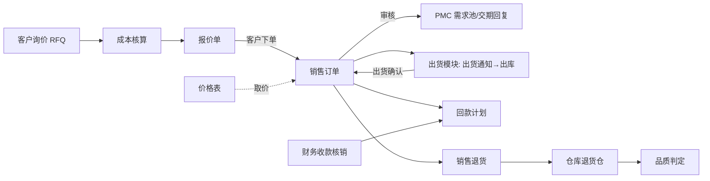

# 04 销售（总览）

## 1. 模块定位

销售负责订单侧业务：销售价格表、客户询价（RFQ）与报价、销售订单与变更、销售预测、销售退货、回款跟踪。

边界：
- 客户主数据、信用额度归 CRM；
- 实际出货（出货通知、拣货、装箱、单证、出库）归出货模块，销售只接收已出货数量回写；
- 应收、收款、核销归财务，销售只跟踪回款计划的执行；
- 交期回复由 PMC 在其模块中录入，写回销售订单行的“承诺交期”。

## 2. 端到端流程

## 3. 功能与页面清单

| 功能 | 文档 | 页面 | 模板 | 路由 | 菜单权限 | 优先级 |
|---|---|---|---|---|---|---|
| 价格表 | [01-价格表](01-价格表.md) | 价格表列表 / 编辑 | T1 / T4 | `/sales/price-list` | `sales:price-list:query` | P1 |
| RFQ 与报价 | [02-RFQ与报价](02-RFQ与报价.md) | RFQ 列表/编辑/详情；报价单列表/编辑/详情 | T1 / T4 / T5 | `/sales/rfq`、`/sales/quotation` | `sales:rfq:query`、`sales:quotation:query` | P1 |
| 销售订单 | [03-销售订单](03-销售订单.md) | 订单列表 / 编辑 / 详情 | T1 / T4 / T5 | `/sales/order` | `sales:order:query` | P0 |
| 订单变更 | [04-订单变更](04-订单变更.md) | 变更单列表 / 编辑 / 详情 | T1 / T4 / T5 | `/sales/order-change` | `sales:order:change` | P0 |
| 销售预测 | [05-销售预测](05-销售预测.md) | 预测列表 / 编辑 / 详情 | T1 / T4 / T5 | `/sales/forecast` | `sales:forecast:query` | P1 |
| 销售退货 | [06-销售退货](06-销售退货.md) | 退货单列表 / 编辑 / 详情 | T1 / T4 / T5 | `/sales/return` | `sales:return:query` | P1 |
| 回款跟踪 | [07-回款跟踪](07-回款跟踪.md) | 回款计划 | T1 | `/sales/payment-plan` | `sales:order:query` | P0 |
| 销售报表 | [08-销售报表](08-销售报表.md) | 订单明细、订单执行跟踪、未交订单、业绩、报价成功率 | T7 | `/sales/report` | `sales:report:query` | P1 |

菜单顺序：RFQ、报价、销售订单、订单变更、销售预测、销售退货、回款、价格表、销售报表。

## 4. 用户角色与数据权限

| 角色 | 功能 | 数据范围建议 |
|---|---|---|
| 业务员 | RFQ、报价、订单、变更、退货、回款跟踪 | 仅本人（单据 owner_id = 业务员） |
| 业务主管 | 审批、团队数据 | 本部门及下级 |
| 成本/报价工程师 | 成本核算 | 全部（仅 RFQ 与成本核算） |
| 业务助理 | 录单、跟单 | 本部门 |

## 5. 数据表

sal_price_list、sal_price_list_item、sal_rfq、sal_rfq_line、sal_cost_sheet、sal_quotation、sal_quotation_line、sal_order、sal_order_line、sal_order_change、sal_order_change_line、sal_order_snapshot、sal_forecast、sal_forecast_line、sal_forecast_consumption、sal_return、sal_return_line、sal_payment_plan。

## 6. 编码规则

SAL_RFQ、SAL_QUOTATION、SAL_ORDER（允许手工）、SAL_ORDER_CHANGE、SAL_FORECAST、SAL_RETURN；价格表 SAL_PRICE_LIST（`PL-yyyy-3`，年重置）。

## 7. 内置字典

| 类型编码 | 名称 | 内置项 |
|---|---|---|
| sal_order_type | 订单类型 | NORMAL 正常订单、SAMPLE 样品订单、REPLACEMENT 补货订单（免费）、STOCK 备货订单 |
| sal_quote_lost_reason | 报价失败原因 | PRICE 价格高、DELIVERY 交期长、SPEC 规格不符、NO_RESPONSE 客户无回复、CANCELED 项目取消、OTHER |
| sal_return_reason | 退货原因 | QUALITY 质量问题、WRONG_GOODS 发错货、DAMAGED 运输损坏、CUSTOMER_CHANGE 客户原因、OTHER |
| sal_change_reason | 订单变更原因 | CUSTOMER 客户要求、INTERNAL 内部原因（产能/物料）、PRICE 价格调整、OTHER |

## 8. 可审批单据

| 单据类型 | 名称 | 条件字段 | 用户字段 |
|---|---|---|---|
| SAL_QUOTATION | 报价单 | amountBase、minMarginRate（最低毛利率 %）、belowFloor（是否低于底价，布尔）、customerLevel | ownerId |
| SAL_ORDER | 销售订单 | amountBase、minMarginRate、belowFloor、customerLevel、orderType、creditWarning（是否信用预警，布尔） | ownerId |
| SAL_ORDER_CHANGE | 订单变更 | amountChangeBase、changeReason | ownerId |
| SAL_RETURN | 销售退货 | amountBase、returnReason | ownerId |
| SAL_PRICE_LIST | 价格表 | — | — |

## 9. 可打印单据

SAL_QUOTATION（报价单，中/英）、SAL_ORDER（销售订单合同，中文；Proforma Invoice，英文）、SAL_RETURN（退货单）。

## 10. 系统参数

| 编码 | 分组 | 名称 | 类型 | 默认 | 说明 |
|---|---|---|---|---|---|
| sal.price.min-margin-pct | 价格 | 最低毛利率（%） | DECIMAL | 15 | 底价 = 标准成本 × (1 + 最低毛利率)；低于底价标记 belowFloor |
| sal.price.no-cost-policy | 价格 | 物料无标准成本时 | ENUM(IGNORE/WARN) | WARN | 无法计算毛利时的处理 |
| sal.quotation.valid-days | 报价 | 默认报价有效期（天） | INT | 30 | |
| sal.order.moq-check | 订单 | MOQ 检查 | ENUM(NONE/WARN/BLOCK) | WARN | 使用物料计划属性中的 MOQ |
| sal.order.over-ship-pct | 订单 | 允许超出货比例（%） | DECIMAL | 0 | |
| sal.order.auto-complete | 订单 | 全部出货后自动完成 | BOOL | 是 | 否：需全部回款后才完成 |
| sal.forecast.consume-window | 预测 | 预测冲销窗口（前后月数） | STRING | 0,1 | “向前 0 个月,向后 1 个月” |
| sal.order.delivery-warn-days | 订单 | 交期预警天数 | INT | 3 | 承诺交期前 N 天仍未出货提醒业务员 |

## 11. 对其他模块提供的 API（sales-api）

| 接口 | 方法 | 使用方 |
|---|---|---|
| `SalesOrderQueryApi` | `getOpenLines(filter)`（已审核未出完的订单行：订单、客户、物料、未出货数量、承诺交期）、`getLine(id)`、`getOpenAmountByCustomer(customerId)` | 出货、PMC、CRM（信用）、财务 |
| `SalesOrderApi` | `updatePromisedDate(lineId, date, remark)`（PMC 交期回复）、`validateShipmentQty(lineId, qty)` | PMC、出货 |
| `ForecastApi` | `getNetForecast(from, to)`（冲销后的预测需求） | PMC |
| `SalesPriceApi` | `getPrice(customerId, materialId, qty, date, currency)` | 出货（补货订单）、BI |

**发布事件**：`QuotationCreatedEvent`、`SalesOrderApprovedEvent`、`SalesOrderChangedEvent`、`SalesOrderClosedEvent`、`SalesOrderUnapprovedEvent`、`SalesOrderOpenAmountChangedEvent`（信用占用）、`ForecastPublishedEvent`、`SalesReturnApprovedEvent`。

**监听事件**：出货 `ShipmentConfirmedEvent` / `ShipmentReversedEvent`（已出货数量）；出货 `ShipmentNoticeChangedEvent`（已通知数量）；仓库 `StockInConfirmedEvent`（销售退货入库）；品质 `InspectionJudgedEvent`（退货判定）；财务 `ReceiptAllocatedEvent`（回款）、`InvoiceIssuedEvent`（已开票数量）；CRM `CustomerOwnerChangedEvent`（转移业务员）。

## 12. 权限点汇总

| 分组 | 权限点 |
|---|---|
| 价格表 | `sales:price-list:query`（菜单）、`create`、`update`、`delete`、`submit`、`import`、`export` |
| RFQ | `sales:rfq:query`（菜单）、`create`、`update`、`delete`、`assign`（分派）、`cost`（成本核算）、`close` |
| 报价 | `sales:quotation:query`（菜单）、`create`、`update`、`delete`、`submit`、`revise`、`send`、`to-order`、`lose`、`print`；字段 `sales:quotation:cost`（成本、毛利） |
| 订单 | `sales:order:query`（菜单）、`create`、`update`、`delete`、`submit`、`unapprove`、`close`、`void`、`change`、`print`、`export`；字段 `sales:order:cost` |
| 预测 | `sales:forecast:query`（菜单）、`create`、`update`、`delete`、`publish` |
| 退货 | `sales:return:query`（菜单）、`create`、`update`、`delete`、`submit`、`void`、`print` |
| 报表 | `sales:report:query`（菜单）、`export` |
