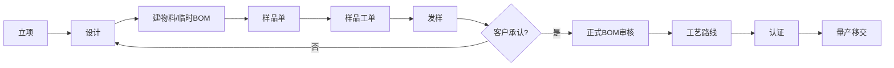
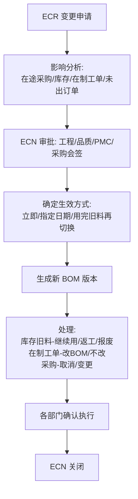

# 05 研发工程

## 1. 模块定位

研发工程是制造 ERP 的**基础数据中心**，负责物料、BOM、工艺路线、工作中心、工装等主数据，以及研发项目、ECN、样品、认证等工程业务。几乎所有模块都依赖这里的数据，因此本模块的**数据准确性和变更控制**是全系统质量的关键。

## 2. 用户角色

- **研发工程师**：新产品设计、建 BOM、申请样品、发起 ECN。
- **工艺/制造工程师**：维护工艺路线、工时、工作中心、工装。
- **文控 / 数据管理员**：物料建档审核、编码管理、图纸版本控制。
- **工程主管**：审批 BOM、ECN、项目节点。
- **认证工程师**：维护产品认证与证书有效期。

## 3. 功能清单

| 子功能 | 功能点 | 优先级 |
|---|---|---|
| 物料 | 物料建档（编码、名称、规格、类别、单位、属性）；采购/生产/库存/质量/财务属性分页维护；停用；物料替代；图片和图纸 | P0 |
| 物料类别 | 多级类别树；类别决定编码前缀和默认属性（如电子料默认批次管理） | P0 |
| 物料申请 | 物料建档申请 → 文控审核 → 生成正式编码，防止重复建料 | P1 |
| BOM | 多级 BOM 维护；BOM 版本；用量、损耗率、位号、替代料组；BOM 审核；BOM 复制；BOM 正查/反查（where-used）；BOM 展开与成本卷算 | P0 |
| 工作中心 | 工作中心（产线/机台组）；日产能、班次、效率、人工费率、制费费率 | P1 |
| 工艺路线 | 产品工序序列；每道工序的工作中心、标准工时、准备时间、是否委外、是否检验点 | P1 |
| 研发项目 | 项目立项、阶段（概念→设计→EVT→DVT→PVT→量产）、里程碑、任务、交付物、项目成员、费用归集 | P1 |
| 产品 | 产品（成品）视图：规格书、BOM、工艺、认证、样品历史、客户 | P1 |
| ECN | 变更申请（ECR）→ 影响分析 → 审批 → 执行（BOM/工艺/图纸更新）→ 在制品和库存处理 → 关闭 | P1 |
| 样品 | 样品申请（客户样/工程样）→ 制作（小批量工单）→ 发样 → 客户反馈 → 承认/不承认 | P1 |
| 工装 | 模具、治具、夹具台账；归属（自有/客户）；寿命（设计次数、已用次数）；保养；借用归还；存放位置 | P1 |
| 认证 | 产品认证记录（CE/UL/FCC/CCC/RoHS/REACH…）；证书文件；有效期提醒；认证关联物料和关键件 | P1 |
| 图纸文档 | 图纸版本、受控发放、作废回收 | P2 |

## 4. 核心流程

### 4.1 新产品导入（NPI）

### 4.2 ECN 流程

## 5. 数据实体

| 实体 | 关键字段 |
|---|---|
| eng_material_category 物料类别 | id, parent_id, code, name, code_prefix, default_attrs(JSON) |
| eng_material 物料 | id, code, name, name_en, spec, category_id, material_type(原材料/半成品/成品/包材/辅料/虚拟件), base_uom, status(草稿/启用/停用), drawing_no, revision, brand, manufacturer, manufacturer_part_no |
| eng_material_plan 计划属性 | material_id, source_type(采购/自制/委外), lead_time_days, safety_stock, min_stock, max_stock, moq, mpq, order_policy(按需/批量/固定周期), planner_id |
| eng_material_purchase 采购属性 | material_id, buyer_id, default_supplier_id, purchase_uom, over_receive_rate, inspection_required |
| eng_material_stock 库存属性 | material_id, tracking(无/批次/序列号), shelf_life_days, default_warehouse_id, allow_negative |
| eng_material_quality 质量属性 | material_id, iqc_required, inspection_standard_id, sampling_plan_id |
| eng_material_finance 财务属性 | material_id, cost_method(移动平均/月加权/标准成本), standard_cost, inventory_account, cost_account |
| eng_material_substitute 替代料 | material_id, substitute_id, priority, ratio, scope(全局/指定BOM) |
| eng_bom BOM 头 | id, material_id, version, status(草稿/已审核/已停用), is_default, effective_from, effective_to, base_qty, remark |
| eng_bom_line BOM 行 | bom_id, line_no, component_id, qty_per, scrap_rate, position_no, substitute_group, is_phantom, issue_method(领料/倒冲), operation_seq, effective_from, effective_to |
| eng_work_center 工作中心 | id, code, name, dept_id, capacity_per_day, shift_count, efficiency, labor_rate, overhead_rate |
| eng_routing 工艺路线 | id, material_id, version, status, is_default |
| eng_routing_step 工序 | routing_id, seq, operation_code, operation_name, work_center_id, setup_time, run_time_per_unit, is_outsourced, is_inspection_point, is_report_point |
| eng_project 研发项目 | id, code, name, customer_id, product_material_id, stage, pm_id, start_date, plan_end_date, budget, status |
| eng_project_task | project_id, name, stage, owner_id, plan_start, plan_end, actual_end, deliverable_file_id, status |
| eng_ecn ECN | 通用单头 + ecn_type(设计/工艺/物料替代), reason, effective_mode, effective_date, affected_materials(JSON), impact_analysis(JSON) |
| eng_ecn_line | ecn_id, bom_id, action(新增/删除/替换/改用量), component_id_old, component_id_new, qty_old, qty_new, stock_handling, wip_handling |
| eng_sample 样品单 | 通用单头 + customer_id, project_id, material_id, sample_type, qty, required_date, work_order_id, shipped_at, feedback, approval_result |
| eng_tooling 工装 | id, code, name, type(模具/治具/夹具/检具), ownership(自有/客户), customer_id, material_ids, design_life, used_count, status(在库/借出/维修/报废), location, maintenance_cycle |
| eng_tooling_record 工装使用/保养记录 | tooling_id, type(借出/归还/保养/维修), qty, user_id, occurred_at |
| eng_certification 认证 | id, cert_type, cert_no, material_id, issuing_body, issue_date, expire_date, file_id, status, key_components(JSON), countries(适用国家) |

## 6. 业务规则

### 6.1 物料

1. 物料编码全局唯一，建议按类别前缀 + 流水号自动生成；启用后编码不可修改。
2. 查重：同类别下“名称 + 规格”或“制造商料号”重复时提示。
3. 物料基本单位在存在库存或单据后不允许修改。
4. 停用的物料不能出现在新单据中，但历史单据可正常查看和执行完成。
5. 批次/序列号管理属性在存在库存时不允许修改。

### 6.2 BOM

1. 同一物料同一时间只能有一个**默认且已审核**的 BOM 版本；已审核 BOM 不可直接修改，只能通过新版本或 ECN 变更。
2. 保存时进行**循环引用检测**（A 含 B，B 含 A），发现即拒绝保存。
3. 子件用量 > 0；损耗率范围 0～100%。
4. 实际需求量 = 父件数量 × 用量 ÷ BOM 基数 × (1 + 损耗率)。
5. 虚拟件（phantom）在 MRP 展开和生产领料时透过，不单独产生需求。
6. BOM 展开层数上限（默认 20 层），防止数据异常导致死循环。
7. BOM 行按生效日期区间生效，支持 ECN 指定日期切换。
8. 成本卷算：自下而上按子件成本 × 用量累加材料成本，加工序人工和制费得到标准成本。

### 6.3 ECN

1. ECN 审批通过前，旧 BOM 版本保持有效。
2. 必须对每项受影响的库存、在制工单、在途采购给出处理方式才能关闭 ECN。
3. ECN 生效后发布 `EcnEffectiveEvent`，PMC 在下一次 MRP 运算时采用新 BOM；已下达工单根据 wip_handling 决定是否更新工单用料。

### 6.4 工装

1. 工装使用次数由生产报工自动累加（报工数量 ÷ 模穴数）；达到设计寿命 90% 预警，100% 禁止继续排产（可强制放行并记录）。
2. 客户资产工装需单独标识，不计入本厂固定资产。

### 6.5 认证

1. 证书到期前 90/30/7 天推送预警。
2. 认证关联的关键件发生 ECN 变更时，自动提醒认证工程师评估是否需要重新认证。

## 7. 集成

| 方向 | 对象 | 内容 |
|---|---|---|
| 提供 API | 全部模块 | `MaterialApi`（查询、校验、单位换算、属性）、`BomApi`（展开、反查、成本卷算）、`RoutingApi`、`WorkCenterApi`、`ToolingApi` |
| 发布事件 | PMC、生产、采购、仓库 | `MaterialChangedEvent`、`BomApprovedEvent`、`EcnEffectiveEvent`、`CertificationExpiringEvent` |
| 监听事件 | 生产 | `WorkReportApprovedEvent`（工装使用次数累加）、样品工单完工 |
| 调用 | 生产 | 样品单生成样品工单 |
| 调用 | 仓库、资材、生产 | ECN 影响分析时查询库存、在途采购、在制工单 |

## 8. 报表

- 物料清单查询与导出、物料使用情况（哪些 BOM 使用）
- BOM 多级展开表、BOM 比较（两个版本的差异）
- 产品标准成本表
- ECN 统计（数量、类型、平均处理周期）
- 项目进度甘特图、项目费用
- 工装寿命与保养计划表
- 证书到期清单

## 9. 权限点

`eng:material:query / create / update / enable / disable / import / export`、`eng:material:cost`（财务属性）、`eng:bom:query / create / update / approve / copy / export`、`eng:routing:*`、`eng:work-center:*`、`eng:project:*`、`eng:ecn:*`、`eng:sample:*`、`eng:tooling:*`、`eng:cert:*`

## 10. 异常场景

- 大 BOM（数千行、10 层以上）展开性能：展开结果缓存，BOM 审核/ECN 生效时失效缓存。
- 两个人同时修改同一 BOM 草稿：乐观锁冲突时提示刷新。
- 物料被删除的误操作：物料只允许停用；只有从未被引用的草稿物料允许删除。
