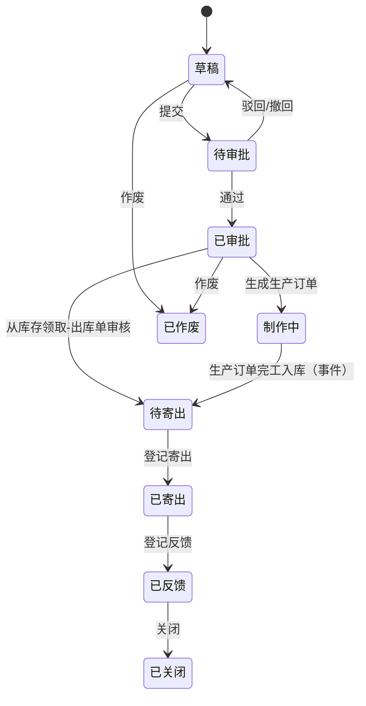

# 05-07 样品

## 1. 功能说明

管理样品从申请到客户承认的全过程：样品申请 → 审批 → 制作（生成样品生产订单或从库存领取）→ 寄样 → 客户反馈 → 关闭。

- 使用者：业务员/研发工程师（申请）、工程主管（审批）、生产（制作）、仓库（出库）
- 优先级：P1
- 样品出库走仓库“其他出库（样品）”，样品制作走生产模块“样品生产订单”，不另建库存。

## 2. 数据表

### eng_sample 样品单（单据，编码规则 ENG_SAMPLE）

| 字段 | 类型 | 必填 | 默认 | 说明 |
|---|---|---|---|---|
| sample_type | enum(CUSTOMER/ENGINEERING/CERTIFICATION) | 是 | CUSTOMER | 客户样 / 工程验证样 / 认证送样 |
| customer_id | id | 条件 | | 客户样必填 |
| contact_id | id | 否 | | 客户联系人 |
| project_id | id | 否 | | 研发项目 |
| material_id | id | 是 | | 样品物料（需已建料，可为草稿物料） |
| customer_part_no | str(64) | 否 | | 客户料号 |
| qty | qty | 是 | | 数量 > 0 |
| required_date | date | 是 | | 要求寄出日期 |
| make_method | enum(PRODUCE/FROM_STOCK) | 是 | PRODUCE | 生产制作 / 从库存领取 |
| prod_order_id | id | 否 | | 生成的样品生产订单 |
| purpose | str(512) | 是 | | 用途说明 |
| requirements | str(1000) | 否 | | 特殊要求（包装、标签、测试报告） |
| ship_date | date | 否 | | 寄出日期 |
| courier | str(32) | 否 | | 快递公司 |
| tracking_no | str(64) | 否 | | 快递单号 |
| ship_address | str(512) | 否 | | 寄送地址（默认带出客户收货地址） |
| stock_out_id | id | 否 | | 关联的样品出库单 |
| feedback_result | enum(APPROVED/CONDITIONAL/REJECTED) | 否 | | 客户承认 / 有条件承认 / 不承认 |
| feedback_date | date | 否 | | |
| feedback_content | str(1000) | 否 | | 客户反馈内容 |
| sample_status | enum(DRAFT/PENDING/APPROVED/MAKING/READY/SHIPPED/FEEDBACK/CLOSED/VOIDED) | 是 | DRAFT | 样品单业务状态（见第 4 节） |

## 3. 页面

### 3.1 样品单列表（T1）

查询：单号、客户、物料、样品类型、状态（默认未关闭未作废）、要求日期（范围）、申请人。
列：单号（链接）、类型、客户、物料编码/名称、数量、要求日期（逾期未寄出红色）、制作方式、状态（颜色：草稿灰、待审批橙、已审批蓝、制作中蓝、待寄出蓝、已寄出蓝、已反馈绿/红（不承认）、已关闭灰、已作废红）、客户反馈、申请人、操作。

### 3.2 样品单编辑（T3）

字段：样品类型*、客户（客户样必填，CustomerSelect 可选潜在客户）、联系人、研发项目、物料*（MaterialSelect，含草稿）、客户料号、数量*、要求日期*（≥ 今天）、制作方式*、用途*、特殊要求、寄送地址、附件。

### 3.3 样品单详情（T5）

**按钮显示矩阵**

| 按钮 | 状态 | 权限 | 行为 |
|---|---|---|---|
| 编辑 / 删除 / 提交 | 草稿 | update / delete / submit | |
| 撤回 / 通过 / 驳回 | 待审批 | 审批流 | |
| 生成生产订单 | 已审批且制作方式=生产 | `eng:sample:approve` 或 `mfg:prod-order:create` | 调用生产模块创建“样品”类型生产订单（数量=样品数量），状态 → 制作中 |
| 申请出库 | 已审批（从库存）或 待寄出 | `eng:sample:ship` | 调用仓库创建“其他出库-样品”单据（草稿），由仓库审核出库 |
| 登记寄出 | 待寄出（出库单已审核） | `eng:sample:ship` | 填写寄出日期、快递、单号 → 已寄出；通知申请人 |
| 登记反馈 | 已寄出 | `eng:sample:feedback` | 填写结果、日期、内容、附件 → 已反馈 |
| 关闭 | 已反馈，或任意非草稿状态（原因必填） | `eng:sample:close` | → 已关闭 |
| 作废 | 草稿、已审批（未生成生产订单） | `eng:sample:void` | 原因必填 |
| 打印 | 非作废 | `eng:sample:print` | |

页签：基本信息、执行情况（生产订单进度、出库单）、审批记录、操作日志、附件。

## 4. 状态与流转

## 5. 业务规则

| 编号 | 触发 | 规则 | 提示原文 |
|---|---|---|---|
| ENG-SMP-R01 | 保存 | 客户样必须选择客户 | `客户样必须选择客户` |
| ENG-SMP-R02 | 生成生产订单 | 物料必须有已审核的 BOM；草稿物料需先启用 | `物料「{code}」没有已审核的 BOM，不能生成生产订单` |
| ENG-SMP-R03 | 事件 | 监听 `ProductionOrderCompletedEvent`（order_type=SAMPLE 且来源为本样品单）→ 状态改为待寄出，通知申请人 | — |
| ENG-SMP-R04 | 登记寄出 | 出库单必须已审核 | `样品尚未出库` |
| ENG-SMP-R05 | 反馈 | 客户“承认”时，若物料为草稿，提醒数据管理员启用物料（工作台待办） | — |
| ENG-SMP-R06 | 提醒 | 要求日期前 2 天仍未寄出的，提醒申请人 | — |

## 6. 接口

`/engineering/samples`（CRUD）、`/{id}/submit`、`/{id}/create-prod-order`、`/{id}/request-stock-out`、`/{id}/ship`、`/{id}/feedback`、`/{id}/close`、`/{id}/void`、`/{id}/print-data`。

## 7. 验收用例

| 编号 | 前置条件 | 操作 | 预期结果 |
|---|---|---|---|
| ENG-SMP-T01 | 物料有已审核 BOM | 客户样审批通过 → 生成生产订单 | 生产模块出现样品生产订单，样品单状态“制作中” |
| ENG-SMP-T02 | 样品生产订单完工入库 | — | 样品单自动变为“待寄出”，申请人收到通知 |
| ENG-SMP-T03 | 待寄出 | 申请出库 → 仓库审核 → 登记寄出 | 状态“已寄出”，库存减少 |
| ENG-SMP-T04 | 已寄出 | 登记客户不承认 | 状态“已反馈”，列表中反馈显示红色“不承认” |
| ENG-SMP-T05 | 物料无 BOM | 生成生产订单 | 提示“物料「…」没有已审核的 BOM，不能生成生产订单” |
