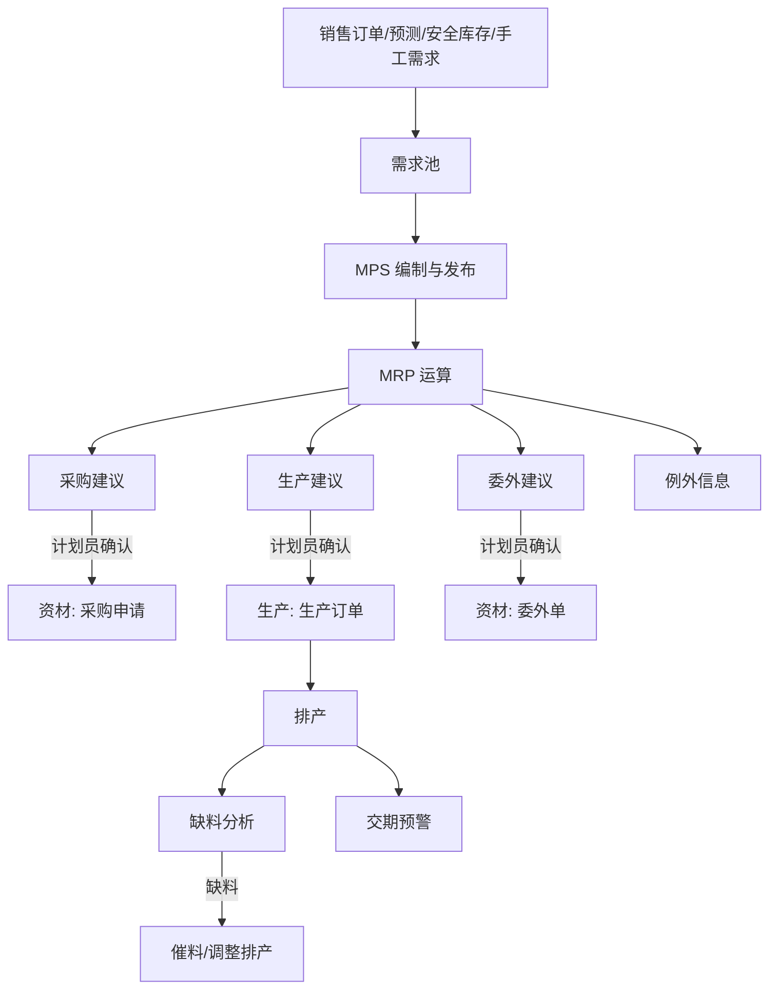

# 06 PMC（生产与物料控制）

## 1. 模块定位

PMC 是计划中枢：把销售订单和销售预测转成**主生产计划（MPS）**，通过 **MRP** 展开出采购建议、生产建议和委外建议，再做**排产**、**产能**评估、**缺料分析**和**交期预警**。PMC 不直接产生库存和财务数据，它的输出是各类“建议”和“计划”，由资材和生产确认后转为正式单据。

## 2. 用户角色

- **计划员（生管）**：维护 MPS、运行 MRP、排产、回复交期。
- **物控员**：缺料跟踪、催料、物料齐套分析。
- **PMC 主管**：审核 MPS、处理交期冲突、评审订单。

## 3. 功能清单

| 子功能 | 功能点 | 优先级 |
|---|---|---|
| 需求池（销售需求） | 汇总已审核销售订单行、销售预测（冲销后）、安全库存补充、样品需求、手工需求；显示每条需求的满足状态 | P0 |
| MPS | 按成品/关键半成品生成主计划（周/日桶）；计划员调整；审核发布；版本管理 | P1 |
| MRP 运算 | 全量/净变更运算；BOM 多级展开；毛需求 → 扣减现有库存/在途/在制/已分配 → 净需求；按批量规则和提前期倒排 | P0 |
| MRP 结果处理 | 采购建议 → 采购申请；生产建议 → 生产订单；委外建议 → 委外单；例外信息（提前/推迟/取消建议） | P0 |
| 排产 | 生产订单按工作中心/产线排程；甘特图拖拽；有限产能/无限产能两种模式；插单模拟 | P1 |
| 产能 | 工作中心产能日历（班次、节假日、停机）；负荷分析（负荷 vs 产能）；瓶颈识别 | P1 |
| 缺料分析 | 按生产订单/工单做齐套分析；缺料清单（缺什么、缺多少、何时要、在途何时到、谁负责） | P0 |
| 交期预警 | 订单交期 vs 预计完工日期；按风险等级预警；推送业务员和计划员 | P1 |
| 出货计划 | 按订单交期和成品库存生成出货计划（周计划/日计划），交由出货模块执行 | P1 |
| 交期回复 | 订单评审时，基于物料齐套和产能模拟给出可承诺交期（ATP/CTP 简化版） | P2 |

## 4. 核心流程

### 4.1 计划主流程



### 4.2 MRP 计算逻辑

对每个物料按低位码（Low-Level Code）从上往下逐层计算：

```
毛需求(t)   = 独立需求(t) + 上层父件计划订单下达量(t) × 用量 × (1+损耗率)
预计可用(t) = 上期预计可用 + 预计入库(t)[在途采购 + 在制生产] − 毛需求(t)
净需求(t)   = max(0, 安全库存 − 预计可用(t))
计划订单     = 按批量规则(按需/固定批量/MOQ/MPQ 取整/固定周期)对净需求取整
下达日期     = 需求日期 − 提前期(采购LT / 生产LT + 固定工艺周期)
```

- 现有库存只计算**可用库存**：合格状态、非冻结、非隔离库位、未被其他订单预留。
- 在途采购：已审核未到货的采购订单数量；在制：已下达未完工的生产订单数量。
- 替代料：主料不足时按替代优先级使用替代料库存（参数控制是否启用）。
- 虚拟件透过展开。
- 运算范围：全部物料 / 指定订单（单订单 MRP）/ 指定物料。

### 4.3 缺料分析

1. 选择生产订单/工单范围和日期。
2. 按工单开工日期先后顺序分配可用库存（先到先得，可手工调整优先级）。
3. 输出：每张工单的齐套率、缺料明细、对应在途采购单及预计到货日、采购员。
4. 缺料清单可一键推送到采购员待办（催料）。

## 5. 数据实体

| 实体 | 关键字段 |
|---|---|
| pmc_demand 需求池 | id, demand_type(订单/预测/安全库存/样品/手工), source_id, source_line_id, material_id, qty, required_date, customer_id, priority, fulfilled_qty, status |
| pmc_mps MPS 头 | 通用单头 + plan_version, period_type, horizon_start, horizon_end |
| pmc_mps_line | mps_id, material_id, period, demand_qty, planned_qty, released_qty |
| pmc_mrp_run MRP 运算记录 | id, run_type(全量/净变更/单订单), scope(JSON), params(JSON: 是否考虑安全库存/替代料/在途), started_at, finished_at, status(运行中/成功/失败), operator_id, error_msg |
| pmc_mrp_result MRP 结果 | run_id, material_id, suggestion_type(采购/生产/委外), qty, required_date, release_date, pegging(JSON: 需求来源), status(待处理/已转单/已忽略), converted_doc_id |
| pmc_mrp_exception 例外信息 | run_id, material_id, type(提前/推迟/取消/超期), doc_id, message |
| pmc_schedule 排产 | id, prod_order_id, operation_seq, work_center_id, equipment_id, plan_start, plan_end, qty, status, locked |
| pmc_capacity_calendar 产能日历 | work_center_id, date, shift_count, hours, is_holiday, remark |
| pmc_shortage 缺料快照 | id, snapshot_at, prod_order_id, material_id, required_qty, allocated_qty, shortage_qty, required_date, po_eta, buyer_id |
| pmc_delivery_alert 交期预警 | order_line_id, required_date, estimated_date, delay_days, level, reason, status |
| pmc_shipping_plan 出货计划 | 通用单头 + plan_week |
| pmc_shipping_plan_line | order_line_id, material_id, qty, plan_ship_date, available_qty, status |

## 6. 业务规则

1. MRP 运算期间对同一组织加**分布式锁**，禁止并发运行；运算中产生的业务单据变化由下一次净变更运算处理。
2. MRP 运算必须是**幂等**的：同样输入得到同样结果；新运算覆盖上一次“待处理”的建议，不影响已转单的建议。
3. MRP 在独立事务/异步任务中执行，运算失败不能影响业务单据；失败记录错误信息并通知计划员。
4. 建议转单时再次校验物料状态（停用物料不能转单）、供应商（采购建议带默认供应商）。
5. 低位码在 BOM 审核时重新计算。
6. 排产锁定（locked）的计划不被自动排程覆盖。
7. 有限产能排程：同一工作中心同一时间的负荷不超过产能；超出时顺延并产生交期预警。
8. 交期预警等级：预计延期 ≤ 2 天为提示，3～7 天为警告，> 7 天为严重（阈值可配置）。

## 7. 集成

| 方向 | 对象 | 内容 |
|---|---|---|
| 监听事件 | 销售 | `SalesOrderApprovedEvent / ChangedEvent / ClosedEvent`、`ForecastPublishedEvent` → 更新需求池 |
| 监听事件 | 研发工程 | `BomApprovedEvent`、`EcnEffectiveEvent` → 重算低位码、标记需重算 |
| 调用 | 研发工程 | BOM 展开、物料计划属性、工艺路线、工作中心 |
| 调用 | 仓库 | 可用库存、预留量 |
| 调用 | 资材 | 在途采购量、默认供应商 |
| 调用 | 生产 | 在制数量、工单进度 |
| 调用 | 资材 / 生产 | 建议转单：`PurchaseRequisitionApi.createFromMrp`、`ProductionOrderApi.createFromMrp`、`OutsourcingApi.createFromMrp` |
| 发布事件 | 工作台 | 缺料预警、交期预警 |
| 发布事件 | 出货 | `ShippingPlanPublishedEvent` |

## 8. 报表

- MRP 运算结果（按物料/按需求来源追溯 pegging）
- 物料供需平衡表（按日/周：期初、需求、供给、期末）
- 工作中心负荷图
- 缺料清单、齐套率
- 订单交期达成率、延期订单清单与原因分析
- 计划达成率（计划 vs 实际完工）

## 9. 权限点

`pmc:demand:query`、`pmc:mps:*`、`pmc:mrp:run / query / convert / ignore`、`pmc:schedule:*`、`pmc:capacity:*`、`pmc:shortage:query / push`、`pmc:alert:*`、`pmc:shipping-plan:*`

## 10. 非功能与异常

- 性能：1 万物料、5 层 BOM 的全量 MRP ≤ 5 分钟；运算在内存中批量计算，一次性读入库存/在途/在制，避免逐行查询数据库。
- MRP 运算中服务重启：运算记录状态为“运行中”超过阈值自动置为“失败”，允许重新运行。
- BOM 数据异常（循环、层数过深）：运算中检测到立即终止并报告具体物料。
