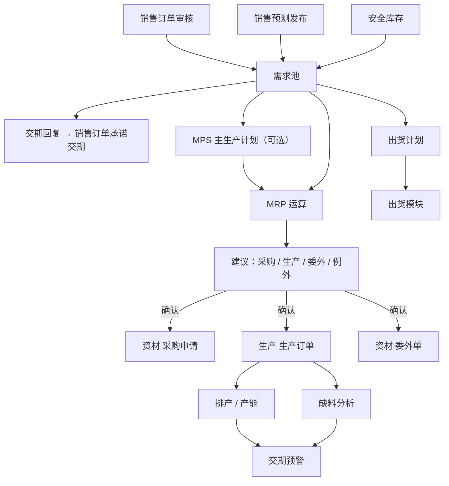

# 06 PMC（总览）

## 1. 模块定位

PMC 是计划中枢：汇总需求（销售订单、预测、安全库存）、回复交期、编制主生产计划（MPS）、运行 MRP 产生采购/生产/委外建议、排产与产能分析、缺料分析、交期预警、出货计划。

PMC 只产生**计划和建议**，不直接产生库存和财务数据；建议经计划员确认后，通过资材、生产模块的 API 转为正式单据。

## 2. 端到端流程

## 3. 功能与页面清单

| 功能 | 文档 | 页面 | 模板 | 路由 | 菜单权限 | 优先级 |
|---|---|---|---|---|---|---|
| 需求池与交期回复 | [01-需求池与交期回复](01-需求池与交期回复.md) | 需求池、交期回复 | T1 / 专用 | `/pmc/demand`、`/pmc/delivery-reply` | `pmc:demand:query` | P0 |
| MPS | [02-MPS](02-MPS.md) | MPS 列表 / 编制 | T1 / 专用矩阵 | `/pmc/mps` | `pmc:mps:query` | P1 |
| MRP 运算 | [03-MRP运算](03-MRP运算.md) | MRP 运算记录、供需平衡 | T1 / 专用 | `/pmc/mrp` | `pmc:mrp:query` | P0 |
| MRP 建议处理 | [04-MRP建议处理](04-MRP建议处理.md) | 建议列表（采购/生产/委外/例外） | T1 | `/pmc/mrp/suggestions` | `pmc:mrp:query` | P0 |
| 排产与产能 | [05-排产与产能](05-排产与产能.md) | 产能日历、排产甘特图、负荷分析 | 专用 | `/pmc/schedule`、`/pmc/capacity` | `pmc:schedule:query`、`pmc:capacity:query` | P1 |
| 缺料分析 | [06-缺料分析](06-缺料分析.md) | 齐套/缺料分析 | 专用 | `/pmc/shortage` | `pmc:shortage:query` | P0 |
| 交期预警 | [07-交期预警](07-交期预警.md) | 交期预警 | T1 | `/pmc/alert` | `pmc:alert:query` | P1 |
| 出货计划 | [08-出货计划](08-出货计划.md) | 出货计划 | T1 / T4 | `/pmc/shipping-plan` | `pmc:shipping-plan:query` | P1 |

菜单顺序：需求池、交期回复、MPS、MRP、排产、产能、缺料分析、交期预警、出货计划。

## 4. 用户角色

| 角色 | 功能 |
|---|---|
| 计划员（生管） | 交期回复、MPS、MRP 运算与建议确认、排产 |
| 物控员 | 缺料分析、催料（推送给采购员） |
| PMC 主管 | 全部，审核 MPS、处理交期冲突 |

计划员数据范围：MRP 建议按物料的计划员（`planner_id`）过滤；采购建议也可按采购员过滤。

## 5. 数据表

pmc_demand、pmc_mps、pmc_mps_line、pmc_mrp_run、pmc_mrp_result、pmc_mrp_pegging、pmc_mrp_exception、pmc_capacity_calendar、pmc_schedule、pmc_shortage_snapshot、pmc_delivery_alert、pmc_shipping_plan、pmc_shipping_plan_line。

## 6. 编码规则

PMC_MPS、PMC_MRP_RUN、PMC_SHIPPING_PLAN。

## 7. 系统参数

| 编码 | 分组 | 名称 | 类型 | 默认 | 说明 |
|---|---|---|---|---|---|
| pmc.mrp.horizon-days | MRP | 计划展望期（天） | INT | 180 | |
| pmc.mrp.use-mps | MRP | 成品需求取自 MPS | BOOL | 否 | 否：直接用需求池 |
| pmc.mrp.include-forecast | MRP | 计入净预测 | BOOL | 是 | |
| pmc.mrp.include-safety-stock | MRP | 计入安全库存 | BOOL | 是 | |
| pmc.mrp.use-substitute | MRP | 主料不足时使用替代料库存 | BOOL | 否 | |
| pmc.mrp.po-date-basis | MRP | 在途采购到货日期依据 | ENUM(CONFIRMED/REQUIRED) | CONFIRMED | 优先确认交期 |
| pmc.mrp.nightly | MRP | 夜间自动全量运算 | BOOL | 否 | 定时任务 02:30 |
| pmc.mrp.reschedule-tolerance-days | MRP | 例外信息容差（天） | INT | 3 | 供应日期与需求日期相差超过 N 天才产生提前/推迟建议 |
| pmc.alert.levels | 预警 | 交期预警阈值（天） | STRING | 2,7 | 延期 ≤2 天提示、3～7 天警告、>7 天严重 |
| pmc.schedule.mode | 排产 | 排产模式 | ENUM(INFINITE/FINITE) | INFINITE | 无限产能：只按提前期倒排；有限产能：按工作中心产能顺排 |

## 8. 对其他模块提供的 API（pmc-api）

| 接口 | 方法 | 使用方 |
|---|---|---|
| `PmcQueryApi` | `getShortage(prodOrderId)`、`getEstimatedDate(orderLineId)` | 生产、销售 |
| `ShippingPlanApi` | `getPlanLines(week)` | 出货 |

**发布事件**：`ShippingPlanPublishedEvent`、`DeliveryAlertRaisedEvent`、`MrpRunCompletedEvent`。

**监听事件**：销售 `SalesOrderApprovedEvent / ChangedEvent / ClosedEvent / UnapprovedEvent`、`ForecastPublishedEvent`；研发工程 `BomApprovedEvent`、`BomDefaultChangedEvent`、`EcnEffectiveEvent`、`MaterialChangedEvent`（计划属性）；资材 `PurchaseDeliveryDateChangedEvent`；生产 `ProductionOrderReleasedEvent`、`ProductionProgressEvent`；出货 `ShipmentConfirmedEvent`。

**调用**：研发工程 `BomApi`、`MaterialApi`、`RoutingApi`、`WorkCenterApi`；仓库 `InventoryQueryApi`；资材 `PurchaseQueryApi`、`PurchaseRequisitionApi.createFromMrp`、`OutsourcingApi.createFromMrp`；生产 `ProductionQueryApi`、`ProductionOrderApi.createFromMrp`；销售 `SalesOrderQueryApi`、`SalesOrderApi.updatePromisedDate`、`ForecastApi`。

## 9. 权限点汇总

| 分组 | 权限点 |
|---|---|
| 需求池 | `pmc:demand:query`（菜单）、`pmc:demand:create`（手工需求）、`pmc:delivery:reply`（交期回复） |
| MPS | `pmc:mps:query`（菜单）、`create`、`update`、`publish` |
| MRP | `pmc:mrp:query`（菜单）、`run`、`convert`（建议转单）、`ignore` |
| 排产 | `pmc:schedule:query`（菜单）、`run`、`adjust`、`apply`（回写生产订单日期） |
| 产能 | `pmc:capacity:query`（菜单）、`update`（产能日历） |
| 缺料 | `pmc:shortage:query`（菜单）、`push`（推送催料） |
| 预警 | `pmc:alert:query`（菜单）、`handle` |
| 出货计划 | `pmc:shipping-plan:query`（菜单）、`create`、`update`、`publish` |
