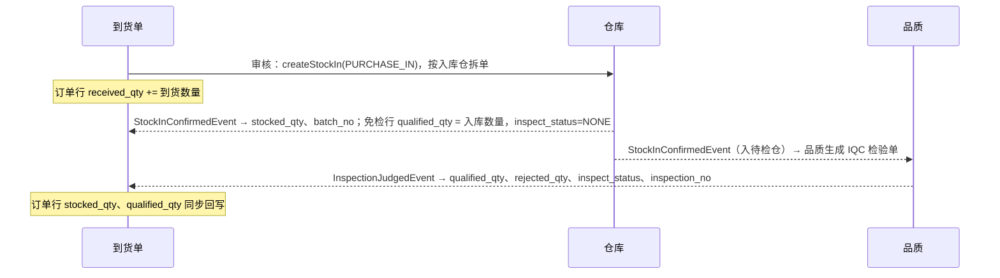

# 07-06 到货

## 1. 功能说明

供应商送货到厂后，收货员按采购订单登记到货（数量、批次信息）。到货单审核后自动生成仓库的采购入库单：需检物料入**待检仓**，免检物料入**物料默认仓**。之后的检验结果、入库、退货都回写到到货单行，形成一条完整的收货记录。

- 使用者：收货员（仓库）、采购员
- 优先级：P0

## 2. 数据表

### pur_receipt 到货单（BaseDocDO，编码规则 PUR_RECEIPT）

| 字段 | 类型 | 必填 | 说明 |
|---|---|---|---|
| supplier_id | id | 是 | |
| delivery_note_no | str(64) | 否 | 供应商送货单号 |
| arrival_at | datetime | 是 | 到货时间 |
| receipt_type | enum(PURCHASE/OUTSOURCE/SAMPLE) | 是 | 采购到货 / 委外收货 / 样品到货（样品订单） |
| receiver_id | id | 是 | 收货人 |

一张到货单只能对应一个供应商，可以包含多张采购订单的行。

状态：草稿 → 已审核（已生成入库单）→ 已完成（所有行检验和入库处理完毕）；草稿可删除。

### pur_receipt_line

| 字段 | 类型 | 必填 | 说明 |
|---|---|---|---|
| line_no | int | 是 | |
| order_id / order_line_id | id | 是 | 来源采购订单行（委外收货为委外单） |
| material_id | id | 是 | |
| uom | str(16) | 是 | 订单单位 |
| qty | qty | 是 | 到货数量（订单单位） |
| base_qty | qty | 是 | |
| supplier_batch_no | str(64) | 否 | 供应商批号 |
| production_date | date | 条件 | 物料有保质期时必填 |
| inspect_required | bool | 是 | 是否需检（取物料质量属性，收货员不能修改） |
| target_warehouse_id | id | 是 | 需检：默认待检仓；免检：物料默认仓 |
| stock_in_id | id | 否 | 生成的入库单 |
| stocked_qty | qty | 是 | 已入库（基本单位） |
| batch_no | str(64) | 否 | 入库批次号（入库确认后回写） |
| inspect_status | enum(NONE/PENDING/QUALIFIED/CONCESSION/REJECTED/PARTIAL) | 是 | 免检 / 待检 / 合格 / 特采 / 不合格 / 部分合格 |
| qualified_qty | qty | 是 | 合格（含特采） |
| rejected_qty | qty | 是 | 不合格 |
| returned_qty | qty | 是 | 已退货 |
| inspection_no | str(64) | 否 | 检验单号 |
| remark | str(256) | 否 | |

## 3. 页面

### 3.1 到货单列表（T1）

查询：单号、供应商、送货单号、采购订单号、物料、检验状态、状态、到货日期（默认近 30 天）。
列：单号（链接）、类型、供应商、送货单号、到货时间、物料摘要、行数、检验状态汇总（如“待检 2 / 合格 1”）、入库状态（全部入库 / 部分 / 未入库）、收货人、状态、操作。
工具栏：[新建到货]、[导出]。

### 3.2 编辑页（T4）

**单头**：到货类型*、供应商*（选择后只能选该供应商的订单）、送货单号、到货时间*（默认当前时间）、收货人*（默认当前用户）、备注、附件（送货单照片）。

**明细**：主要通过 [选择采购订单行]（SourceDocPicker：该供应商已审核/执行中、未到货数量 > 0 的订单行，显示订单号、物料、订购、已到货、未到货、要求日期、确认交期）带入；也可在明细中扫描/输入“采购订单号-行号”快速添加。

| 列 | 控件 | 必填 | 说明 |
|---|---|---|---|
| 订单号-行号 | 只读 | | |
| 物料 / 名称 / 规格 | 只读 | | |
| 单位 | 只读 | | 订单单位 |
| 未到货 | 只读 | | |
| 到货数量 | QtyInput | 是 | 默认 = 未到货；R02 |
| 供应商批号 | 输入框 | 否 | |
| 生产日期 | 日期 | 条件 | 有保质期必填；R03 |
| 需检 | 只读（是/否） | | |
| 入库仓 | 只读 | | 自动：需检 → 待检仓；免检 → 物料默认仓 |
| 备注 | 输入框 | 否 | |

页头：[保存] [审核]（`pur:receipt:approve`）。

### 3.3 详情页（T5）

按钮：编辑/删除（草稿）、审核（草稿）、反审核（已审核且生成的入库单均未确认；`pur:receipt:unapprove`）、打印（收货单）。
页签：明细（含入库、检验、退货各数量与状态）、关联单据（采购订单、入库单、检验单、检验调拨单、退货单）、操作日志、附件。

## 4. 处理流程与回写

- 到货单审核即回写采购订单 received_qty（占用未到货数量，防止重复收货）。
- 入库单被仓库退回（`StockDocRejectedEvent`）时：到货单保持已审核，行上显示“入库被退回：原因”，并通知收货员和采购员；处理方式为反审核到货单后修改重新审核。
- 所有行 stocked_qty = base_qty 且检验状态非 PENDING 时，到货单状态变为已完成。

## 5. 业务规则

| 编号 | 触发 | 规则 | 提示原文 |
|---|---|---|---|
| PUR-RC-R01 | 保存 | 订单行属于该供应商且订单为已审核/执行中；订单行未关闭 | `采购订单「{no}」不是已审核状态` |
| PUR-RC-R02 | 保存 | 到货数量 ≤ 未到货数量 × (1 + 超收比例)（物料超收比例，未设置取参数默认值） | `第 {n} 行到货数量超过允许数量 {max}` |
| PUR-RC-R03 | 保存 | 有保质期的物料：生产日期必填且不晚于今天；剩余保质期比例 < 物料最小剩余比例时按参数警告或阻止 | `第 {n} 行剩余保质期 {pct}%，低于要求 {min}%` |
| PUR-RC-R04 | 审核 | 供应商为暂停状态时提示但允许（已下订单可到货）；淘汰状态阻止 | `供应商已淘汰，不能收货` |
| PUR-RC-R05 | 审核 | 生成入库单（按入库仓拆分）；参数 `inv.in.auto-confirm-source` 打开时自动确认 | — |
| PUR-RC-R06 | 反审核 | 生成的入库单全部未确认：作废入库单，扣回订单 received_qty；有已确认的入库单时阻止 | `入库单「{no}」已入库，不能反审核` |
| PUR-RC-R07 | 超收 | 超收部分在订单行上表现为 received_qty > base_qty，行状态为已收齐 | — |
| PUR-RC-R08 | 样品到货 | 只能选择样品类型订单 | `样品到货只能选择样品订单` |

## 6. 接口

`/purchase/receipts`（CRUD）、`/{id}/approve`、`/{id}/unapprove`、`/{id}/print-data`；`GET /purchase/order-lines/open`（选单）。

## 7. 验收用例

| 编号 | 前置条件 | 操作 | 预期结果 |
|---|---|---|---|
| PUR-RC-T01 | PO 行 A 1000（需检）、B 50（免检，辅料） | 登记到货并审核 | 生成两张入库单：A → 待检仓、B → 辅料仓；订单 received_qty 更新 |
| PUR-RC-T02 | 超收比例 5% | 到货 1060 | 提示“第 1 行到货数量超过允许数量 1050” |
| PUR-RC-T03 | A 入库确认 | — | 品质出现 IQC 单；到货行显示已入库 1000、待检 |
| PUR-RC-T04 | IQC 判定合格 980、不合格 20 | — | 到货行合格 980、不合格 20、状态部分合格；订单行 qualified_qty 980 |
| PUR-RC-T05 | 入库单已确认 | 反审核到货单 | 提示“入库单「IN-…」已入库，不能反审核” |
| PUR-RC-T06 | 物料保质期 180 天，最小剩余 2/3 | 生产日期为 90 天前 | 提示剩余保质期 50%，低于要求 66.67% |
