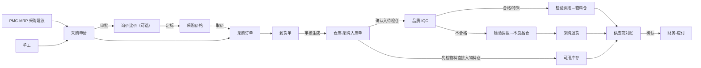

# 07 资材（总览）

## 1. 模块定位

资材负责**供应商主数据**和**采购到收货**的全过程：供应商准入、采购价格、采购申请、询价比价、采购订单、到货、委外加工、采购退货、供应商对账和评估。

边界：
- 物料主数据归研发工程；
- 来料检验（IQC）归品质：到货的物料入待检仓后，品质生成检验单；
- 入库记账归仓库：到货单审核后生成仓库入库单，仓管员确认入库；
- 应付账款归财务：供应商对账单确认后，财务生成应付单。

## 2. 端到端流程

## 3. 功能与页面清单

| 功能 | 文档 | 页面 | 模板 | 路由 | 菜单权限 | 优先级 |
|---|---|---|---|---|---|---|
| 供应商 | [01-供应商](01-供应商.md) | 列表 / 编辑 / 详情 | T1 / T3 / T5 | `/purchase/supplier` | `pur:supplier:query` | P0 |
| 采购价格 | [02-采购价格](02-采购价格.md) | 价格列表 / 调价单 | T1 / T4 | `/purchase/price` | `pur:price:query` | P0 |
| 采购申请 | [03-采购申请](03-采购申请.md) | 列表 / 编辑 / 详情 | T1 / T4 / T5 | `/purchase/requisition` | `pur:requisition:query` | P0 |
| 询价比价 | [04-询价比价](04-询价比价.md) | 列表 / 编辑 / 比价 | T1 / T4 / 专用 | `/purchase/rfq` | `pur:rfq:query` | P1 |
| 采购订单 | [05-采购订单](05-采购订单.md) | 列表 / 编辑 / 详情 / 变更 / 交期跟踪 | T1 / T4 / T5 | `/purchase/order` | `pur:order:query` | P0 |
| 到货 | [06-到货](06-到货.md) | 列表 / 编辑 / 详情 | T1 / T4 / T5 | `/purchase/receipt` | `pur:receipt:query` | P0 |
| 委外加工 | [07-委外加工](07-委外加工.md) | 列表 / 编辑 / 详情 | T1 / T4 / T5 | `/purchase/outsourcing` | `pur:outsourcing:query` | P1 |
| 采购退货 | [08-采购退货](08-采购退货.md) | 列表 / 编辑 / 详情 | T1 / T4 / T5 | `/purchase/return` | `pur:return:query` | P0 |
| 供应商对账 | [09-供应商对账](09-供应商对账.md) | 列表 / 编辑 / 详情 | T1 / T4 / T5 | `/purchase/statement` | `pur:statement:query` | P1 |
| 供应商评估 | [10-供应商评估](10-供应商评估.md) | 评估结果 | T1 | `/purchase/score` | `pur:score:query` | P1 |
| 采购报表 | [11-采购报表](11-采购报表.md) | 订单执行、逾期未到货、价格趋势、采购汇总 | T7 | `/purchase/report` | `pur:report:query` | P1 |

菜单顺序：供应商、采购价格、采购申请、询价、采购订单、到货、委外、采购退货、对账、供应商评估、采购报表。

## 4. 用户角色与数据权限

| 角色 | 功能 | 数据范围建议 |
|---|---|---|
| 采购员 | 询价、下单、跟单、到货、退货、对账 | 仅本人（按单据 owner_id = 采购员；供应商按 buyer_id） |
| 采购主管 | 审批订单、价格、供应商准入 | 本部门及下级 |
| 收货员（仓库） | 登记到货 | 全部（按仓库） |
| SQE | 供应商准入审核、评估 | 全部 |
| 计划员 | 采购申请 | 仅本人 |

## 5. 数据表

pur_supplier、pur_supplier_contact、pur_supplier_bank、pur_supplier_cert、pur_supplier_material、pur_price、pur_price_adjust、pur_price_adjust_line、pur_requisition、pur_requisition_line、pur_rfq、pur_rfq_line、pur_rfq_supplier、pur_rfq_quote、pur_order、pur_order_line、pur_order_change、pur_order_change_line、pur_receipt、pur_receipt_line、pur_outsourcing、pur_outsourcing_material、pur_return、pur_return_line、pur_statement、pur_statement_line、pur_supplier_score。

## 6. 编码规则

PUR_SUPPLIER、PUR_REQUISITION、PUR_RFQ、PUR_ORDER、PUR_RECEIPT、PUR_OUTSOURCING、PUR_RETURN、PUR_STATEMENT；调价单 PUR_PRICE_ADJUST（`PA-yyyyMM-4`，月重置）；订单变更单 PUR_ORDER_CHANGE（`PC-yyyyMM-4`）。

## 7. 内置字典

| 类型编码 | 名称 | 内置项 |
|---|---|---|
| pur_supplier_type | 供应商类型 | MANUFACTURER 生产商、TRADER 贸易商、OUTSOURCER 委外加工商、SERVICE 服务商 |
| pur_supplier_level | 供应商等级 | A、B、C、D |
| pur_cert_type | 供应商资质类型 | LICENSE 营业执照、ISO9001、ISO14001、IATF16949、ROHS_REPORT 环保报告、OTHER 其他 |
| pur_requisition_type | 申请类型 | MRP 计划申请、MANUAL 手工申请、SAMPLE 样品、EXPENSE 费用类 |
| pur_return_reason | 退货原因 | IQC_REJECT 检验不合格、STOCK_DEFECT 库存不良、OVER_RECEIPT 多收、PRODUCTION_DEFECT 制程发现来料不良、OTHER 其他 |

## 8. 可审批单据

| 单据类型 | 名称 | 条件字段 | 用户字段 |
|---|---|---|---|
| PUR_SUPPLIER_QUALIFY | 供应商准入 | supplierType | buyerId |
| PUR_PRICE_ADJUST | 调价单 | maxIncreasePct（最大涨幅%）、amountImpactBase | — |
| PUR_REQUISITION | 采购申请 | requisitionType、amountBase（按参考价估算） | — |
| PUR_ORDER | 采购订单 | amountBase、supplierLevel、hasPriceOverrun（是否有超价格表的行，布尔） | buyerId |
| PUR_ORDER_CHANGE | 采购订单变更 | amountChangeBase | buyerId |
| PUR_RETURN | 采购退货 | amountBase、returnReason | — |
| PUR_STATEMENT | 供应商对账单 | amountBase | — |

## 9. 可打印单据

PUR_ORDER（采购订单，中文 + 英文，发给供应商）、PUR_RECEIPT（到货单/收货单）、PUR_RETURN（退货单）、PUR_STATEMENT（对账单）、PUR_OUTSOURCING（委外加工单）。

## 10. 系统参数

| 编码 | 分组 | 名称 | 类型 | 默认 | 说明 |
|---|---|---|---|---|---|
| pur.order.require-price | 订单 | 下单必须有有效采购价格 | ENUM(NONE/WARN/BLOCK) | WARN | 没有有效价格时的处理 |
| pur.order.price-overrun-pct | 订单 | 单价超出价格表的容差（%） | DECIMAL | 0 | 超出时订单行标记“超价”，可在审批流条件中使用 |
| pur.order.require-approved-supplier-material | 订单 | 物料必须在供应商的合格可供物料中 | BOOL | 是 | |
| pur.receipt.over-receive-default-pct | 到货 | 默认超收比例（物料未设置时） | DECIMAL | 0 | |
| pur.receipt.min-remaining-life-check | 到货 | 剩余保质期不足时 | ENUM(WARN/BLOCK) | WARN | |
| pur.delivery.ontime-tolerance-days | 评估 | 准时交货容差（天） | INT | 0 | 到货日期 ≤ 确认交期 + N 天视为准时 |
| pur.score.weights | 评估 | 评估权重 | STRING | 40,30,20,10 | 质量、交期、价格、服务，合计 100 |
| pur.overdue.remind-days | 跟单 | 交期前提醒天数 | INT | 3 | 确认交期前 N 天未到货提醒采购员 |

## 11. 对其他模块提供的 API（purchase-api）

| 接口 | 方法 | 使用方 |
|---|---|---|
| `SupplierApi` | `getSupplier`、`validateQualified`（已定义）、`search`、`getDefaultSupplier(materialId)` | 品质、财务、研发工程 |
| `PurchasePriceApi` | `getEffectivePrice(supplierId, materialId, qty, date, currency)`、`getLatestPrice(materialId)` | 销售（报价核算）、财务 |
| `PurchaseQueryApi` | `getInTransitQty(materialIds)`（已审核未到货数量，基本单位，含预计到货日期明细）、`getOpenQtyByMaterial(materialId)` | PMC、仓库、研发工程（ECN） |
| `PurchaseRequisitionApi` | `createFromMrp(List<MrpSuggestion>)` → 申请单 ID | PMC |
| `OutsourcingApi` | `createFromMrp(...)` | PMC |

**发布事件**：`PurchaseOrderApprovedEvent`、`PurchaseOrderChangedEvent`、`PurchaseReceiptApprovedEvent`、`PurchaseReturnCompletedEvent`、`PurchaseStatementConfirmedEvent`、`SupplierStatusChangedEvent`。

**监听事件**：仓库 `StockInConfirmedEvent` / `StockInReversingEvent` / `StockInReversedEvent`（采购入库、委外入库）、`StockOutConfirmedEvent`（采购退货出库、委外发料）；品质 `InspectionJudgedEvent`（IQC 结果回写到货行）、`SupplierQualityEvent`（评估用）；仓库 `StockDocRejectedEvent`（入库单被退回）。

## 12. 权限点汇总

| 分组 | 权限点 |
|---|---|
| 供应商 | `pur:supplier:query`（菜单）、`create`、`update`、`qualify`（提交准入）、`suspend`、`eliminate`、`delete`、`import`、`export` |
| 采购价格 | `pur:price:query`（菜单）、`adjust`（新建调价单）、`submit`、`import`、`export`；字段 `pur:price:view`（查看采购单价与金额，全模块生效） |
| 采购申请 | `pur:requisition:query`（菜单）、`create`、`update`、`delete`、`submit`、`close`、`to-order`（转订单） |
| 询价 | `pur:rfq:query`（菜单）、`create`、`update`、`delete`、`quote`（录入报价）、`award`（定标） |
| 采购订单 | `pur:order:query`（菜单）、`create`、`update`、`delete`、`submit`、`unapprove`、`change`、`close`、`void`、`confirm-date`（回复交期）、`print`、`export` |
| 到货 | `pur:receipt:query`（菜单）、`create`、`update`、`delete`、`approve`、`unapprove`、`print` |
| 委外 | `pur:outsourcing:query`（菜单）、`create`、`update`、`delete`、`submit`、`issue`（发料）、`receive`（收货）、`close`、`print` |
| 采购退货 | `pur:return:query`（菜单）、`create`、`update`、`delete`、`submit`、`void`、`print` |
| 对账 | `pur:statement:query`（菜单）、`create`、`update`、`delete`、`submit`、`confirm`（供应商确认）、`unconfirm`、`print` |
| 评估 | `pur:score:query`（菜单）、`calculate`、`update`（手工评分） |
| 报表 | `pur:report:query`（菜单）、`export` |
