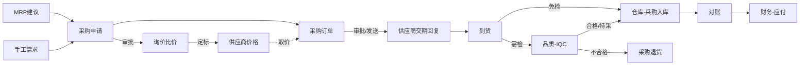

# 07 资材（采购与供应商）

## 1. 模块定位

资材模块负责**供应商主数据**和**采购到收货**的过程：采购申请、询价比价、采购订单、到货、委外加工、采购退货和采购分析。物料主数据归研发工程；来料检验（IQC）归品质模块，本模块在到货单上显示检验状态并通过事件联动；入库记账归仓库模块；应付账款归财务模块。

## 2. 用户角色

- **采购员**：询价、下单、跟单、催料、对账。
- **采购主管**：审批采购订单、供应商准入和评估。
- **SQE（供应商质量工程师）**：参与供应商准入审核、质量评分（与品质模块协作）。
- **收货员**（仓库）：登记到货。

## 3. 功能清单

| 子功能 | 功能点 | 优先级 |
|---|---|---|
| 供应商档案 | 基本信息、联系人、银行、资质证书（营业执照、ISO9001/14001 等）及有效期；供货范围（可供物料）；结算币别和付款条件 | P0 |
| 供应商准入 | 潜在供应商 → 资质审核 → 样品承认 → 小批量试用 → 合格供应商（AVL）；准入审批 | P1 |
| 供应商价格 | 物料 × 供应商价格（阶梯价、有效期、含税/不含税）；价格审批；历史价格 | P0 |
| 物料配额 | 同一物料多个供应商的采购比例 | P2 |
| 采购申请 | 手工申请、MRP 建议转入；申请审批；合并/拆分申请转采购订单 | P0 |
| 询价/比价 | 发起询价单给多家供应商；录入报价；比价表；定标后更新供应商价格 | P1 |
| 采购订单 | 手工/由申请生成；自动取价；分批交期；审批；打印/邮件发送给供应商；订单变更；关闭 | P0 |
| 交期跟踪 | 供应商回复交期；逾期未到货预警；催料记录 | P0 |
| 到货 | 按采购订单登记到货（数量、批次号、供应商批号、生产日期）；推送 IQC；免检物料直接入库 | P0 |
| 委外加工 | 委外订单（加工费）；发料给委外商；委外收货；委外损耗核算 | P1 |
| 采购退货 | IQC 判退或库存退货 → 退货单 → 出库 → 冲减应付 | P0 |
| 供应商对账 | 按月生成对账单（入库 − 退货），供应商确认后推送财务生成应付 | P1 |
| 供应商评估 | 按月/季度：质量（批次合格率）、交期（准时率）、价格、服务打分，自动计算 + 手工评分；分级 A/B/C/D | P1 |
| 采购分析 | 采购金额、价格趋势、供应商份额、到货准时率 | P1 |

## 4. 核心流程

## 5. 数据实体

| 实体 | 关键字段 |
|---|---|
| pur_supplier 供应商 | id, code, name, name_en, short_name, type(生产商/贸易商/委外商), status(潜在/合格/暂停/淘汰), level, country, tax_no, currency, payment_term_id, buyer_id, address, website |
| pur_supplier_contact / pur_supplier_bank | 联系人 / 银行信息 |
| pur_supplier_cert 资质 | supplier_id, cert_type, cert_no, issue_date, expire_date, file_id |
| pur_supplier_material 可供物料 | supplier_id, material_id, supplier_part_no, status(试用/合格/停用), approved_at, lead_time_days, moq, mpq |
| pur_price 采购价格 | supplier_id, material_id, currency, min_qty, price, tax_rate, tax_included, effective_from, effective_to, source(询价/手工/合同), status, price_formula_id |
| pur_requisition 采购申请 | 通用单头 + demand_type(MRP/手工/样品/费用), required_date |
| pur_requisition_line | material_id, qty, required_date, suggested_supplier_id, ordered_qty, mrp_result_id |
| pur_rfq 询价单 | 通用单头 + deadline |
| pur_rfq_line / pur_rfq_quote | 询价物料 / 各供应商报价（price, lead_time, moq, valid_until, is_awarded） |
| pur_order 采购订单 | 通用单头 + supplier_id, currency, exchange_rate, payment_term_id, trade_term, buyer_id, total_amount, total_tax, order_type(标准/委外/样品) |
| pur_order_line | material_id, qty, uom, base_qty, unit_price, tax_rate, amount, required_date, confirmed_date, received_qty, returned_qty, stocked_qty, invoiced_qty, requisition_line_id |
| pur_receipt 到货单 | 通用单头 + supplier_id, delivery_note_no, arrival_time |
| pur_receipt_line | order_line_id, material_id, qty, batch_no, supplier_batch_no, production_date, expire_date, inspect_status(免检/待检/合格/不合格/特采), qualified_qty, rejected_qty, stocked_qty |
| pur_outsourcing 委外单 | 通用单头 + supplier_id, material_id(加工成品), qty, process_fee, issued_material(JSON) |
| pur_return 采购退货 | 通用单头 + supplier_id, reason_type(IQC判退/库存退货/超收) |
| pur_return_line | receipt_line_id / order_line_id, material_id, batch_no, qty |
| pur_statement 对账单 | 通用单头 + supplier_id, period, amount, confirmed_at |
| pur_supplier_score 供应商评估 | supplier_id, period, quality_score, delivery_score, price_score, service_score, total, level |

## 6. 业务规则

1. **供应商校验**：只有“合格”状态的供应商才能下正式采购订单；“潜在”供应商只能下样品单；资质过期的供应商禁止下单并预警。
2. **可供物料校验**：采购订单行的物料必须在该供应商的可供物料（合格）清单中（参数可关闭）。
3. **取价规则**：有效期内的供应商价格 → 按数量命中阶梯 → 无价格时允许手工输入但需审批；单价高于上次采购价 X% 或高于价格表需审批。
4. **MOQ/MPQ**：低于 MOQ 警告；按 MPQ 向上取整。
5. **超收控制**：到货数量 ≤ 订单剩余数量 × (1 + 物料超收比例)；超出拒收。
6. **数量回写**：到货回写 `received_qty`；入库回写 `stocked_qty`；退货回写 `returned_qty`；应付开票回写 `invoiced_qty`。
7. **到货批次**：批次管理物料到货时必须录入批次（或自动生成）；有保质期的物料必须录入生产日期，系统计算到期日；剩余保质期 < 设定比例（默认 2/3）时提示拒收。
8. **检验联动**：物料质量属性为“需检”时，到货审核后物料入**待检仓**，并发布 `ReceiptCreatedEvent`，品质自动生成 IQC 检验单；检验合格/特采后调入物料默认仓（原材料/FPC/电子料/包材/辅料仓），不合格调入不良品仓。免检物料到货后直接入默认仓。
9. **委外**：委外发料通过仓库“委外发料出库”，委外收货时按 BOM 核销已发料，超耗需说明原因。
10. **订单变更**：已到货数量以下不能减量；变更需审批并通知供应商（重新发送 PO）。

## 7. 集成

| 方向 | 对象 | 内容 |
|---|---|---|
| 提供 API | PMC | `PurchaseRequisitionApi.createFromMrp`、`OutsourcingApi.createFromMrp`、`PurchaseQueryApi.getInTransitQty` |
| 提供 API | 品质、财务 | `SupplierApi`（查询、状态校验） |
| 调用 | 研发工程 | 物料属性（采购/质量属性） |
| 调用 | 仓库 | 采购入库、采购退货出库、委外发料出库 |
| 发布事件 | 品质 | `ReceiptCreatedEvent`（生成 IQC） |
| 发布事件 | 财务 | `PurchaseStatementConfirmedEvent`（生成应付）、`PurchaseReturnApprovedEvent` |
| 监听事件 | 品质 | `IqcCompletedEvent`（回写到货检验状态，合格数量可入库；不合格自动生成退货建议）、`SupplierQualityScoreEvent` |
| 监听事件 | 仓库 | `StockInApprovedEvent`（回写入库数量） |

## 8. 报表

- 采购订单执行表（下单、到货、检验、入库、退货、开票）
- 逾期未到货清单
- 采购价格趋势（按物料）、价格差异分析（实际价 vs 标准价）
- 供应商交货准时率、批次合格率、评估排名
- 采购金额分析（按供应商/物料类别/采购员/月份）

## 9. 权限点

`pur:supplier:*`、`pur:price:query / create / approve`、`pur:price:view`（价格字段）、`pur:requisition:*`、`pur:rfq:*`、`pur:order:query / create / update / submit / approve / close / change / print`、`pur:receipt:*`、`pur:outsourcing:*`、`pur:return:*`、`pur:statement:*`、`pur:score:*`
