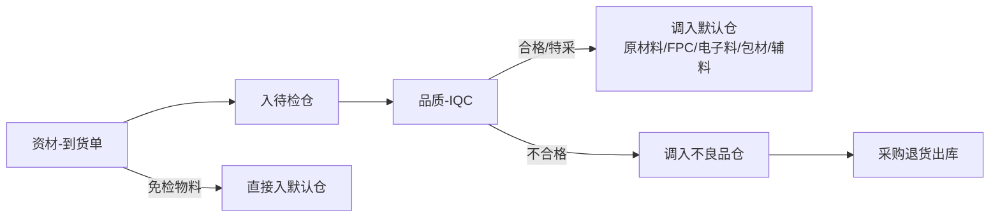
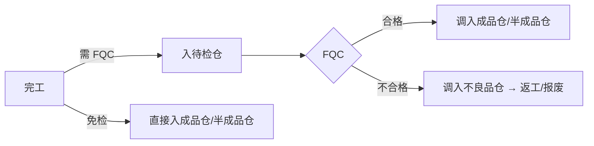
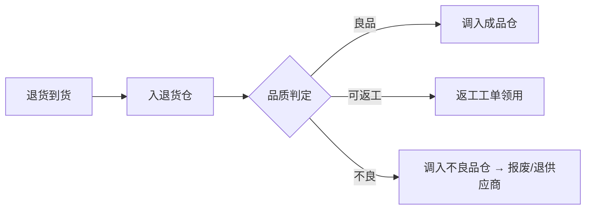
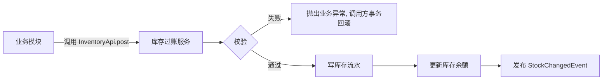

# 08 仓库

## 1. 模块定位

仓库模块是**库存的唯一记账方**。任何模块要改变库存（入库、出库、调拨、盘点、质量状态变化），都必须调用仓库模块的库存 API，由仓库统一写**库存流水**并更新**库存余额**。其他模块不能直接修改库存表。

## 2. 仓库分类

本企业按以下 10 类仓库管理库存。仓库类型是字典值，后续新增仓库类型只需加字典项，不改代码。

| 编码 | 仓库类型 | 存放内容 | 库存是否可用 | 说明 |
|---|---|---|---|---|
| RAW | 原材料仓 | 一般原材料（结构件、五金、塑胶件等） | 可用 | IQC 合格后从待检仓调入 |
| SEMI | 半成品仓 | 自制半成品 | 可用 | 半成品完工入库、下道工序领用 |
| FG | 成品仓 | 成品 | 可用 | 完工入库（FQC 合格）、销售出库 |
| FPC | FPC 仓 | FPC 柔性线路板 | 可用 | 独立仓位管理，IQC 合格后从待检仓调入 |
| ELEC | 电子料仓 | 电子元器件（IC、电阻电容、PCB、连接器等） | 可用 | IQC 合格后从待检仓调入 |
| PKG | 包材仓 | 纸箱、彩盒、泡棉、标签、说明书等 | 可用 | IQC 合格（或免检）后入库 |
| AUX | 辅料仓 | 胶水、胶带、焊锡、清洁用品、劳保等 | 可用 | 常为免检，可直接入库；按部门领用 |
| NG | 不良品仓 | IQC 判退、制程不良、退料不良、退货判定不良 | **不可用** | 只能做退供应商、返工、报废处理 |
| QC | 待检仓 | 已到货未检验的物料、待 FQC 的成品 | **不可用** | 检验合格后调到对应仓，不合格调到不良品仓 |
| RTN | 退货仓 | 客户退回的产品 | **不可用** | 品质判定后转成品仓、不良品仓或返工 |

**默认仓规则**：每个物料类别配置一个默认仓（如 FPC 类 → FPC 仓，电子料类 → 电子料仓），检验合格后的入库和调拨默认带出该仓，允许手工修改为同类型的其他仓。

**可用性规则**：只有“可用”类型仓库中、质量状态为“合格”的库存，才能被 MRP 计算、生产领料和销售出库使用。

## 3. 用户角色

- **仓管员**：收货、入库、发料、出库、调拨、盘点。
- **仓库主管**：审核盘点差异、维护仓库库位、处理库存预警、月结。

## 4. 功能清单

| 子功能 | 功能点 | 优先级 |
|---|---|---|
| 仓库与库位 | 仓库（10 类，见第 2 节）；库位（区-排-层-位，可选启用）；仓库负责人 | P0 |
| 库存查询 | 按物料/物料类别/仓库/仓库类型/库位/批次/质量状态查询；现存量、可用量、预留量 | P0 |
| 入库 | 采购入库、生产完工入库、生产退料入库、销售退货入库、委外入库、其他入库（盘盈、客供料、赠品） | P0 |
| 出库 | 生产领料出库、销售出库、采购退货出库、委外发料出库、其他出库（报废、样品、研发领用、部门领用） | P0 |
| 调拨 | 仓库间调拨（如待检仓 → 电子料仓）、库位间移库 | P0 |
| 盘点 | 盘点计划（全盘/按仓库盘/循环盘）；冻结；盘点表；实盘录入；差异审核；生成盘盈盘亏 | P0 |
| 批次 | 批次档案（供应商批号、生产日期、有效期、来源单据）；批次冻结/解冻 | P0 |
| 序列号 | 序列号管理物料的出入库记录与查询（物料属性启用时） | P1 |
| 库存预留 | 为销售订单/生产订单预留库存 | P1 |
| 库存预警 | 安全库存、最高库存、呆滞、临期/过期 | P1 |
| 库存分析 | 收发存汇总、库存金额（按仓库类型）、库龄、周转率、呆滞料 | P1 |
| 期初导入 | 上线期初库存导入（含批次、成本） | P0 |
| 月结 | 关闭当期出入库，计算期末结存，交财务核算成本 | P1 |

## 5. 核心流程

### 5.1 采购来料

### 5.2 生产完工

### 5.3 客户退货

### 5.4 库存记账统一入口

**过账请求**：业务单据类型、单据 ID/行 ID、方向（入/出）、物料、仓库、库位、批次、数量、单位、单价（入库时）、业务日期。

### 5.5 盘点

盘点计划 → 冻结仓库/库位 → 生成盘点表（账存快照）→ 录入实盘 → 计算差异 → 差异超阈值复盘 → 差异审核 → 生成盘盈盘亏单 → 解冻。

## 6. 数据实体

| 实体 | 关键字段 |
|---|---|
| inv_warehouse 仓库 | id, code, name, warehouse_type(RAW/SEMI/FG/FPC/ELEC/PKG/AUX/NG/QC/RTN), available(是否可用仓), org_id, manager_id, location_enabled, status |
| inv_location 库位 | id, warehouse_id, code, zone, row, level, position, status |
| inv_category_warehouse 类别默认仓 | material_category_id, warehouse_id |
| inv_stock 库存余额 | id, material_id, warehouse_id, location_id, batch_no, quality_status, qty, reserved_qty, version |
| inv_stock_txn 库存流水 | id, txn_type, direction, material_id, warehouse_id, location_id, batch_no, qty, unit_cost, amount, balance_qty_after, biz_type, biz_id, biz_line_id, biz_date, created_by, created_at |
| inv_batch 批次档案 | material_id, batch_no, supplier_id, supplier_batch_no, production_date, expire_date, source_doc, frozen |
| inv_serial 序列号 | sn, material_id, batch_no, status(在库/已出库/已报废), warehouse_id |
| inv_stock_in 入库单 | 通用单头 + in_type, warehouse_id |
| inv_stock_in_line | material_id, location_id, batch_no, qty, unit_cost, source_line_id |
| inv_stock_out 出库单 | 通用单头 + out_type, warehouse_id |
| inv_stock_out_line | material_id, location_id, batch_no, qty, source_line_id |
| inv_transfer 调拨单 | 通用单头 + from_warehouse_id, to_warehouse_id, reason(检验合格/检验不合格/退货判定/移库/其他) |
| inv_transfer_line | material_id, from_location_id, to_location_id, batch_no, qty |
| inv_count 盘点单 | 通用单头 + count_type, scope(JSON), snapshot_at |
| inv_count_line | material_id, warehouse_id, location_id, batch_no, book_qty, count_qty, diff_qty, recount_qty, reason |
| inv_reservation 预留 | material_id, warehouse_id, batch_no, qty, biz_type, biz_id, status |
| inv_period 库存期间 | period, status(未结/已结) |

## 7. 业务规则

1. **唯一记账入口**：库存只能通过 `InventoryApi` 修改；每笔变动必须有来源单据；流水只增不改，冲销用反向流水。
2. **仓库类型约束**：
   - 待检仓、不良品仓、退货仓为不可用仓，不能做生产领料和销售出库。
   - 需检物料到货只能进待检仓；免检物料可直接进默认仓。
   - 从待检仓调出必须有检验结论：合格/特采 → 可用仓；不合格 → 不良品仓（由 IQC/FQC 判定自动生成调拨单，也可手工调拨但需引用检验单）。
   - 销售退货只能入退货仓，调出必须引用品质判定结果。
   - 不良品仓只能做：采购退货出库、报废出库、返工领料、调回待检仓复检。
   - 成品只能入成品仓（或待检仓），半成品只能入半成品仓（或待检仓），规则由“物料类型 ↔ 允许仓库类型”配置表控制。
3. **并发安全**：扣减库存使用条件更新（`UPDATE ... SET qty = qty - ? WHERE id = ? AND qty - reserved_qty >= ?`）或乐观锁，防止超出；批量过账按固定顺序加锁，避免死锁。
4. **负库存**：默认禁止；仓库级参数可允许（仅用于倒冲等特殊场景），月结前必须清零。
5. **批次出库**：按物料配置先进先出（FIFO）或先到期先出（FEFO）推荐批次；过期批次禁止出库；冻结批次禁止出库。
6. **序列号**：启用序列号的物料出入库时序列号个数必须等于数量，且状态匹配。
7. **盘点冻结**：盘点期间冻结的仓库/库位禁止出入库；差异超阈值须复盘。
8. **月结**：已结期间不允许新增或反审核该期间的出入库单据；反结账需财务主管权限。
9. **单位**：一律按基本单位记账。
10. **库位**：仓库启用库位管理时，出入库必须指定库位。

## 8. 集成

| 方向 | 对象 | 内容 |
|---|---|---|
| 提供 API | 所有需要改库存的模块 | `InventoryApi.post(StockPostingRequest)`、`reserve / release`、`transfer` |
| 提供 API | PMC、销售、生产、BI | `InventoryQueryApi`：可用量（只统计可用仓合格库存）、批次推荐、收发存 |
| 发布事件 | 资材、生产、销售、财务、工作台 | `StockChangedEvent`、`StockInApprovedEvent`、`StockOutApprovedEvent`、`StockAlertEvent`、`PeriodClosedEvent` |
| 监听事件 | 品质 | `InspectionJudgedEvent`（IQC/FQC/退货判定后自动生成待检仓/退货仓的调拨单） |

## 9. 报表

- 即时库存（按仓库类型：原材料/半成品/成品/FPC/电子料/包材/辅料/不良品/待检/退货）
- 收发存汇总表（期初、入库、出库、期末，数量和金额）
- 库存流水明细
- 待检仓滞留清单（到货超过 N 小时未检验）
- 不良品仓库存与处理进度（待退供应商/待报废/待返工）
- 退货仓待判定清单
- 库龄分析、呆滞料报表、临期/过期批次
- 盘点差异报表

## 10. 权限点

`inv:warehouse:*`、`inv:stock:query / export`、`inv:stock:cost`（成本字段）、`inv:in:*`、`inv:out:*`、`inv:transfer:*`、`inv:count:*`、`inv:batch:freeze`、`inv:period:close / reopen`

仓库数据权限可按仓库授权：仓管员只能操作自己负责的仓库。

## 11. 非功能

- 库存流水表按月分区；查询默认限制时间范围。
- 库存余额查询 P95 < 500ms。
- 过账服务在调用方事务内执行（REQUIRED 传播），保证业务单据审核与库存变动原子性。
