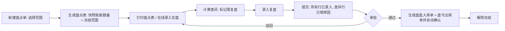

# 08-06 盘点

## 1. 功能说明

核对账面库存与实物库存，生成盘盈盘亏调整。支持全盘和抽盘（按物料类别、库位、指定物料）。

- 使用者：仓管员（录入实盘）、仓库主管（创建、审核）、财务（审批差异，可选）
- 优先级：P0

## 2. 数据表

### inv_count 盘点单（BaseDocDO，编码规则 INV_COUNT）

| 字段 | 类型 | 必填 | 默认 | 说明 |
|---|---|---|---|---|
| count_type | enum(FULL/PARTIAL) | 是 | FULL | 全盘 / 抽盘 |
| warehouse_ids | str(512) | 是 | | 盘点仓库（ID 逗号分隔） |
| category_ids | str(512) | 否 | | 抽盘：物料类别范围 |
| location_ids | text | 否 | | 抽盘：库位范围 |
| material_ids | text | 否 | | 抽盘：指定物料 |
| include_zero | bool | 是 | 0 | 是否包含账面为 0 的库存行 |
| blind_count | bool | 是 | 1 | 盲盘：录入和打印时不显示账面数量 |
| snapshot_at | datetime | 否 | | 生成盘点表（冻结）时间 |
| count_status | enum(DRAFT/COUNTING/SUBMITTED/APPROVED/VOIDED) | 是 | DRAFT | 草稿 / 盘点中 / 已提交 / 已审核（已调整） / 已作废 |
| gain_in_id / loss_out_id | id | 否 | | 生成的盘盈入库单、盘亏出库单 |

### inv_count_line 盘点明细

| 字段 | 类型 | 必填 | 说明 |
|---|---|---|---|
| line_no | int | 是 | |
| warehouse_id / location_id / material_id / batch_no | | 是 | 库存维度 |
| book_qty | qty | 是 | 账面数量（快照） |
| count_qty | qty | 否 | 实盘数量（未录入为空） |
| recount_qty | qty | 否 | 复盘数量 |
| final_qty | qty | 否 | 最终数量 = 复盘数量（有）或实盘数量 |
| diff_qty | qty | 否 | final_qty − book_qty |
| ref_cost | price | 否 | 参考单价（计算差异金额） |
| diff_amount | amt | 否 | |
| need_recount | bool | 是 | 是否需要复盘（系统计算） |
| is_added | bool | 是 | 盘点时新增的行（账面没有的实物） |
| reason | dict(inv_count_diff_reason) | 条件 | 有差异时必填 |
| counter_id / counted_at | | 否 | 录入人 / 时间 |
| remark | str(256) | 否 | |

## 3. 流程

**冻结**：生成盘点表后，盘点范围内（仓库 + 物料/库位条件）的库存不能进行任何出入库确认（`该物料正在盘点中（盘点单 {no}），不能出入库`），直到盘点单审核或作废。

## 4. 页面

### 4.1 盘点单列表（T1）

查询：单号、盘点类型、仓库、状态（默认未审核、未作废）、日期。
列：单号（链接）、类型、仓库、范围摘要、盘点行数、已录入/总行数（进度）、差异行数、差异金额（字段权限）、状态、创建人、日期、操作。
工具栏：[新建盘点]（`inv:count:create`）。

### 4.2 新建盘点（T2 大弹窗）

字段：盘点类型*、仓库*（WarehouseSelect 多选）、物料类别（抽盘，树多选）、库位（抽盘）、指定物料（抽盘，MaterialSelect 多选）、包含零库存（开关）、盲盘（开关，默认开）、单据日期、备注。
保存后状态草稿；详情页点击 [生成盘点表]。

### 4.3 盘点单详情（T5 变体）

**按钮**

| 按钮 | 状态 | 权限 | 行为 |
|---|---|---|---|
| 编辑 / 删除 | 草稿 | create | |
| 生成盘点表 | 草稿 | create | 快照并冻结；确认框“生成后范围内的库存将被冻结，直到盘点结束，确定吗？” |
| 打印盘点表 | 盘点中 | print | 按仓库 → 库位 → 物料排序；盲盘时不打印账面数量；留空实盘数量栏和签字栏 |
| 导出盘点表 / 导入实盘 | 盘点中 | input | Excel：导出包含行 ID，填写实盘数量后导入 |
| 提交 | 盘点中 | submit | R03 |
| 通过 / 驳回 | 已提交（审批流） | — | |
| 审核 | 已提交（无审批流时） | approve | |
| 作废 | 草稿、盘点中 | void | 解除冻结 |

**明细表**（可在线录入）：仓库、库位、物料编码、名称、规格、单位、批次、账面数量（盲盘且状态为盘点中时显示 `***`，有 `inv:count:approve` 的人可见）、实盘数量（QtyInput）、复盘数量（需复盘时可编辑）、差异数量（非盲盘可见；正数绿、负数红）、差异金额（字段权限）、差异原因（DictSelect，有差异时必填）、录入人、备注。

表格上方筛选：全部 / 未录入 / 有差异 / 需复盘；[新增盘点外物料]（账面没有的实物：选择仓库、库位、物料、批次、实盘数量，is_added=1）。

## 5. 业务规则

| 编号 | 触发 | 规则 | 提示原文 |
|---|---|---|---|
| INV-CNT-R01 | 生成盘点表 | 范围内存在未确认的出入库单、调拨单时提示列出（不阻止），建议先处理；同一库存维度不能同时在两张盘点中 | `以下单据尚未确认：…，确定继续吗？` / `物料「{code}」已在盘点单「{no}」中` |
| INV-CNT-R02 | 冻结 | 盘点中冻结范围内库存的所有过账（盘点自身的调整除外） | `该物料正在盘点中（盘点单 {no}），不能出入库` |
| INV-CNT-R03 | 提交 | 所有行已录入实盘；需复盘的行已录入复盘；有差异的行已选择原因 | `还有 {n} 行未录入实盘数量` / `第 {n} 行有差异，请选择差异原因` |
| INV-CNT-R04 | 复盘判定 | 差异比例（\|diff\| ÷ book，book=0 时视为 100%）≥ 参数 `inv.count.recount-threshold-pct`，或 \|差异金额\| ≥ `inv.count.recount-threshold-amount` 时需复盘 | — |
| INV-CNT-R05 | 审核 | 生成盘盈入库单（COUNT_GAIN）和盘亏出库单（COUNT_LOSS），单据日期 = 盘点单日期，自动确认过账；成功后解除冻结 | — |
| INV-CNT-R06 | 新增行 | 批次管理物料的盘点外新增行必须填写批次（可新建批次号） | `请填写批次号` |
| INV-CNT-R07 | 序列号 | 序列号管理物料盘点时录入实盘序列号清单，系统比对出盘亏序列号和盘盈序列号 | — |

## 6. 接口

`/inventory/counts`（CRUD）、`/{id}/generate`、`/{id}/lines`（GET 分页、PUT 批量保存录入）、`/{id}/lines/add`、`/{id}/export-sheet`、`/{id}/import-count`、`/{id}/submit`、`/{id}/approve`、`/{id}/void`、`/{id}/print-data`。

## 7. 验收用例

| 编号 | 前置条件 | 操作 | 预期结果 |
|---|---|---|---|
| INV-CNT-T01 | 电子料仓 3 个物料有库存 | 全盘生成盘点表 | 3 行，账面数量为当时库存；仓管员看到的账面数量为 `***` |
| INV-CNT-T02 | 盘点中 | 对电子料仓物料确认出库单 | 提示“该物料正在盘点中（盘点单 CK-…），不能出入库” |
| INV-CNT-T03 | 账面 100，实盘 90，阈值 5% | 录入 | 该行标记需复盘 |
| INV-CNT-T04 | 复盘 92，原因“损坏” | 提交 → 审核 | 生成盘亏出库单 8 并过账；冻结解除 |
| INV-CNT-T05 | 实物中发现账面没有的物料 X 5 个 | 新增盘点外物料 | 审核后生成盘盈入库 5 |
| INV-CNT-T06 | 有未录入行 | 提交 | 提示“还有 n 行未录入实盘数量” |
| INV-CNT-T07 | 盘点中 | 作废 | 冻结解除，库存不变 |
