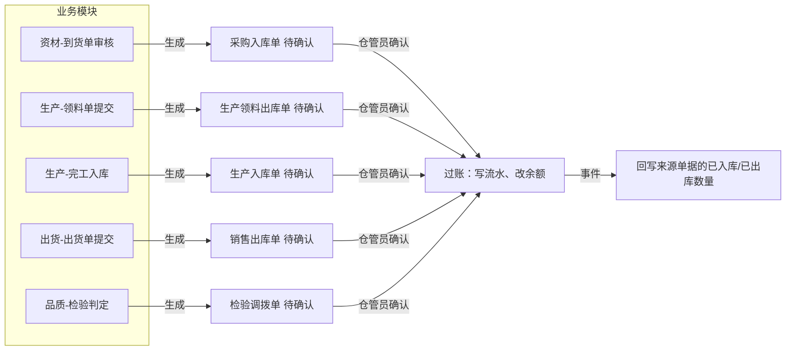

# 08 仓库（总览）

## 1. 模块定位

仓库是**库存的唯一记账方**。所有库存变化都通过仓库的出入库单据完成，由仓管员确认后过账，写库存流水、更新库存余额。其他模块不能直接修改库存表。

## 2. 仓库分类

| 编码 | 仓库类型 | 存放内容 | 可用仓 |
|---|---|---|---|
| RAW | 原材料仓 | 一般原材料（结构件、五金、塑胶件等） | 是 |
| SEMI | 半成品仓 | 自制半成品 | 是 |
| FG | 成品仓 | 成品 | 是 |
| FPC | FPC 仓 | FPC 柔性线路板 | 是 |
| ELEC | 电子料仓 | 电子元器件 | 是 |
| PKG | 包材仓 | 包装材料 | 是 |
| AUX | 辅料仓 | 辅料、耗材 | 是 |
| NG | 不良品仓 | 各环节判定的不良品 | 否 |
| QC | 待检仓 | 到货待检、完工待检 | 否 |
| RTN | 退货仓 | 客户退回待判定 | 否 |

**可用仓**：只有可用仓中、质量状态为合格、未冻结的库存才能被 MRP 计算、生产领料、销售出库使用。仓库类型是代码枚举（`WarehouseType`，已在 inventory-api 中定义），每种类型下可以建多个仓库（如“原材料一仓”“原材料二仓”）。

## 3. 核心设计：单据驱动库存

- 业务模块通过 `InventoryDocApi` **生成**仓库单据（草稿状态，带来源单据信息），仓管员在仓库模块中**确认**（审核）后过账。
- 仓管员也可以手工新建“其他入库 / 其他出库 / 调拨”等单据。
- 过账后发布事件，来源模块监听并回写数量。
- 这样仓管员在一个地方处理所有出入库，库存变化都有单据可查。

## 4. 功能与页面清单

| 功能 | 文档 | 页面 | 模板 | 路由 | 菜单权限 | 优先级 |
|---|---|---|---|---|---|---|
| 仓库与库位 | [01-仓库与库位](01-仓库与库位.md) | 仓库管理 | T1 + T2 | `/inventory/warehouse` | `inv:warehouse:query` | P0 |
| 库存模型与过账 | [02-库存模型与过账](02-库存模型与过账.md) | —（后端核心） | — | — | — | P0 |
| 入库单 | [03-入库单](03-入库单.md) | 入库单列表 / 编辑 / 详情 | T1 / T4 / T5 | `/inventory/in` | `inv:in:query` | P0 |
| 出库单 | [04-出库单](04-出库单.md) | 出库单列表 / 编辑 / 详情 | T1 / T4 / T5 | `/inventory/out` | `inv:out:query` | P0 |
| 调拨单 | [05-调拨单](05-调拨单.md) | 调拨单列表 / 编辑 / 详情 | T1 / T4 / T5 | `/inventory/transfer` | `inv:transfer:query` | P0 |
| 盘点 | [06-盘点](06-盘点.md) | 盘点单列表 / 详情（录入实盘） | T1 / T5 | `/inventory/count` | `inv:count:query` | P0 |
| 批次与序列号 | [07-批次与序列号](07-批次与序列号.md) | 批次查询 | T1 | `/inventory/batch` | `inv:stock:query` | P0 |
| 库存查询与报表 | [08-库存查询与报表](08-库存查询与报表.md) | 库存查询、库存流水、收发存汇总、库龄、呆滞、预警 | T1 / T7 | `/inventory/stock`、`/inventory/analysis` | `inv:stock:query` | P0 / P1 |
| 期初与月结 | [09-期初与月结](09-期初与月结.md) | 期初库存导入、库存期间 | T1 | `/inventory/period` | `inv:period:query` | P0 |

菜单顺序：库存查询、仓库管理、入库、出库、调拨、盘点、批次、库存分析、期初与月结。

## 5. 用户角色

| 角色 | 功能 |
|---|---|
| 仓管员 | 确认出入库、手工其他出入库、调拨、盘点录入（只能操作自己负责的仓库） |
| 仓库主管 | 以上全部 + 盘点差异审核、批次冻结、库位维护、月结 |
| 其他部门 | 库存查询（按权限） |

## 6. 数据表总览

inv_warehouse、inv_location、inv_warehouse_user、inv_category_warehouse、inv_stock、inv_stock_txn、inv_batch、inv_serial、inv_reservation、inv_stock_in、inv_stock_in_line、inv_stock_out、inv_stock_out_line、inv_transfer、inv_transfer_line、inv_count、inv_count_line、inv_period、inv_period_balance。

## 7. 编码规则

INV_STOCK_IN、INV_STOCK_OUT、INV_TRANSFER、INV_COUNT、INV_BATCH（见 01-系统管理 / 05-编码规则）。

## 8. 内置字典

| 类型编码 | 名称 | 内置项 |
|---|---|---|
| inv_other_in_reason | 其他入库原因 | GIFT 赠品、CUSTOMER_SUPPLIED 客供料、FOUND 盘点外发现、OTHER 其他 |
| inv_other_out_reason | 其他出库原因 | SCRAP 报废、SAMPLE 样品、RD_USE 研发领用、DEPT_USE 部门领用、OTHER 其他 |
| inv_count_diff_reason | 盘点差异原因 | RECORD_ERROR 单据漏录/错录、DAMAGE 损坏、LOSS 丢失、MEASURE 计量误差、OTHER 其他 |

## 9. 可审批单据

| 单据类型 | 名称 | 条件字段 |
|---|---|---|
| INV_OTHER_IN | 其他入库（手工） | reason 原因（字典）、amountBase 金额 |
| INV_OTHER_OUT | 其他出库（手工） | reason 原因（字典）、amountBase 金额 |
| INV_COUNT | 盘点差异 | diffAmountBase 差异金额（绝对值合计） |

由业务单据生成的出入库单不走审批流（上游单据已审批），仓管员确认即过账。

## 10. 系统参数

| 编码 | 分组 | 名称 | 类型 | 默认 | 说明 |
|---|---|---|---|---|---|
| inv.stock.allow-negative | 库存控制 | 允许负库存 | BOOL | 否 | 全局开关；仓库上还可单独设置 |
| inv.transfer.auto-confirm-inspection | 库存控制 | 检验调拨自动确认 | BOOL | 否 | 是：检验判定后生成的调拨单自动过账；否：仓管员确认实物移库后过账 |
| inv.in.auto-confirm-source | 库存控制 | 来源单据生成的入库单自动确认 | BOOL | 否 | 小工厂可打开以减少操作 |
| inv.out.auto-confirm-source | 库存控制 | 来源单据生成的出库单自动确认 | BOOL | 否 | |
| inv.count.recount-threshold-pct | 盘点 | 复盘阈值（差异比例） | DECIMAL(0～100) | 5 | |
| inv.count.recount-threshold-amount | 盘点 | 复盘阈值（差异金额，本位币） | DECIMAL | 1000 | 任一满足即需复盘 |
| inv.alert.slow-moving-days | 预警 | 呆滞天数 | INT | 180 | 超过 N 天无出库视为呆滞 |
| inv.alert.expiry-warn-days | 预警 | 临期提醒天数 | INT | 30 | |
| inv.qc.overdue-hours | 预警 | 待检超时（小时） | INT | 24 | 待检仓库存超过 N 小时未检验时预警 |

## 11. 对其他模块提供的 API（inventory-api）

| 接口 | 方法 | 说明 |
|---|---|---|
| `InventoryDocApi` | `createStockIn(StockInRequest)`、`createStockOut(StockOutRequest)`、`createTransfer(TransferRequest)`、`cancelBySource(sourceType, sourceId)` | 业务模块生成仓库单据；来源单据反审核时撤销未确认的仓库单据 |
| `InventoryQueryApi` | `getAvailableQty(materialId[, warehouseId])`、`getStockSummary(materialIds)`、`suggestBatches(materialId, warehouseId, qty)`、`getOnHandByWarehouseType(...)` | 查询 |
| `ReservationApi` | `reserve(bizType, bizId, lines)`、`release(bizType, bizId)` | 库存预留（P1） |
| `InventoryApi` | `post`、`reverse`（已定义，模块内部使用；其他模块不直接调用） | 过账引擎 |
| `WarehouseApi` | `get`、`getDefaultWarehouse(categoryId, warehouseType)`、`listByType(type)` | 仓库查询 |

**发布事件**：`StockInConfirmedEvent`、`StockOutConfirmedEvent`、`TransferConfirmedEvent`（均带来源单据类型/ID/行及数量）、`StockInReversedEvent`、`StockOutReversedEvent`、`StockChangedEvent`、`StockAlertEvent`、`PeriodClosedEvent`。

**监听事件**：品质 `InspectionJudgedEvent`（生成检验调拨单）。

## 12. 权限点汇总

| 分组 | 权限点 |
|---|---|
| 仓库管理 | `inv:warehouse:query`（菜单）、`create`、`update`、`delete` |
| 库存查询 | `inv:stock:query`（菜单）、`export`；字段 `inv:stock:cost` |
| 入库单 | `inv:in:query`（菜单）、`create`、`update`、`delete`、`submit`、`confirm`、`unconfirm`、`void`、`print`、`export` |
| 出库单 | `inv:out:query`（菜单）、`create`、`update`、`delete`、`submit`、`confirm`、`unconfirm`、`void`、`print`、`export` |
| 调拨单 | `inv:transfer:query`（菜单）、`create`、`update`、`delete`、`confirm`、`unconfirm`、`void`、`print` |
| 盘点 | `inv:count:query`（菜单）、`create`、`input`（录入实盘）、`submit`、`approve`、`void`、`print` |
| 批次 | `inv:batch:freeze`（冻结/解冻）、`inv:batch:update`（修改批次属性） |
| 期间 | `inv:period:query`（菜单）、`close`、`reopen`、`inv:opening:import` |
