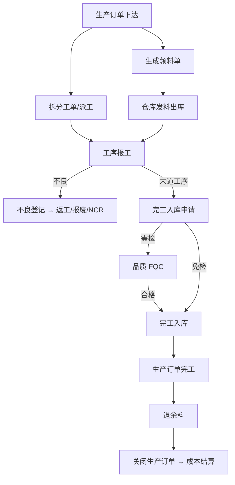

# 09 生产

## 1. 模块定位

生产模块负责**车间执行**：生产订单下达、工单派工、领料退料、报工、不良登记、完工入库、生产追溯。排产计划来自 PMC；检验判定归品质；库存记账调用仓库。

**生产订单与工单的区别**
- **生产订单**：回答“生产什么、生产多少、何时完工”，是计划层单据，来源于 MRP 建议或手工创建，承载成本归集。
- **工单（派工单）**：回答“哪道工序、哪条线/哪台设备、哪个班组、哪天做多少”，是执行层单据，一张生产订单可拆分为多张工单。

## 2. 用户角色

- **生产主管**：下达生产订单、审核报工、处理异常。
- **生产组长 / 班组长**：领料、派工、报工、登记不良。
- **工艺工程师**：维护测试数据导入模板、分档规则执行监控。
- **设备/自动化工程师**：配置测试设备数据接口。

## 3. 功能清单

| 子功能 | 功能点 | 优先级 |
|---|---|---|
| 生产订单 | 手工创建/MRP 转入/样品单转入；带出 BOM 和工艺路线快照；下达；暂停；完工；关闭；拆分 | P0 |
| 工单 | 按工序/产线/班次拆分派工；打印工单与流程卡（带条码） | P1 |
| 领料 | 按生产订单 BOM 生成领料单；按套数领料；超领申请（审批）；倒冲领料（报工时自动扣料） | P0 |
| 退料 | 余料退回、不良料退回（区分良品退料和不良退料） | P0 |
| 报工 | 按工序报工：合格数、不良数、报废数、工时、人员、设备；扫码报工 | P0 |
| 完工入库 | 最后一道工序报工后生成完工入库申请 → FQC（需检时）→ 入库 | P0 |
| 不良登记 | 不良现象、不良代码、位置、数量；返工/报废/待判；关联 NCR | P0 |
| 良率 | 工序良率、直通率（FPY）、按产线/产品/班组统计 | P1 |
| 生产追溯 | 按生产订单/批次/序列号查询投入物料批次、工序、人员、设备 | P1 |
| 返工 | 返工工单（对已完工产品返工，不产生新产品） | P1 |
| 拆解 | 拆解工单（逆向 BOM：把成品/半成品拆回子件） | P1 |
| 生产异常 | 停线、缺料、设备故障、质量异常登记与处理时长 | P2 |

## 4. 核心流程

### 4.1 生产执行主流程

## 5. 数据实体

| 实体 | 关键字段 |
|---|---|
| mfg_prod_order 生产订单 | 通用单头 + material_id, qty, uom, bom_id, bom_version, routing_id, plan_start, plan_end, actual_start, actual_end, completed_qty, scrapped_qty, stocked_qty, sales_order_line_id, order_type(标准/返工/拆解/样品), status(草稿/已下达/生产中/暂停/已完工/已关闭) |
| mfg_prod_order_material 用料快照 | prod_order_id, component_id, qty_per, required_qty, issued_qty, returned_qty, consumed_qty, issue_method, operation_seq, substitute_of |
| mfg_prod_order_operation 工序快照 | prod_order_id, seq, operation_code, work_center_id, plan_qty, good_qty, defect_qty, scrap_qty, fixed_wait_hours, status |
| mfg_work_order 工单 | 通用单头 + prod_order_id, operation_seq, line_id, shift, team_id, plan_date, plan_qty, reported_qty, status |
| mfg_issue 领料单 / mfg_return 退料单 | 通用单头 + prod_order_id, warehouse_id；明细 material_id, batch_no, qty, sn_list |
| mfg_report 报工单 | 通用单头 + work_order_id, prod_order_id, operation_seq, good_qty, defect_qty, scrap_qty, work_hours, operators, equipment_id, reported_at |
| mfg_defect 不良登记 | report_id, defect_code, defect_desc, qty, sn, disposition(返工/报废/待判), ncr_id |
| mfg_trace 生产追溯 | id, prod_order_id, report_id, product_batch_no / product_sn, component_material_id, component_batch_no / component_sn, qty, operation_seq, operator_id, equipment_id, created_at |

## 6. 业务规则

1. **下达**：生产订单下达时固化 BOM 和工艺路线快照；之后 BOM 变更不影响已下达订单，除非通过 ECN 指定更新在制订单。
2. **领料控制**：累计领料 ≤ 需求量 × (1 + 允许超领比例)；超出需超领申请审批并填写原因（损耗/报废/补料）。
3. **报工控制**：某工序累计报工（合格 + 不良 + 报废）≤ 上道工序合格数（首道工序 ≤ 订单数量 × (1 + 超产比例)）。
4. **倒冲**：倒冲物料在报工审核时按合格数 × 单耗自动生成领料流水（从线边仓扣减）。
5. **完工入库**：入库数量 ≤ 末道工序合格数 − 已入库数；需检产品必须 FQC 合格后入库。
6. **关闭**：关闭前需处理完在制和余料（退料或说明），关闭后不允许再领料/报工。
7. **反审核**：报工单已被入库引用时不允许反审核。
8. **追溯记录**：领料、报工、完工入库时自动写入追溯关系（成品批次/序列号 ↔ 投入物料批次/序列号），追溯记录只增不改。

## 7. 集成

| 方向 | 对象 | 内容 |
|---|---|---|
| 提供 API | PMC | `ProductionOrderApi.createFromMrp`、`getWipQty`、`getProgress` |
| 提供 API | 品质 | `TraceApi`：按批次/序列号正反向追溯 |
| 调用 | 研发工程 | BOM、工艺路线 |
| 调用 | 仓库 | 领料出库、退料入库、完工入库 |
| 发布事件 | 品质 | `FinishedGoodsInspectRequestEvent`（生成 FQC）、`IpqcTriggerEvent`、`DefectRegisteredEvent` |
| 发布事件 | 研发工程 | `WorkReportApprovedEvent`（工装次数） |
| 发布事件 | 财务 | `ProductionOrderClosedEvent`（成本结算）、领料/报工工时数据 |
| 发布事件 | PMC | `ProductionProgressEvent` |

## 8. 报表

- 生产订单进度表、工单完成率
- 工序良率、直通率、不良 Pareto（按不良代码）
- 领料差异分析（实际领用 vs 标准用量）
- 人员/班组产量、工时统计

## 9. 权限点

`mfg:prod-order:*`、`mfg:work-order:*`、`mfg:issue:*`、`mfg:return:*`、`mfg:report:*`、`mfg:defect:*`、`mfg:trace:query`

## 10. 非功能

- 生产追溯数据按月份分区，查询默认限定时间范围。
- 扫码报工响应 ≤ 500ms。
