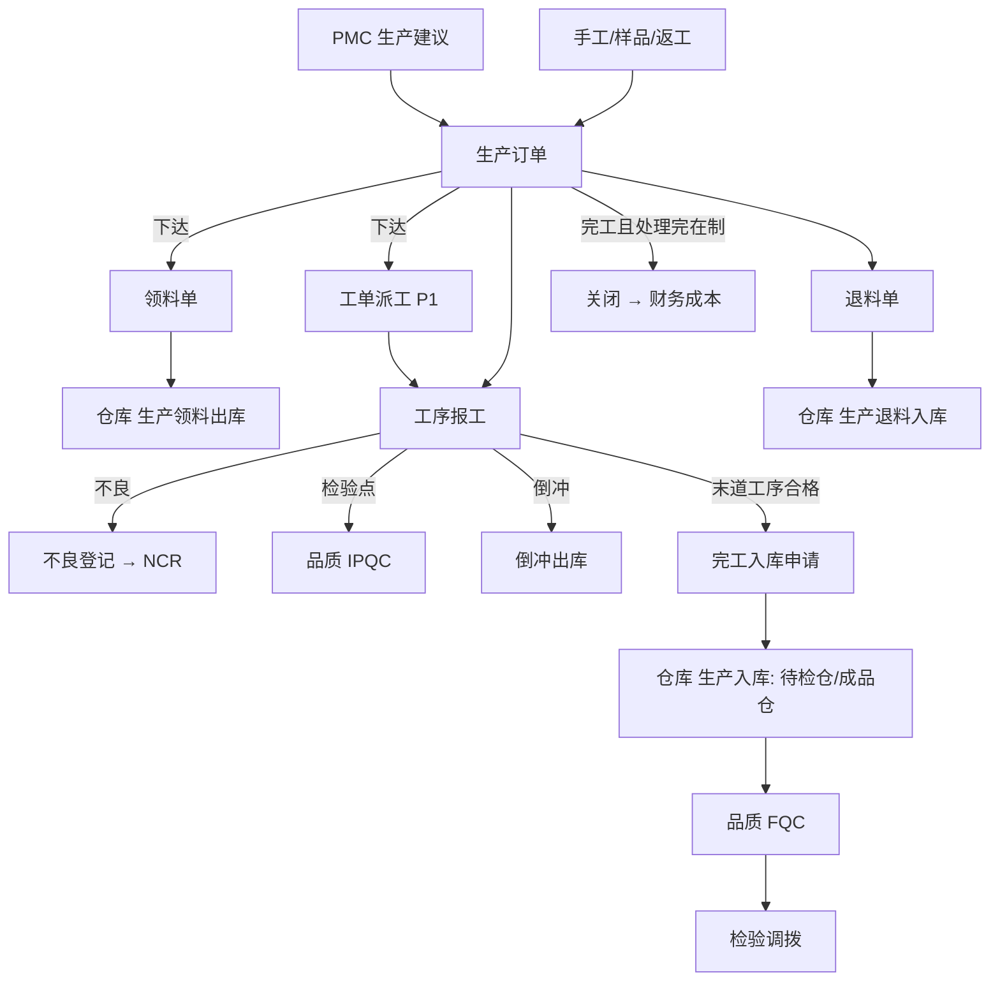

# 09 生产（总览）

## 1. 模块定位

生产负责车间执行：生产订单（计划层）→ 工单派工（执行层，P1）→ 领料 / 退料 → 工序报工（含不良登记）→ 完工入库 → 关闭；并记录生产追溯关系。

边界：
- 生产订单的建议来自 PMC（MRP），排产计划在 PMC；
- 发料、入库由仓库确认过账（生产模块生成领料单/退料单/完工入库申请，仓库生成出入库单）；
- 检验判定（IPQC、FQC）归品质；
- 成本计算归财务（生产提供领料、工时、完工数据）。

## 2. 端到端流程

## 3. 功能与页面清单

| 功能 | 文档 | 页面 | 模板 | 路由 | 菜单权限 | 优先级 |
|---|---|---|---|---|---|---|
| 生产订单 | [01-生产订单](01-生产订单.md) | 列表 / 编辑 / 详情 | T1 / T4 / T5 | `/production/prod-order` | `mfg:prod-order:query` | P0 |
| 工单派工 | [02-工单派工](02-工单派工.md) | 工单列表 / 派工 | T1 / 专用 | `/production/work-order` | `mfg:work-order:query` | P1 |
| 领料与退料 | [03-领料与退料](03-领料与退料.md) | 领料单、退料单 | T1 / T4 / T5 | `/production/issue`、`/production/return` | `mfg:issue:query`、`mfg:return:query` | P0 |
| 报工 | [04-报工](04-报工.md) | 报工单列表 / 快速报工 | T1 / 专用 | `/production/report` | `mfg:report:query` | P0 |
| 完工入库 | [05-完工入库](05-完工入库.md) | 生产订单详情内操作 + 完工入库记录 | T1 | `/production/finish` | `mfg:finish:query` | P0 |
| 不良与良率 | [06-不良与良率](06-不良与良率.md) | 不良记录、良率报表 | T1 / T7 | `/production/defect`、`/production/yield` | `mfg:defect:query` | P0 / P1 |
| 生产追溯 | [07-生产追溯](07-生产追溯.md) | 追溯查询 | 专用 | `/production/trace` | `mfg:trace:query` | P1 |
| 生产报表 | [08-生产报表](08-生产报表.md) | 进度、领料差异、产量工时 | T7 | `/production/report-center` | `mfg:report-center:query` | P1 |

菜单顺序：生产订单、工单、领料、退料、报工、完工入库、不良、良率、生产追溯、生产报表。

## 4. 用户角色

| 角色 | 功能 | 数据范围建议 |
|---|---|---|
| 生产主管 | 下达、关闭生产订单，审核报工，全部查询 | 本部门及下级（按生产订单的车间 dept_id） |
| 计划员 | 新建/下达生产订单（来自 MRP） | 全部 |
| 班组长 | 派工、领料申请、报工、不良登记、退料 | 本部门 |
| 操作员（可选账号） | 快速报工（扫码） | 仅本人 |

## 5. 数据表

mfg_prod_order、mfg_prod_order_material、mfg_prod_order_operation、mfg_work_order、mfg_issue、mfg_issue_line、mfg_return、mfg_return_line、mfg_report、mfg_report_operator、mfg_defect、mfg_finish、mfg_trace。

## 6. 编码规则

MFG_PROD_ORDER、MFG_WORK_ORDER、MFG_ISSUE、MFG_RETURN、MFG_REPORT；完工入库申请 MFG_FINISH（`FN-yyyyMMdd-3`，日重置）。

## 7. 内置字典

| 类型编码 | 名称 | 内置项 |
|---|---|---|
| mfg_defect_code | 不良代码（生产登记用；品质模块的缺陷代码库可同步使用） | 无内置项，示例：短路、虚焊、少件、划伤、尺寸不良、功能不良 |
| mfg_scrap_reason | 报废原因 | PROCESS 工艺、OPERATION 操作、MATERIAL 来料、EQUIPMENT 设备、OTHER |
| mfg_over_issue_reason | 超领原因 | SCRAP 损耗报废、DEFECT 来料不良、PLAN_ERROR 用量错误、OTHER |
| mfg_shift | 班次 | DAY 白班、NIGHT 夜班 |

## 8. 可审批单据

| 单据类型 | 名称 | 条件字段 |
|---|---|---|
| MFG_PROD_ORDER | 生产订单（手工新建的） | orderType、qty |
| MFG_ISSUE_OVER | 超领单 | overPct（超领比例 %）、amountBase |

## 9. 可打印单据

MFG_PROD_ORDER（生产订单/工单流程卡，带条码）、MFG_ISSUE（领料单）、MFG_RETURN（退料单）、MFG_WORK_ORDER（派工单，带条码）。

## 10. 系统参数

| 编码 | 分组 | 名称 | 类型 | 默认 | 说明 |
|---|---|---|---|---|---|
| mfg.order.over-produce-pct | 生产订单 | 允许超产比例（%） | DECIMAL | 0 | 首道工序报工上限 = 订单数量 × (1 + 比例) |
| mfg.issue.over-issue-pct | 领料 | 正常领料允许超领比例（%） | DECIMAL | 0 | 超出需走超领单 |
| mfg.issue.kit-check | 领料 | 下达时齐套检查 | ENUM(NONE/WARN/BLOCK) | WARN | |
| mfg.report.require-work-order | 报工 | 报工必须基于工单 | BOOL | 否 | 否：可直接对生产订单工序报工 |
| mfg.report.auto-approve | 报工 | 报工自动审核 | BOOL | 是 | 否：需班组长/主管审核后才计入数量 |
| mfg.close.require-return | 关闭 | 关闭前必须退回余料 | ENUM(NONE/WARN/BLOCK) | WARN | |

## 11. 对其他模块提供的 API（production-api）

| 接口 | 方法 | 使用方 |
|---|---|---|
| `ProductionOrderApi` | `createFromMrp(List<MrpSuggestion>)`、`createSampleOrder(sampleId, materialId, qty, requiredDate)`、`updateMaterialsByEcn(ecnId, changes)` | PMC、研发工程 |
| `ProductionQueryApi` | `getWipQty(materialIds)`（在制：已下达未完工的剩余数量，含预计完工日期）、`getOpenOrdersByComponent(componentId)`、`getProgress(prodOrderIds)`、`isBomUsed(bomId)`、`getAllocatedQty(materialId)`（已下达未领的用料需求） | PMC、研发工程、销售、财务 |
| `TraceApi` | `forward(materialId, batchNo)`（原材料批次 → 用在哪些生产订单/成品批次）、`backward(materialId, batchNo)`（成品批次 → 用了哪些原材料批次） | 品质、BI |

**发布事件**：`ProductionOrderReleasedEvent`、`ProductionOrderCompletedEvent`、`ProductionOrderClosedEvent`、`WorkReportApprovedEvent`（含工装、工时、合格/不良数量）、`WorkReportReversedEvent`、`IpqcTriggerEvent`、`DefectRegisteredEvent`、`ProductionProgressEvent`。

**监听事件**：仓库 `StockOutConfirmedEvent`（领料出库、倒冲）、`StockInConfirmedEvent`（完工入库、退料入库）、`StockDocRejectedEvent`；研发工程 `EcnEffectiveEvent`；品质 `InspectionJudgedEvent`（FQC 结果回写完工记录）。

## 12. 权限点汇总

| 分组 | 权限点 |
|---|---|
| 生产订单 | `mfg:prod-order:query`（菜单）、`create`、`update`、`delete`、`submit`、`release`（下达）、`unrelease`、`suspend`（暂停/恢复）、`close`、`void`、`print` |
| 工单 | `mfg:work-order:query`（菜单）、`create`（派工）、`update`、`delete`、`print` |
| 领料 | `mfg:issue:query`（菜单）、`create`、`update`、`delete`、`submit`、`over`（超领申请）、`print` |
| 退料 | `mfg:return:query`（菜单）、`create`、`update`、`delete`、`submit`、`print` |
| 报工 | `mfg:report:query`（菜单）、`create`、`update`、`delete`、`approve`、`unapprove` |
| 完工入库 | `mfg:finish:query`（菜单）、`create`、`cancel` |
| 不良 | `mfg:defect:query`（菜单）、`create`、`update`、`to-ncr` |
| 追溯 | `mfg:trace:query`（菜单） |
| 报表 | `mfg:report-center:query`（菜单）、`export` |
