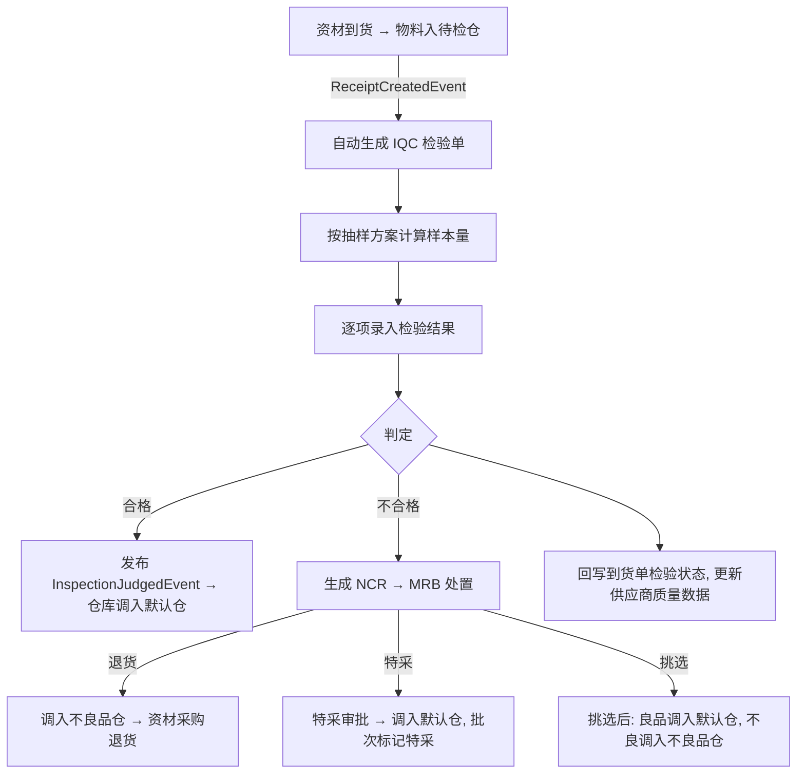
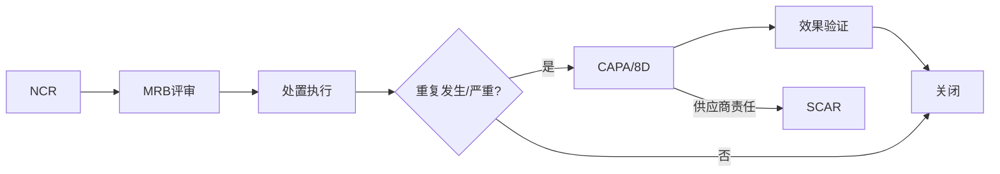

# 10 品质

## 1. 模块定位

品质模块负责**所有检验判定**和**质量问题闭环**：IQC（来料）、IPQC（制程）、FQC（成品）、OQC（出货）、NCR（不合格品处理）、CAPA（纠正预防）、客诉、SCAR（供应商纠正）以及质量追溯。其他模块在需要检验时通过事件请求品质生成检验单，检验判定结果再以事件通知回去；品质模块不直接修改库存，库存状态变化通过调用仓库 API 完成。

## 2. 用户角色

- **IQC 检验员**：来料检验。
- **IPQC 巡检员**：首件、巡检、末件。
- **FQC / OQC 检验员**：成品检验、出货检验。
- **QE（品质工程师）**：处理 NCR、组织 CAPA/8D、维护检验标准。
- **SQE**：供应商质量、SCAR。
- **品质主管**：特采审批、MRB 评审、质量报表。

## 3. 功能清单

| 子功能 | 功能点 | 优先级 |
|---|---|---|
| 检验标准 | 按物料/物料类别维护检验项目（外观、尺寸、功能、性能）、检验方法、标准值/上下限、检验工具；版本管理 | P0 |
| 抽样方案 | GB/T 2828.1（ISO 2859-1）抽样：检验水平、AQL（按严重度 CR/MA/MI 分别设定）；全检/免检；加严/放宽转移规则（P2） | P0 |
| 缺陷代码 | 缺陷分类（外观/尺寸/功能/包装…）、缺陷等级（致命/严重/轻微） | P0 |
| IQC | 到货自动生成检验单；按抽样方案计算样本量；录入检验结果；判定（合格/不合格/特采/挑选使用）；判定后自动调拨 | P0 |
| IPQC | 首件检验、巡检（按频次）、末件检验；与工单关联；不合格触发停线/NCR | P1 |
| FQC | 完工入库前检验；判定后自动调拨（待检仓 → 成品/半成品仓 或 不良品仓） | P0 |
| OQC | 出货前检验（数量、外观、包装、标签、唛头）；OQC 合格才能出货 | P0 |
| 退货判定 | 客户退货检验：良品 / 可返工 / 不良 | P1 |
| NCR | 不合格品报告：来源（IQC/IPQC/FQC/OQC/客诉/库存）、不合格描述、MRB 评审处置（退货/特采/挑选/返工/报废） | P0 |
| 特采 | 不合格品让步接收申请与审批（品质、工程、PMC、主管会签） | P1 |
| CAPA / 8D | 纠正预防措施：D1～D8 各步骤、责任人、期限、效果验证、关闭 | P1 |
| 客诉 | 客户投诉登记、严重度、分析、8D 回复、赔偿/补货、关闭 | P1 |
| SCAR | 向供应商发出纠正要求、回复期限、效果验证；影响供应商评分 | P1 |
| 质量追溯 | 按成品批次/序列号向下追溯原材料批次与供应商；按原材料批次向上查影响的成品与客户 | P1 |
| 检验仪器 | 量检具台账、校验周期、到期提醒 | P2 |
| 质量报表 | 来料合格率、制程良率、出货合格率、客诉统计、供应商质量排名 | P1 |

## 4. 核心流程

### 4.1 IQC

### 4.2 NCR → CAPA 闭环

## 5. 数据实体

| 实体 | 关键字段 |
|---|---|
| qc_standard 检验标准 | id, material_id / category_id, inspect_type(IQC/IPQC/FQC/OQC), version, status |
| qc_standard_item 检验项目 | standard_id, item_name, item_type(定性/定量), method, tool, target, upper_limit, lower_limit, defect_level, sampling_plan_id |
| qc_sampling_plan 抽样方案 | id, name, type(GB2828/全检/固定数量/免检), inspection_level, aql_cr, aql_ma, aql_mi |
| qc_defect_code 缺陷代码 | code, name, category, level |
| qc_inspection 检验单 | 通用单头 + inspect_type, source_type, source_id, source_line_id, material_id, batch_no, lot_qty, sample_qty, inspector_id, inspected_at, result(待检/合格/不合格/特采/挑选), judge_by, judge_at |
| qc_inspection_item 检验明细 | inspection_id, item_id, measured_values(JSON), defect_qty, result |
| qc_inspection_defect 缺陷记录 | inspection_id, defect_code, qty, description, image_file_ids |
| qc_ncr NCR | 通用单头 + source_type, source_id, material_id, batch_no, ncr_qty, description, responsibility(供应商/制程/设计/客户), disposition, disposition_qty(JSON), mrb_members, capa_required |
| qc_capa CAPA | 通用单头 + source_type(NCR/客诉/内审), d1_team, d2_problem, d3_containment, d4_root_cause, d5_actions, d6_implementation, d7_prevention, d8_closure, owner_id, due_date, verify_result |
| qc_complaint 客诉 | 通用单头 + customer_id, order_id, material_id, batch_no, sn, complaint_type, severity, description, qty, claim_amount, reply_due_date, capa_id |
| qc_scar SCAR | 通用单头 + supplier_id, ncr_id, requirement, reply_due_date, reply_content, verify_result |
| qc_instrument 量检具 | code, name, spec, calibration_cycle_days, last_calibrated_at, next_due_at, status |

## 6. 状态机

**检验单**：待检 → 检验中 → 待判定 → 已判定（合格/不合格/特采/挑选）→ 已关闭。已判定后如需改判，需主管权限执行“重判”并记录原因。

**NCR**：草稿 → 待 MRB 评审 → 处置中 → 已处置 → 已关闭。

**CAPA**：D1～D8 逐步推进，每步需责任人提交，D8 经验证后关闭；超期自动预警。

## 7. 业务规则

1. **样本量计算**：按批量 + 检验水平 + AQL 查 GB/T 2828.1 表得样本量和 Ac/Re；样本量 ≥ 批量时全检。
2. **判定**：各严重度的缺陷数 ≤ Ac 判合格，≥ Re 判不合格；任一致命缺陷（CR）直接判不合格。
3. **免检**：物料质量属性设置为免检，或供应商 + 物料连续 N 批合格进入免检（P2）。
4. **检验超时**：到货超过设定时限（默认 24 小时）未检验，推送预警到品质主管。
5. **判定联动**：判定后发布 `InspectionJudgedEvent`，仓库据此生成调拨（待检仓 → 可用仓 / 不良品仓）；资材/生产据此回写检验状态。
6. **特采**：特采必须审批；特采批次在库存批次上标记“特采”，追溯时可识别。
7. **OQC 拦截**：出货单审核前校验对应批次 OQC 已合格。
8. **NCR 处置数量**：各处置方式数量之和 = NCR 数量。
9. **CAPA 触发**：同一物料同一缺陷 30 天内重复 ≥ 3 次、或致命缺陷、或客诉，必须开 CAPA（规则可配置）。
10. **供应商质量数据**：IQC 判定结果按月汇总成批次合格率，推送给资材做供应商评估。
11. **检验记录不可删除**：已判定的检验单只能重判，不能删除。

## 8. 集成

| 方向 | 对象 | 内容 |
|---|---|---|
| 监听事件 | 资材 | `ReceiptCreatedEvent` → 生成 IQC |
| 监听事件 | 生产 | `FinishedGoodsInspectRequestEvent` → 生成 FQC；`IpqcTriggerEvent`；`DefectRegisteredEvent` → 可生成 NCR |
| 监听事件 | 出货 | `OqcRequestEvent` → 生成 OQC |
| 监听事件 | 销售 | `SalesReturnReceivedEvent` → 生成退货判定检验 |
| 发布事件 | 仓库、资材、生产、出货、销售 | `InspectionJudgedEvent`、`IqcCompletedEvent`、`ReturnInspectionCompletedEvent` |
| 发布事件 | 资材 | `SupplierQualityScoreEvent` |
| 调用 | 生产 | `TraceApi`（质量追溯） |
| 调用 | 研发工程 | 物料质量属性 |

## 9. 报表

- IQC 来料合格率（按供应商/物料/月份）
- 制程良率、FQC 一次合格率、OQC 合格率
- 缺陷 Pareto 图（按缺陷代码）
- NCR 统计（来源、责任、处置方式）
- CAPA 按期关闭率、超期清单
- 客诉统计（按客户/产品/类型）、客诉处理周期
- 供应商质量排名

## 10. 权限点

`qc:standard:*`、`qc:sampling:*`、`qc:iqc:*`、`qc:ipqc:*`、`qc:fqc:*`、`qc:oqc:*`、`qc:inspection:judge / rejudge`、`qc:ncr:*`、`qc:mrb:approve`、`qc:concession:approve`、`qc:capa:*`、`qc:complaint:*`、`qc:scar:*`、`qc:trace:query`
