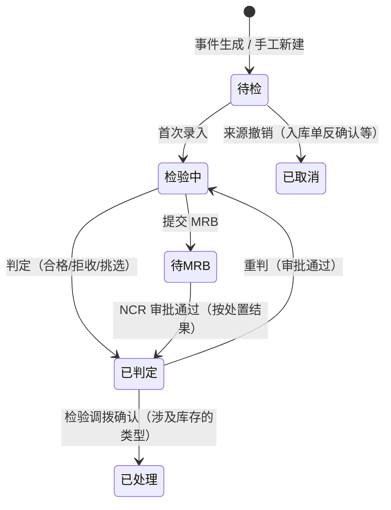

# 10-02 检验单

## 1. 功能说明

所有检验类型（IQC、IPQC、FQC、OQC、退货检验、复检）使用统一的检验单模型和录入界面：系统按事件自动生成检验单 → 检验员按标准和样本量录入结果 → 系统建议判定 → 检验员判定（不合格可提交 MRB）→ 发布判定事件驱动库存调拨和上游回写。

- 使用者：各类检验员、品质主管
- 优先级：P0

## 2. 数据表

### qc_inspection 检验单（BaseDocDO，编码规则按类型：QC_IQC 等）

| 字段 | 类型 | 必填 | 说明 |
|---|---|---|---|
| inspect_type | enum(IQC/IPQC/FQC/OQC/RETURN/RECHECK) | 是 | |
| ipqc_kind | enum(FIRST/PATROL/LAST/REPORT) | 否 | IPQC：首件 / 巡检 / 末件 / 报工触发 |
| material_id | id | 是 | |
| batch_no | str(64) | 否 | |
| lot_qty | qty | 是 | 送检批量（基本单位） |
| supplier_id | id | 否 | IQC |
| customer_id | id | 否 | OQC、退货检验 |
| source_type / source_id / source_line_id / source_no | | 是 | 来源：入库单行、报工单、出货通知、调拨单 |
| upstream_no | str(64) | 否 | 上游业务单号（到货单、生产订单、销售退货单、出货通知），便于查询 |
| warehouse_id | id | 否 | 被检物所在仓库（待检仓/退货仓/成品仓） |
| standard_id | id | 否 | 使用的检验标准（快照） |
| sampling_snapshot | json | 否 | 抽样方案与计算结果（n、各等级 Ac/Re） |
| sample_qty | int | 是 | 样本量 |
| inspector_id | id | 否 | 检验员 |
| started_at / inspected_at | datetime | 否 | 开始 / 完成录入时间 |
| suggested_result | enum(PASS/FAIL) | 否 | 系统根据缺陷数建议的结果 |
| result | enum(QUALIFIED/REJECTED/CONCESSION/SORTED) | 否 | 最终判定：合格 / 拒收 / 特采 / 挑选 |
| qualified_qty | qty | 是 | 判定为可用的数量（合格或挑选后的良品） |
| concession_qty | qty | 是 | 特采数量 |
| rejected_qty | qty | 是 | 不合格数量 |
| cr_count / ma_count / mi_count | int | 是 | 各等级缺陷数 |
| judge_by / judge_at | | 否 | 判定人 / 时间 |
| ncr_id | id | 否 | |
| insp_status | enum(PENDING/INSPECTING/WAIT_MRB/JUDGED/HANDLED/CANCELED) | 是 | 待检 / 检验中 / 待 MRB / 已判定 / 已处理（库存调拨已完成）/ 已取消 |
| remark | str(512) | 否 | |

数量关系：`qualified_qty + concession_qty + rejected_qty = lot_qty`（IPQC、OQC 不涉及库存时仍记录样本判定结果，数量按批量填写）。

### qc_inspection_item 检验项目结果

| 字段 | 类型 | 说明 |
|---|---|---|
| inspection_id | id | |
| seq | int | |
| item_name / spec / target / upper_limit / lower_limit / defect_level | | 标准快照 |
| sample_qty | int | 该项目样本量 |
| measured_values | json | 定量：每个样本的测量值数组；定性：不填 |
| ng_count | int | 该项目不合格样本数（定量按超限自动计算，定性手工录入） |
| item_result | enum(OK/NG) | |
| remark | str(256) | |

### qc_inspection_defect 缺陷明细

`inspection_id`、`defect_code`、`defect_level`、`qty`、`description`、`image_file_ids`。

## 3. 页面

### 3.1 检验单列表（T1，每种类型一个菜单）

路由 `/quality/iqc`、`/quality/ipqc`、`/quality/fqc`、`/quality/oqc`、`/quality/return-inspection`（复检归入 IQC 菜单，类型筛选“复检”）。

**查询条件**：单号、物料、批次、供应商（IQC）/ 客户（OQC、退货）、上游单号、状态（默认待检、检验中、待 MRB）、结果、检验员、创建日期（默认近 30 天）。
页面顶部快捷筛选：`待检 (n)`、`超时 (n)`（创建超过参数小时数仍未判定，红色）、`今日已判定`。

**列表列**

| 列 | 说明 |
|---|---|
| 单号 | 链接到检验录入页 |
| 物料编码 / 名称 / 规格 | |
| 批次 | |
| 供应商 / 客户 | 按类型 |
| 批量 / 样本量 | |
| 上游单号 | 链接 |
| 等待时长 | 创建至今（未判定时），超时红色 |
| 结果 | 合格绿 / 拒收红 / 特采橙 / 挑选蓝 |
| 合格 / 特采 / 不合格数量 | |
| 检验员 | |
| 状态 | 待检橙、检验中蓝、待 MRB 橙、已判定绿、已处理灰 |
| 操作 | 检验（待检/检验中）、查看、打印报告 |

工具栏：[新建]（仅 IPQC 首件/巡检/末件：选择生产订单 + 工序 + 送检数量）、[批量判定合格]（仅对已录入且建议结果为 PASS 的单据）、[导出]。

### 3.2 检验录入页（专用）

路由 `/quality/inspection/:id`。

```
┌ ← IQC-20260924-001  [检验中]                   [保存] [提交MRB] [判定] ┐
│ 物料 ELEC00012 贴片电阻 10K 0603   批次 B260924001   供应商 V1 华强       │
│ 批量 5,000   样本量 200（II 级：MA 0.65 Ac3/Re4，MI 1.5 Ac7/Re8，CR 0）    │
│ 标准 QS-0012 V2 [查看 SIP]   到货单 RC-20260924-001                        │
├──────────────────────────────────────────────────────────────────────────┤
│ 检验项目                                                                  │
│ # 项目   规格          等级 样本 测量值/不良数            结果              │
│ 1 外观   无破损脏污     MI   200  不良 [ 2 ]              OK               │
│ 2 阻值   10K ±1%       MA   5    [9.98][10.02][10.05][…] OK（全部在限内）   │
│ 3 焊性   上锡 ≥95%      MA   5    不良 [ 0 ]              OK               │
├──────────────────────────────────────────────────────────────────────────┤
│ 缺陷明细 [+ 添加]：代码 / 等级 / 数量 / 描述 / 照片                          │
├──────────────────────────────────────────────────────────────────────────┤
│ 汇总：CR 0 / MA 0 / MI 2    建议结果：合格 ✓                                │
│ 附件：供应商出货报告、检测报告                                              │
└──────────────────────────────────────────────────────────────────────────┘
```

- 定量项目：按样本数生成输入格，超出上下限的值自动标红并计入不良数；支持从 Excel 粘贴一列数值。
- 定性项目：录入不良数，> 0 时结果 NG。
- 缺陷明细：数量按等级汇总到 CR/MA/MI 计数（与项目不良数取较大者，避免重复计数时以缺陷明细为准）。
- 建议结果：按 Ac/Re 实时计算。
- 首次录入时状态自动变为检验中并记录开始时间、检验员。

**判定弹窗**

| 判定 | 数量字段 | 说明 |
|---|---|---|
| 合格 | 合格数 = 批量 | 建议结果为 FAIL 时需要填写“让步判定合格”的理由（记录日志） |
| 拒收 | 不合格数 = 批量 | 自动生成 NCR（参数）|
| 挑选 | 输入挑选后良品数 + 不良数（合计 = 批量） | 挑选完成后判定 |
| 特采 | 不可直接选择 | 特采必须通过 [提交 MRB]，由 NCR 审批决定 |

[提交 MRB]：生成 NCR（带检验结果、缺陷照片），检验单状态待 MRB；NCR 审批通过后按其处置结果自动完成判定（见 03-NCR与MRB）。

### 3.3 检验报告（打印）

单头信息、样本量与 AQL、各项目规格与实测、缺陷汇总、结果、检验员、判定人、日期。OQC 报告可选英文模板随货。

## 4. 状态与流转



## 5. 业务规则

| 编号 | 触发 | 规则 | 提示原文 |
|---|---|---|---|
| QC-INS-R01 | 生成 | 监听事件生成检验单：批量 = 入库数量；按 01 文档匹配标准并计算样本量；物料质量属性为免检的不生成（仓库不会把免检物料放入待检仓，此处为兜底：直接发布合格判定） | — |
| QC-INS-R02 | 生成 | 同一来源行不重复生成（幂等：source_type + source_line_id 唯一） | — |
| QC-INS-R03 | 判定 | 判定数量合计 = 批量；判定人需要对应类型的 judge 权限 | `判定数量合计必须等于批量 {qty}` |
| QC-INS-R04 | 判定 | 发布 `InspectionJudgedEvent`：IQC/FQC/RETURN/RECHECK → 仓库生成检验调拨；IQC → 资材回写到货行；FQC → 生产回写完工记录；RETURN → 销售回写退货行（合格 = 良品、不合格按 NCR 处置区分返工/报废）；OQC → 出货放行或退回 | — |
| QC-INS-R05 | 特采 | 特采批次在检验调拨中标记 `is_concession`；特采只能通过 NCR 审批 | `特采需要提交 MRB 审批` |
| QC-INS-R06 | 重判 | 已判定、未处理（检验调拨未确认）时可发起重判（审批流 QC_REJUDGE）；已处理的检验单重判需先由仓库反确认检验调拨 | `检验调拨已完成，请先由仓库反确认` |
| QC-INS-R07 | 取消 | 来源撤销（入库单反确认）时：待检/检验中的检验单自动取消；已判定的阻止上游撤销（仓库反确认入库时校验） | `已检验判定，不能反确认` |
| QC-INS-R08 | 超时 | 每小时检查：创建超过 `qc.inspection.overdue-hours` 小时仍未判定的检验单提醒品质主管（每单只提醒一次） | — |
| QC-INS-R09 | IPQC | IPQC 不合格：生产订单该工序显示“IPQC 不合格”警示；可一键生成 NCR；参数 `qc.ipqc.first-article` 打开时，首件检验合格前该生产订单工序的报工被阻止 `首件检验未通过，不能报工` | |
| QC-INS-R10 | OQC | OQC 判定合格 → 出货通知允许出货；拒收 → 出货通知状态退回“待拣货”，已拣货物由仓库调拨到不良品仓或返工 | — |

## 6. 接口

| 方法 | 路径 | 权限 |
|---|---|---|
| GET | /quality/inspections?type= | 对应类型 query |
| GET | /quality/inspections/{id} | 对应类型 query |
| POST | /quality/inspections | `qc:inspection:create`（IPQC 手工、复检） |
| PUT | /quality/inspections/{id}/results | 对应类型 inspect（保存项目结果、缺陷） |
| POST | /quality/inspections/{id}/judge | 对应类型 judge |
| POST | /quality/inspections/batch-judge-pass | 对应类型 judge |
| POST | /quality/inspections/{id}/to-mrb | 对应类型 judge |
| POST | /quality/inspections/{id}/rejudge | `qc:inspection:rejudge` |
| GET | /quality/inspections/{id}/print-data?lang= | 对应类型 query |

## 7. 验收用例

| 编号 | 前置条件 | 操作 | 预期结果 |
|---|---|---|---|
| QC-INS-T01 | 电阻 5000 入待检仓（入库确认） | — | 生成 IQC 单，样本量 200，状态待检 |
| QC-INS-T02 | 阻值上限 10.1，录入 10.15 | — | 该值标红，阻值项目不良数 1 |
| QC-INS-T03 | MI 缺陷 2（Ac 7） | 判定合格 | 仓库生成检验调拨 5000 → 电子料仓；到货行合格 5000 |
| QC-INS-T04 | MA 缺陷 4（Re 4） | — | 建议结果不合格 |
| QC-INS-T05 | 建议不合格 | 提交 MRB → NCR 特采审批通过 | 检验单判定特采 5000；批次标记特采 |
| QC-INS-T06 | 挑选：良品 4900、不良 100 | 判定挑选 | 调拨 4900 → 电子料仓、100 → 不良品仓 |
| QC-INS-T07 | 检验单已判定，调拨未确认 | 重判（审批） | 原调拨单作废，检验单回到检验中 |
| QC-INS-T08 | 首件检验开启，首件未判定 | 生产报工 | 提示“首件检验未通过，不能报工” |
| QC-INS-T09 | OQC 拒收 | — | 出货通知退回待拣货 |
