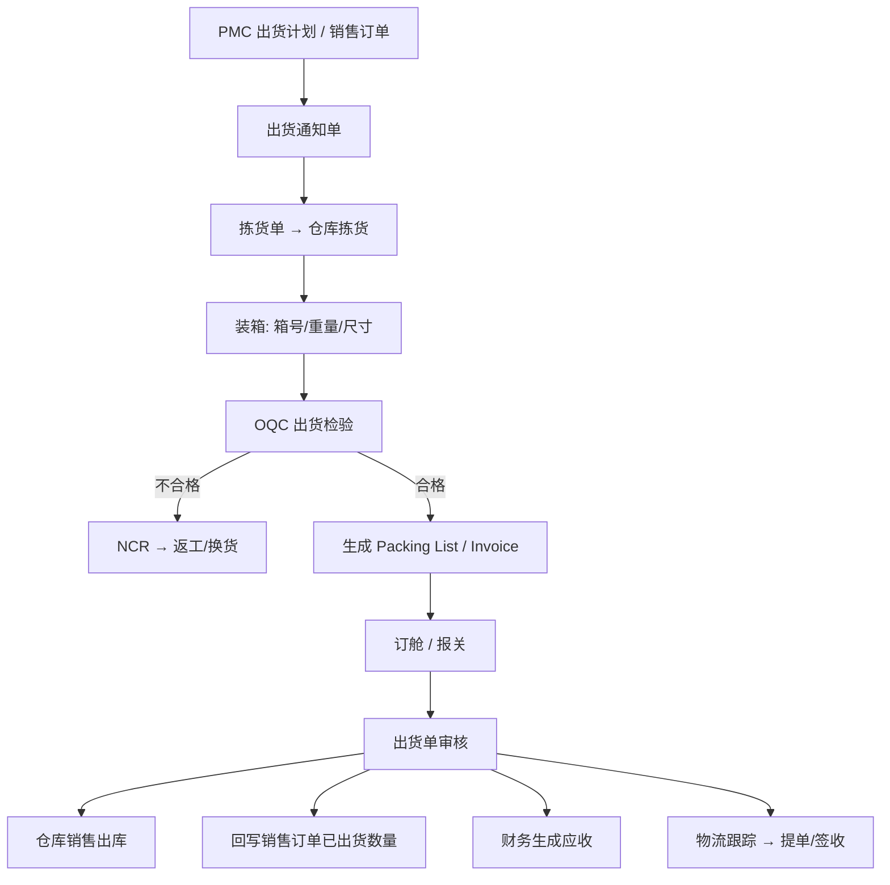

# 11 出货

## 1. 模块定位

出货模块负责把成品从仓库交到客户手里，包括外销出货所需的单证：出货通知、拣货、装箱、Packing List、Commercial Invoice、报关/订舱资料、出货单。出货计划由 PMC 编制，本模块负责**执行**；实际库存扣减调用仓库 API；出货确认后通知销售（回写已出货数量）和财务（生成应收）。

## 2. 用户角色

- **船务 / 单证员**：出货通知、订舱、制作 PL/CI、报关资料、跟踪物流。
- **仓管员**：拣货、装箱、出库。
- **OQC 检验员**：出货检验。
- **业务员**：确认出货内容和客户要求、跟踪提单。

## 3. 功能清单

| 子功能 | 功能点 | 优先级 |
|---|---|---|
| 出货通知 | 基于 PMC 出货计划或销售订单生成出货通知单（本次出哪些订单行、多少数量、出货日期、运输方式、目的港） | P0 |
| 拣货单 | 按出货通知生成拣货单，系统推荐批次和库位；拣货确认 | P1 |
| 装箱 | 录入箱号、每箱数量、毛重、净重、尺寸（体积）；混装；打印箱唛（外箱标签） | P1 |
| Packing List | 按装箱结果生成装箱单（英文），按客户模板打印 | P0 |
| Commercial Invoice | 按出货内容生成商业发票（英文），币别、单价、贸易条款、HS 编码、原产地 | P0 |
| 订舱/物流 | 货代、船公司/航空公司、柜型、柜号、封条号、提单号、ETD/ETA；物流跟踪状态 | P1 |
| 报关资料 | 报关要素（HS 编码、申报要素、申报品名、数量、单位、金额）；导出报关单草稿；报关单号回填 | P1 |
| OQC 联动 | 出货前发起 OQC；OQC 合格才能出库 | P0 |
| 出货单 | 出货确认：仓库出库、回写销售订单已出货数量、生成应收 | P0 |
| 客户签收 | 国内：签收单回传；外销：提单日期作为出货完成依据 | P1 |
| 出货文件归档 | 提单、报关单、原产地证、保险单等附件归档 | P1 |

说明：原菜单中“出货单”与“Shipment”合并为一张**出货单**（Shipment），承载出库和物流信息，避免两张单据重复。

## 4. 核心流程

## 5. 数据实体

| 实体 | 关键字段 |
|---|---|
| shp_notice 出货通知 | 通用单头 + customer_id, ship_date, transport_mode(海运/空运/快递/陆运), trade_term, port_of_loading, port_of_destination, ship_to_address_id, forwarder_id |
| shp_notice_line | sales_order_line_id, material_id, qty, customer_part_no, picked_qty, shipped_qty |
| shp_picking 拣货单 | 通用单头 + notice_id, warehouse_id |
| shp_picking_line | notice_line_id, material_id, location_id, batch_no, suggested_qty, picked_qty |
| shp_packing 装箱 | notice_id, carton_no_from, carton_no_to, carton_count, material_id, qty_per_carton, total_qty, net_weight, gross_weight, length, width, height, cbm, mixed |
| shp_packing_list 装箱单 | 通用单头 + notice_id, total_cartons, total_net_weight, total_gross_weight, total_cbm, template_id |
| shp_invoice 商业发票 | 通用单头 + notice_id, customer_id, currency, trade_term, total_amount, payment_term, bank_info, template_id |
| shp_invoice_line | material_id, description_en, hs_code, origin, qty, uom, unit_price, amount |
| shp_shipment 出货单 | 通用单头 + notice_id, customer_id, warehouse_id, forwarder, carrier, container_type, container_no, seal_no, bl_no, etd, eta, customs_decl_no, logistics_status, signed_at |
| shp_shipment_line | notice_line_id, sales_order_line_id, material_id, batch_no, qty, unit_price, amount |
| shp_customs 报关资料 | shipment_id, items(JSON: hs_code, declare_name, elements, qty, uom, amount), decl_no, decl_date |
| shp_forwarder 货代 | code, name, contact, phone, email |

## 6. 业务规则

1. 出货通知数量 ≤ 销售订单行未出货数量（订单数量 − 已出货 − 已通知未出货）；支持超出货比例参数。
2. 只能从**成品仓**出货；拣货推荐按 FIFO，只推荐合格状态库存。
3. 装箱总数量必须等于拣货数量；箱号连续不重复。
4. 需要 OQC 的客户/产品，出货单审核前必须 OQC 合格。
5. Invoice 金额 = 出货数量 × 订单单价；Invoice 与出货单一一对应（或一张 Invoice 对应多张出货单，参数控制）。
6. 出货单审核：同一事务内完成仓库出库过账 + 回写销售订单已出货数量；应收由财务监听事件生成。
7. 出货单反审核：仅在财务尚未确认应收、未开票时允许，同时回滚库存和订单已出货数量。
8. 客户信用：出货单审核时再次检查客户信用（参数：不控制/警告/禁止）。
9. HS 编码从物料带出，可在 Invoice 上修改；报关要素按 HS 编码模板生成。
10. 出货后提单日期作为回款计划“见提单”节点的起算日期，推送给销售。

## 7. 集成

| 方向 | 对象 | 内容 |
|---|---|---|
| 监听事件 | PMC | `ShippingPlanPublishedEvent` → 生成出货通知草稿 |
| 调用 | 销售 | 订单行信息、未出货数量、价格 |
| 调用 | CRM | 客户地址、通知方、开票信息 |
| 调用 | 仓库 | 批次推荐、销售出库过账 |
| 发布事件 | 品质 | `OqcRequestEvent` |
| 监听事件 | 品质 | `InspectionJudgedEvent`（OQC 结果） |
| 发布事件 | 销售、财务 | `ShipmentApprovedEvent`（回写已出货、生成应收）、`ShipmentUnapprovedEvent`、`BillOfLadingReceivedEvent` |

## 8. 报表

- 出货明细（按客户/产品/月份）
- 待出货清单、逾期未出货清单
- 出货准时率（实际出货日 vs 承诺交期）
- 出口报关统计（按 HS 编码/国家）
- 物流在途跟踪表

## 9. 权限点

`shp:notice:*`、`shp:picking:*`、`shp:packing:*`、`shp:packing-list:*`、`shp:invoice:*`、`shp:shipment:query / create / approve / unapprove / print`、`shp:customs:*`、`shp:forwarder:*`
