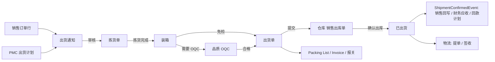

# 11 出货（总览）

## 1. 模块定位

出货负责把成品从仓库交付给客户：出货通知 → 拣货 → 装箱 → OQC → 出货单（出库）→ 单证（Packing List、Commercial Invoice、报关资料）→ 物流跟踪（提单、签收）。

边界：
- 出货数量来源于销售订单（出货只能针对已审核订单行）；
- 实际库存扣减由仓库确认“销售出库单”完成；
- OQC 判定归品质；
- 应收由财务监听出货确认事件生成。

## 2. 端到端流程

## 3. 功能与页面清单

| 功能 | 文档 | 页面 | 模板 | 路由 | 菜单权限 | 优先级 |
|---|---|---|---|---|---|---|
| 出货通知 | [01-出货通知](01-出货通知.md) | 列表 / 编辑 / 详情 | T1 / T4 / T5 | `/shipping/notice` | `shp:notice:query` | P0 |
| 拣货与装箱 | [02-拣货与装箱](02-拣货与装箱.md) | 拣货单、装箱 | T1 / 专用 | `/shipping/picking`、`/shipping/packing` | `shp:picking:query`、`shp:packing:query` | P0 |
| 出货单 | [03-出货单](03-出货单.md) | 列表 / 编辑 / 详情 | T1 / T4 / T5 | `/shipping/shipment` | `shp:shipment:query` | P0 |
| 出货单证 | [04-出货单证](04-出货单证.md) | Packing List、Invoice、报关资料 | T1 / T4 | `/shipping/packing-list`、`/shipping/invoice`、`/shipping/customs` | `shp:document:query` | P0 / P1 |
| 物流跟踪 | [05-物流跟踪](05-物流跟踪.md) | 物流跟踪、货代 | T1 | `/shipping/logistics`、`/shipping/forwarder` | `shp:logistics:query` | P1 |
| 出货报表 | [06-出货报表](06-出货报表.md) | 出货明细、待出货、准时率 | T7 | `/shipping/report` | `shp:report:query` | P1 |

菜单顺序：出货通知、拣货单、装箱、出货单、Packing List、Invoice、报关、物流跟踪、货代、出货报表。

## 4. 用户角色

| 角色 | 功能 | 数据范围 |
|---|---|---|
| 船务 / 单证员 | 出货通知、出货单、单证、订舱、物流 | 全部或本部门 |
| 仓管员 | 拣货、装箱、确认出库 | 按仓库 |
| 业务员 | 查看自己订单的出货、单证 | 仅本人（按订单业务员） |

## 5. 数据表

shp_notice、shp_notice_line、shp_picking、shp_picking_line、shp_carton、shp_carton_line、shp_shipment、shp_shipment_line、shp_packing_list、shp_invoice、shp_invoice_line、shp_customs、shp_customs_item、shp_forwarder、shp_logistics_event。

## 6. 编码规则

SHP_NOTICE、SHP_PICKING、SHP_PACKING_LIST（允许手工）、SHP_INVOICE（允许手工）、SHP_SHIPMENT；报关资料 SHP_CUSTOMS（`CD-yyyyMM-4`）。

## 7. 内置字典

| 类型编码 | 名称 | 内置项 |
|---|---|---|
| shp_transport_mode | 运输方式 | SEA 海运、AIR 空运、EXPRESS 快递、LAND 陆运、RAIL 铁路 |
| shp_container_type | 柜型 | 20GP、40GP、40HQ、LCL 拼箱 |
| shp_carton_spec | 常用外箱规格 | 无内置项（管理员维护：名称 + 长宽高 cm + 皮重 kg） |
| shp_logistics_status | 物流状态 | BOOKED 已订舱、LOADED 已装柜、DEPARTED 已离港、ARRIVED 已到港、CLEARED 已清关、DELIVERED 已签收 |

## 8. 可审批单据

| 单据类型 | 名称 | 条件字段 |
|---|---|---|
| SHP_NOTICE | 出货通知 | amountBase、creditWarning、prepaymentUnpaid（出货前款项未收齐，布尔） |
| SHP_SHIPMENT | 出货单（放行） | amountBase、creditWarning、prepaymentUnpaid |

## 9. 可打印单据

出货通知（中文）、拣货单（中文，按库位排序）、箱唛标签（中/英，每箱一张）、Packing List（英文）、Commercial Invoice（英文）、出货单/送货单（中文，客户签收联）、报关资料（中文）。

## 10. 系统参数

| 编码 | 分组 | 名称 | 类型 | 默认 | 说明 |
|---|---|---|---|---|---|
| shp.notice.credit-check | 出货 | 出货通知提交时检查信用 | BOOL | 是 | 使用 CRM 信用规则 |
| shp.shipment.prepayment-check | 出货 | 出货前款项未收齐时 | ENUM(NONE/WARN/BLOCK) | WARN | 检查销售回款计划中“出货前”节点 |
| shp.oqc.required-default | OQC | 未设置物料 OQC 属性时默认需要 OQC | BOOL | 否 | 以物料质量属性“出货检验”为准 |
| shp.picking.enabled | 拣货 | 启用拣货单 | BOOL | 是 | 否：出货单直接生成出库单，由仓管员确认时分配批次 |
| shp.packing.enabled | 装箱 | 启用装箱 | BOOL | 是 | 否：Packing List 按出货单行简单生成（不记录箱号） |

## 11. 对其他模块提供的 API（shipping-api）

| 接口 | 方法 | 使用方 |
|---|---|---|
| `ShipmentQueryApi` | `getShippedLines(customerId, filter)`（退货选单）、`getShipmentsByBatch(materialId, batchNo)`（追溯）、`getShipmentsByOrder(orderId)` | 销售、生产追溯、品质、财务 |

**发布事件**：`ShipmentNoticeChangedEvent`（已通知数量）、`OqcRequestEvent`、`ShipmentConfirmedEvent`（订单行、数量、金额、批次、出货日期）、`ShipmentReversedEvent`、`BillOfLadingReceivedEvent`、`ShipmentSignedEvent`。

**监听事件**：仓库 `StockOutConfirmedEvent` / `StockOutReversingEvent` / `StockOutReversedEvent`（销售出库）；品质 `InspectionJudgedEvent`（OQC）；PMC `ShippingPlanPublishedEvent`；CRM `CustomerStatusChangedEvent`（黑名单拦截）。

## 12. 权限点汇总

| 分组 | 权限点 |
|---|---|
| 出货通知 | `shp:notice:query`（菜单）、`create`、`update`、`delete`、`submit`、`unapprove`、`close`、`print` |
| 拣货 | `shp:picking:query`（菜单）、`pick`（录入拣货）、`print` |
| 装箱 | `shp:packing:query`（菜单）、`pack`、`print-label` |
| 出货单 | `shp:shipment:query`（菜单）、`create`、`update`、`delete`、`submit`、`withdraw`、`print`、`export` |
| 单证 | `shp:document:query`（菜单）、`create`、`update`、`print`；字段 `shp:document:price`（Invoice 价格，默认与 `sales:order:query` 同时授予） |
| 物流 | `shp:logistics:query`（菜单）、`update`、`shp:forwarder:manage` |
| 报表 | `shp:report:query`（菜单）、`export` |
