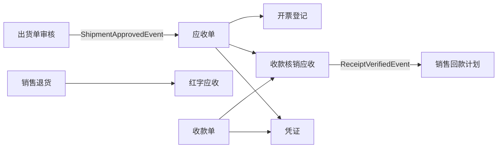
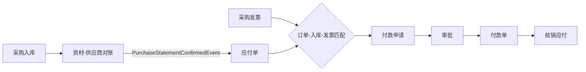
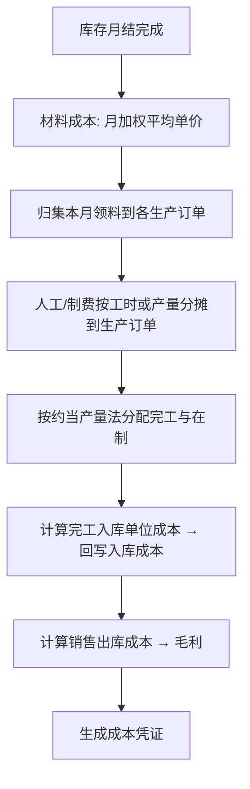

# 12 财务

## 1. 模块定位

财务模块负责业务财务一体化中的**账务处理**：应收、应付、收款、付款、核销、总账凭证、成本核算和利润分析。业务模块只产生业务单据，财务通过监听业务事件生成应收/应付单和凭证草稿，**财务不反向修改业务单据**。

本系统财务范围为“业务财务 + 简版总账”。如企业已使用金蝶/用友等专业财务软件，可只启用应收应付和成本，通过凭证接口导出到外部总账。

## 2. 用户角色

- **应收会计**：应收确认、开票、收款核销、账龄。
- **应付会计**：应付确认、供应商对账、付款申请与核销。
- **出纳**：收付款登记、银行流水。
- **成本会计**：月末成本计算、成本分析。
- **财务主管**：审核、月结、报表。

## 3. 功能清单

| 子功能 | 功能点 | 优先级 |
|---|---|---|
| 基础设置 | 会计科目、会计期间、结算方式、银行账户、科目映射规则（业务类型 → 科目） | P0 |
| 应收 | 出货自动生成应收单；销售退货生成红字应收；其他应收；应收确认；销售发票登记 | P0 |
| 收款 | 收款单（银行水单）；预收款；收款核销应收（手工/自动按 FIFO）；汇兑差异 | P0 |
| 应付 | 采购对账确认生成应付单；采购退货红字应付；委外加工费应付；其他应付；采购发票登记（三单匹配：订单-入库-发票） | P0 |
| 付款 | 付款申请（按到期应付）→ 审批 → 付款单 → 核销应付；预付款 | P0 |
| 账龄与对账 | 应收/应付账龄；客户/供应商对账单；逾期提醒 | P0 |
| 凭证 | 业务单据按规则生成凭证草稿；凭证审核、过账；凭证导出（对接外部财务软件） | P1 |
| 成本核算 | 月末：材料成本（月加权平均）、人工与制造费用分摊、在制品与完工产品成本分配；产品单位成本 | P1 |
| 成本分析 | 实际成本 vs 标准成本差异；订单成本；材料价差、量差 | P1 |
| 利润 | 订单毛利、产品毛利、客户毛利；月度损益简表 | P1 |
| 费用 | 费用报销（按部门/项目）、费用分摊到成本 | P2 |
| 汇兑 | 外币应收应付期末汇率重估 | P1 |
| 月结 | 检查（库存已月结、凭证已过账）→ 成本计算 → 结账；反结账 | P1 |

## 4. 核心流程

### 4.1 应收到收款

### 4.2 应付到付款

### 4.3 月末成本计算

多级产品按 BOM 低位码从下往上逐级计算（先半成品，后成品）。

## 5. 数据实体

| 实体 | 关键字段 |
|---|---|
| fin_account 会计科目 | code, name, parent_code, type(资产/负债/权益/成本/损益), direction, aux_types(客户/供应商/部门/项目), status |
| fin_period 会计期间 | year, period, start_date, end_date, status(未开/已开/已结) |
| fin_account_mapping 科目映射 | biz_type, condition(JSON), debit_account, credit_account |
| fin_bank_account 银行账户 | code, bank_name, account_no, currency, account_id |
| fin_receivable 应收单 | 通用单头 + customer_id, source_type, source_id, currency, exchange_rate, amount, tax_amount, due_date, verified_amount, status |
| fin_receivable_line | material_id, qty, unit_price, amount, source_line_id |
| fin_receipt 收款单 | 通用单头 + customer_id, bank_account_id, currency, exchange_rate, amount, receipt_type(销售收款/预收), verified_amount |
| fin_payable 应付单 | 通用单头 + supplier_id, source_type, source_id, currency, exchange_rate, amount, tax_amount, due_date, verified_amount, status |
| fin_payable_line | material_id, qty, unit_price, amount, source_line_id |
| fin_invoice 发票登记 | direction(销项/进项), invoice_no, invoice_type, partner_id, amount, tax_amount, invoice_date, matched_status |
| fin_payment_request 付款申请 | 通用单头 + supplier_id, amount, payables(JSON), plan_pay_date |
| fin_payment 付款单 | 通用单头 + supplier_id, bank_account_id, currency, amount, payment_type(采购付款/预付), verified_amount |
| fin_verification 核销记录 | verify_type(收款-应收/付款-应付/预收冲应收…), doc_a_id, doc_b_id, amount, exchange_diff, verified_at |
| fin_voucher 凭证 | period, voucher_no, voucher_date, source_type, source_id, status(草稿/已审核/已过账), total_debit, total_credit |
| fin_voucher_line | voucher_id, account_code, summary, debit, credit, aux_customer_id, aux_supplier_id, aux_dept_id, currency, fc_amount |
| fin_cost_calc 成本计算 | period, status, started_at, finished_at |
| fin_cost_order 生产订单成本 | period, prod_order_id, material_cost, labor_cost, overhead_cost, wip_cost, finished_qty, unit_cost |
| fin_cost_item 产品单位成本 | period, material_id, unit_cost, material_part, labor_part, overhead_part |

## 6. 业务规则

1. **来源唯一**：同一出货单行/对账单行只能生成一次应收/应付（以 source_line_id 唯一约束保证幂等，重复事件不会重复生成）。
2. **核销**：核销金额 ≤ 双方剩余未核销金额；外币核销产生汇兑差异，自动记入汇兑损益。
3. **三单匹配**：发票数量 ≤ 入库数量 − 已开票数量；单价差异超过容差（默认 1%）需审批。
4. **付款控制**：付款金额 ≤ 已确认应付未付金额（预付款除外）；付款申请需审批；同一应付不能重复申请。
5. **期间控制**：已结账期间不允许新增/修改凭证和应收应付单；业务单据日期落在已结期间时拒绝审核。
6. **凭证平衡**：借贷必须相等才能保存为已审核。
7. **成本计算**：库存未月结不能计算成本；成本计算可重复执行（幂等覆盖本期结果），结账后锁定。
8. **金额精度**：所有金额用 BigDecimal 运算，四舍五入 HALF_UP 到 2 位；尾差计入最后一行。
9. **反审核限制**：已核销、已生成凭证并过账的应收应付单不能反审核。

## 7. 集成

| 方向 | 对象 | 内容 |
|---|---|---|
| 监听事件 | 出货 | `ShipmentApprovedEvent` → 应收；`ShipmentUnapprovedEvent` → 作废应收（未核销时） |
| 监听事件 | 销售 | `SalesReturnApprovedEvent` → 红字应收 |
| 监听事件 | 资材 | `PurchaseStatementConfirmedEvent` → 应付；`PurchaseReturnApprovedEvent` → 红字应付 |
| 监听事件 | 生产 | `ProductionOrderClosedEvent`、报工工时数据 |
| 监听事件 | 仓库 | `PeriodClosedEvent` → 可进行成本计算 |
| 发布事件 | 销售 | `ReceiptVerifiedEvent` → 更新回款计划 |
| 发布事件 | CRM | `ReceivableChangedEvent` → 更新信用占用 |
| 调用 | 仓库 | 收发存数量和金额 |
| 调用 | 研发工程 | BOM 低位码、标准成本 |

## 8. 报表

- 应收账龄表、应付账龄表
- 客户/供应商往来对账单
- 收付款日报、资金收支汇总
- 产品成本明细表、成本差异分析
- 订单毛利表、客户毛利排名、产品毛利排名
- 月度损益简表
- 科目余额表、明细账（启用总账时）

## 9. 权限点

`fin:account:*`、`fin:period:*`、`fin:receivable:*`、`fin:receipt:*`、`fin:payable:*`、`fin:payment-request:*`、`fin:payment:*`、`fin:verify:*`、`fin:invoice:*`、`fin:voucher:*`、`fin:cost:calc / query`、`fin:profit:query`、`fin:close:execute / reopen`
