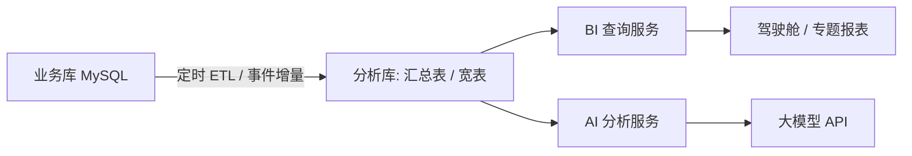

# 13 BI / AI

## 1. 模块定位

BI/AI 模块提供**跨模块**的经营分析和智能分析。各业务模块内部保留操作型报表（如“逾期未到货清单”），BI 负责需要跨模块汇总、趋势对比、钻取的分析型报表。BI **只读**业务数据，不写业务表。

## 2. 用户角色

- **管理层**：经营驾驶舱、各专题分析。
- **部门主管**：本部门专题分析。
- **数据分析员**：维护指标定义、报表配置。

## 3. 功能清单

| 子功能 | 功能点 | 优先级 |
|---|---|---|
| 指标库 | 统一指标定义（名称、口径、计算公式、数据来源、更新频率、负责人），避免各报表口径不一致 | P1 |
| 经营分析（驾驶舱） | 销售额、回款额、毛利、毛利率、库存金额、应收余额、订单交期达成率、良率；同比/环比；目标达成 | P1 |
| 销售分析 | 按客户/区域/产品/业务员的销售额与趋势；客户贡献 ABC 分析；报价成功率；新老客户占比 | P1 |
| 采购分析 | 采购金额与趋势；价格走势；供应商份额与集中度；交期准时率；来料合格率 | P1 |
| 库存分析 | 库存金额（按仓库类型/物料类别）；周转天数；库龄；呆滞；待检仓/不良品仓/退货仓滞留分析 | P1 |
| 生产分析 | 计划达成率；工序良率与直通率；产能利用率；工时效率；生产周期 | P1 |
| 品质分析 | 来料/制程/出货合格率趋势；缺陷 Pareto；客诉趋势；质量成本（报废、返工、退货） | P1 |
| AI 分析 | 自然语言问数；异常检测；销售预测；智能补货建议；报表解读摘要 | P2 |
| 报表订阅 | 定时（日/周/月）把报表以邮件或站内信推送给指定人 | P2 |
| 自助分析 | 选择维度和指标拖拽生成图表（P2，或集成外部 BI 工具） | P2 |

## 4. 数据架构

1. **不直接在业务库上做重查询**：BI 报表查询分析库中的汇总表（按日/月、按维度预聚合），避免影响业务操作性能。
2. **增量更新**：业务事件（如 `ShipmentApprovedEvent`）触发对应汇总表增量更新，同时每晚全量校对一次。
3. **分析库**：初期可以是同一 MySQL 实例的独立 schema；数据量增大后可切换为 ClickHouse/Doris，BI 查询服务接口不变。
4. **数据权限**：BI 查询同样按数据权限过滤（业务员只能看自己的销售分析）。

## 5. AI 分析设计

| 能力 | 说明 | 实现要点 |
|---|---|---|
| 自然语言问数 | 例：“上个月哪个客户的销售额下降最多？” | 大模型根据**指标库和语义层**生成查询（只允许调用白名单指标查询接口，不允许生成任意 SQL 直连业务库）；结果附带口径说明 |
| 异常检测 | 销售额骤降、采购价异常上涨、良率突降、库存异常积压 | 统计方法（同比/环比阈值、3σ）先筛选，再由大模型生成解释和建议 |
| 销售预测 | 基于历史订单预测未来 3 个月需求 | 时间序列模型输出结果写入销售预测草稿，由计划员确认 |
| 补货建议 | 结合预测、安全库存、提前期给出采购建议 | 输出为建议，不直接生成单据 |
| 报表解读 | 驾驶舱数据自动生成文字摘要（周报/月报） | 大模型总结，标注数据来源 |

**AI 使用原则**
- AI 只读、只建议，不自动执行业务操作；所有建议需人工确认后才转为单据。
- 调用大模型时传入的数据遵守数据权限；敏感字段（成本、价格）按配置脱敏或不传。
- 所有 AI 问答记录日志（问题、生成的查询、结果、用户），便于审计和优化。
- 大模型供应商通过适配器接入，可替换。

## 6. 数据实体

| 实体 | 关键字段 |
|---|---|
| bi_metric 指标定义 | code, name, definition, formula, source, granularity, refresh_cycle, owner_id |
| bi_agg_sales_daily 销售日汇总 | date, customer_id, material_id, salesperson_id, order_amount, ship_amount, receipt_amount, cost_amount |
| bi_agg_purchase_daily 采购日汇总 | date, supplier_id, material_id, order_amount, receipt_qty, qualified_qty, on_time_flag_count |
| bi_agg_inventory_monthly 库存月汇总 | period, warehouse_id, material_id, begin_qty, in_qty, out_qty, end_qty, end_amount |
| bi_agg_production_daily 生产日汇总 | date, work_center_id, material_id, plan_qty, good_qty, defect_qty, work_hours |
| bi_agg_quality_daily 品质日汇总 | date, inspect_type, supplier_id, material_id, lot_count, pass_count, defect_count |
| bi_etl_job ETL 任务 | job_code, last_run_at, status, rows, error_msg |
| bi_subscription 报表订阅 | report_code, cron, receivers, channel |
| ai_query_log AI 问答日志 | user_id, question, generated_query, result_summary, feedback, created_at |

## 7. 业务规则

1. 每个报表上显示数据截止时间（如“数据更新于 2026-09-24 10:00”）。
2. 驾驶舱指标数据延迟 ≤ 15 分钟；专题报表 T+1 可接受（可配置）。
3. 指标口径以指标库为准；修改指标口径需记录版本，历史报表可按口径版本重算。
4. 报表导出受数据权限和导出权限控制。

## 8. 集成

- **监听事件**：各模块的审核类事件（订单、出货、收款、入库、报工、检验）→ 增量更新汇总表。
- **调用**：各模块查询 API（用于每晚全量校对）。
- **输出**：工作台看板卡片数据、预警（异常检测结果推送到工作台）。

## 9. 权限点

`bi:dashboard:view`、`bi:sales:view`、`bi:purchase:view`、`bi:inventory:view`、`bi:production:view`、`bi:quality:view`、`bi:metric:manage`、`bi:subscription:manage`、`ai:query:use`、`ai:log:view`
