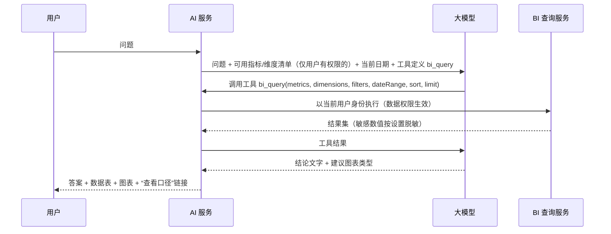

# 13-04 AI 分析

## 1. 功能说明

在指标库和数据权限的约束下，用自然语言提问经营数据、自动解读异常、生成经营周报。

- 使用者：管理层、各部门主管（`ai:query:use`）
- 优先级：P2（依赖 BI 指标库与汇总表先完成）
- 原则：**AI 只读、只建议**。AI 不执行任何业务操作，不生成单据；所有数字来自 BI 查询服务（`/bi/query`），AI 负责理解问题、选择指标和维度、组织结论。

## 2. 功能

### 2.1 AI 问数（对话）

示例问题：“上个月哪 5 个客户的出货额下降最多？”“电子料本季度来料合格率最低的供应商是哪家？”“FG00001 最近 6 个月的毛利率趋势？”

处理流程：

- 大模型只能通过 `bi_query` 工具取数，**不能生成 SQL**、不能访问业务表。
- 答案必须附带所用指标、期间、筛选条件，用户可点击“在专题分析中打开”。
- 无法回答（指标不存在、无权限）时如实说明，不编造数字。

### 2.2 异常解读

- 每天 08:00 检测：各 KPI 与过去 8 周同星期均值偏离超过 3σ，或环比变化超过 30% 的指标（按维度检测前 20 个客户/供应商/物料）。
- 统计方法先筛选异常，再把异常数据（指标、维度、数值、历史）交给大模型生成 2～3 句解释与建议关注点。
- 结果以预警（类型 AI_ANOMALY，级别 INFO/WARNING）推送给相关权限用户，并在 AI 页面“异常”页签列出。

### 2.3 经营周报

每周一 07:30 为有 `bi:dashboard:view` 的用户生成上周经营周报：驾驶舱 KPI 与变化、Top 变化客户/产品、交付与质量要点、异常摘要；大模型生成文字总结；在 AI 页面查看，可选邮件发送（订阅）。

### 2.4 销售预测建议（P2）

基于历史出货（至少 12 个月）的时间序列模型给出未来 3 个月的物料需求预测，输出为“预测建议”，业务/计划员确认后可一键生成销售预测草稿（04-销售 / 05-销售预测）。

## 3. 数据表

| 表 | 内容 |
|---|---|
| ai_conversation | user_id、title、created_at |
| ai_message | conversation_id、role（USER/ASSISTANT/TOOL）、content、tool_call（json）、tokens、created_at |
| ai_query_log | user_id、question、tool_calls（json：指标、维度、条件）、result_rows、latency_ms、feedback（👍/👎 + 说明）、created_at |

## 4. 页面（`/bi/ai`）

- 左侧会话列表（新建、重命名、删除）；右侧对话区：输入框（Enter 发送，Shift+Enter 换行）、示例问题快捷按钮；回答中包含文字结论、数据表（可导出）、图表、“口径”折叠区、👍/👎 反馈。
- 页签：对话 / 异常 / 周报。
- 管理员（`ai:setting:manage`）：设置页（参数见 README）、用量统计（按用户、按日的提问数和 token 数）；`ai:log:view` 查看问答日志。

## 5. 业务规则

| 编号 | 规则 | 提示原文 |
|---|---|---|
| AI-R01 | 未启用或未配置 API Key 时菜单显示但页面提示 | `AI 分析未启用，请联系管理员配置` |
| AI-R02 | 发送给模型的指标清单只包含当前用户有权限的指标；工具执行以当前用户身份和数据范围进行 | — |
| AI-R03 | 参数 `ai.mask-sensitive` 为是时，成本、单价、毛利额等敏感数值不发送给模型：以比例、排名、变化率代替；返回给用户的数据表中仍显示真实数值（在本系统内渲染） | — |
| AI-R04 | 每用户每日提问上限 | `今日提问次数已达上限 {n}` |
| AI-R05 | 模型调用超时 60 秒；失败时返回“AI 服务暂时不可用，请稍后重试”，并记录日志 | — |
| AI-R06 | 大模型供应商通过 `LlmAdapter` 接口接入，默认实现 Anthropic Messages API（工具调用），可扩展 OpenAI 兼容接口 | — |
| AI-R07 | 问答日志保留 180 天 | — |

## 6. 接口

`GET/POST/PUT/DELETE /bi/ai/conversations`、`POST /bi/ai/conversations/{id}/messages`（流式返回，SSE）、`POST /bi/ai/messages/{id}/feedback`、`GET /bi/ai/anomalies`、`GET /bi/ai/weekly-reports`、`GET /bi/ai/usage`、`GET /bi/ai/logs`。

## 7. 验收用例

| 编号 | 前置条件 | 操作 | 预期结果 |
|---|---|---|---|
| AI-T01 | 启用 AI | 问“上个月出货额是多少” | 回答数值与驾驶舱一致，并标注指标“出货额”、期间 |
| AI-T02 | 业务员 | 问“全公司毛利率” | 回答说明没有该指标的权限，不给出数字 |
| AI-T03 | 脱敏开启 | 问产品毛利排名 | 发给模型的数据只有排名和毛利率变化；页面表格显示真实毛利额 |
| AI-T04 | 某客户出货环比下降 60% | 次日 08:00 | 异常页签出现该客户，附解读 |
