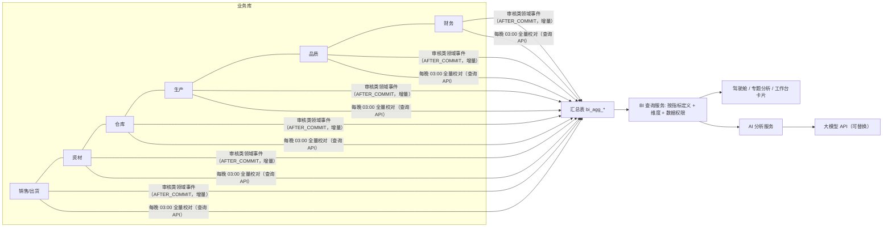

# 13 BI / AI（总览）

## 1. 模块定位

提供**跨模块**的经营分析与智能分析：统一指标库、汇总数据层、经营驾驶舱、专题分析（销售、采购、库存、生产、品质）、AI 分析（问数、异常解读、预测）。

边界：
- 各业务模块自己的操作型报表（如逾期未到货、待检清单）留在各模块；BI 负责需要跨模块汇总、趋势对比、下钻的分析；
- BI **只读**业务数据，数据来自汇总表（由事件增量 + 每晚全量校对生成），不直接在业务表上做重查询。

## 2. 功能与页面清单

| 功能 | 文档 | 页面 | 路由 | 菜单权限 | 优先级 |
|---|---|---|---|---|---|
| 指标库与数据层 | [01-指标库与数据层](01-指标库与数据层.md) | 指标库、数据任务 | `/bi/metric`、`/bi/etl` | `bi:metric:manage` | P1 |
| 经营驾驶舱 | [02-经营驾驶舱](02-经营驾驶舱.md) | 经营分析 | `/bi/dashboard` | `bi:dashboard:view` | P1 |
| 专题分析 | [03-专题分析](03-专题分析.md) | 销售、采购、库存、生产、品质分析 | `/bi/sales` 等 | `bi:sales:view` 等 | P1 |
| AI 分析 | [04-AI分析](04-AI分析.md) | AI 问数、异常解读、经营周报 | `/bi/ai` | `ai:query:use` | P2 |

## 3. 数据架构

- 汇总表初期放在同一 MySQL 实例（表前缀 `bi_`）；数据量增大后可迁移到 ClickHouse/Doris，BI 查询服务接口不变。
- 数据延迟：增量更新 ≤ 15 分钟（事件异步处理）；成本、毛利类数据在成本计算完成（`CostCalculatedEvent`）后更新。
- 数据权限：BI 查询同样按用户数据范围过滤（汇总表保留 owner_id/dept_id 维度）。

## 4. 数据表

bi_metric、bi_agg_sales_daily、bi_agg_purchase_daily、bi_agg_inventory_monthly、bi_agg_inventory_daily_snapshot、bi_agg_production_daily、bi_agg_quality_daily、bi_agg_finance_monthly、bi_etl_job、bi_etl_log、bi_subscription、ai_conversation、ai_message、ai_query_log。

## 5. 系统参数

| 编码 | 分组 | 名称 | 类型 | 默认 | 说明 |
|---|---|---|---|---|---|
| bi.etl.nightly-time | 数据 | 全量校对时间 | TIME | 03:00 | |
| bi.fiscal.year-start-month | 口径 | 财年起始月 | INT(1～12) | 1 | |
| ai.enabled | AI | 启用 AI 分析 | BOOL | 否 | |
| ai.provider | AI | 大模型供应商 | ENUM(ANTHROPIC/OPENAI_COMPATIBLE) | ANTHROPIC | 适配器可扩展 |
| ai.model | AI | 模型 | STRING | claude-sonnet-5 | |
| ai.api-key | AI | API Key | STRING | 空 | 加密存储，页面只显示后 4 位；也可用环境变量 `ERP_AI_API_KEY` 注入 |
| ai.mask-sensitive | AI | 敏感字段脱敏 | BOOL | 是 | 成本、价格、利润类数值不发送给模型（只发送比例和趋势） |
| ai.daily-quota-per-user | AI | 每用户每日提问上限 | INT | 50 | |

## 6. 权限点

`bi:dashboard:view`、`bi:sales:view`、`bi:purchase:view`、`bi:inventory:view`、`bi:production:view`、`bi:quality:view`、`bi:finance:view`（财务类指标，含毛利）、`bi:metric:manage`、`bi:subscription:manage`、`bi:export`、`ai:query:use`、`ai:log:view`、`ai:setting:manage`。
