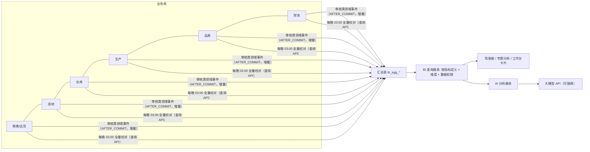

# 13 BI / AI（总览）

## 1. 模块定位

提供**跨模块**的经营分析与智能分析：统一指标库、汇总数据层、经营驾驶舱、专题分析（销售、采购、库存、生产、品质）、AI 分析（问数、异常解读、预测）。

边界：
- 各业务模块自己的操作型报表（如逾期未到货、待检清单）留在各模块；BI 负责需要跨模块汇总、趋势对比、下钻的分析；
- BI **只读**业务数据，数据来自汇总表（由事件增量 + 每晚全量校对生成），不直接在业务表上做重查询。

## 2. 功能与页面清单

| 功能 | 文档 | 页面 | 路由 | 菜单权限 | 优先级 |
|---|---|---|---|---|---|
| 指标库与数据层 | [01-指标库与数据层](01-指标库与数据层.md) | 指标库、数据任务 | `/bi/metric`、`/bi/etl` | `bi:metric:manage` | P1 |
| 经营驾驶舱 | [02-经营驾驶舱](02-经营驾驶舱.md) | 经营分析 | `/bi/dashboard` | `bi:dashboard:view` | P1 |
| 专题分析 | [03-专题分析](03-专题分析.md) | 销售、采购、库存、生产、品质分析 | `/bi/sales` 等 | `bi:sales:view` 等 | P1 |
| AI 分析 | [04-AI分析](04-AI分析.md) | AI 问数、异常解读、经营周报 | `/bi/ai` | `ai:query:use` | P2 |

## 3. 数据架构

```mermaid
flowchart LR
  subgraph 业务库
    S[销售/出货] --- P[资材] --- I[仓库] --- M[生产] --- Q[品质] --- F[财务]
  end
  S & P & I & M & Q & F -->|审核类领域事件（AFTER_COMMIT，增量）| AGG[汇总表 bi_agg_*]
  S & P & I & M & Q & F -->|每晚 03:00 全量校对（查询 API）| AGG
  AGG --> API[BI 查询服务: 按指标定义 + 维度 + 数据权限]
  API --> UI[驾驶舱 / 专题分析 / 工作台卡片]
  API --> AI[AI 分析服务] --> LLM[大模型 API（可替换）]
```

- 汇总表初期放在同一 MySQL 实例（表前缀 `bi_`）；数据量增大后可迁移到 ClickHouse/Doris，BI 查询服务接口不变。
- 数据延迟：增量更新 ≤ 15 分钟（事件异步处理）；成本、毛利类数据在成本计算完成（`CostCalculatedEvent`）后更新。
- 数据权限：BI 查询同样按用户数据范围过滤（汇总表保留 owner_id/dept_id 维度）。

## 4. 数据表

bi_metric、bi_agg_sales_daily、bi_agg_purchase_daily、bi_agg_inventory_monthly、bi_agg_inventory_daily_snapshot、bi_agg_production_daily、bi_agg_quality_daily、bi_agg_finance_monthly、bi_etl_job、bi_etl_log、bi_subscription、ai_conversation、ai_message、ai_query_log。

## 5. 系统参数

| 编码 | 分组 | 名称 | 类型 | 默认 | 说明 |
|---|---|---|---|---|---|
| bi.etl.nightly-time | 数据 | 全量校对时间 | TIME | 03:00 | |
| bi.fiscal.year-start-month | 口径 | 财年起始月 | INT(1～12) | 1 | |
| bi.inventory.slow-moving-days | 口径 | 呆滞天数 | INT | 180 | 超过该天数无出库（从无出库按最近入库）计为呆滞 |
| ai.enabled | AI | 启用 AI 分析 | BOOL | 否 | |
| ai.provider | AI | 大模型供应商 | ENUM(DEEPSEEK/QWEN/OPENAI_COMPATIBLE) | DEEPSEEK | 均通过 OpenAI 兼容接口（Chat Completions + 工具调用）接入 |
| ai.base-url | AI | 接口地址 | STRING | 空 | 为空按供应商默认：DeepSeek `https://api.deepseek.com`、千问 `https://dashscope.aliyuncs.com/compatible-mode/v1`；其他兼容接口必填；也可用环境变量 `ERP_AI_BASE_URL` |
| ai.model | AI | 模型 | STRING | 空 | 为空按供应商默认：`deepseek-chat` / `qwen-plus`；须支持工具调用 |
| ai.api-key | AI | API Key | STRING | 空 | 加密存储，页面只显示后 4 位；也可用环境变量 `ERP_AI_API_KEY` 注入 |
| ai.mask-sensitive | AI | 敏感字段脱敏 | BOOL | 是 | 成本、价格、利润类数值不发送给模型（只发送比例和趋势） |
| ai.daily-quota-per-user | AI | 每用户每日提问上限 | INT | 50 | |

## 6. 权限点

`bi:dashboard:view`、`bi:sales:view`、`bi:purchase:view`、`bi:inventory:view`、`bi:production:view`、`bi:quality:view`、`bi:finance:view`（财务类指标，含毛利）、`bi:metric:manage`、`bi:subscription:manage`、`bi:export`、`ai:query:use`、`ai:log:view`、`ai:setting:manage`。

## 7. 实现说明（已实现）

- **数据来源**：契约 `bi-api` 的 `BiFactProvider` + `BiFacts`（销售 / 采购 / 生产 / 品质 / 库存快照 / 库存流水 / 往来事实记录）。各业务模块在自己的 biz 中实现（`service/bi/*BiFactProvider`），只查询本模块的表：销售（接单额按审核日、退货按收货日）、出货（出货额 = 出货行金额 × 汇率，不含税；首次出货的订单行按承诺交期 / 要求交期计交期达成）、财务（回款 = 收款核销应收 + 预收确认；应收 / 应付期末余额与逾期）、资材（采购订单审核额、合格入库额、到期行准时率）、生产（报工合格 / 不良 / 报废 / 工时，正常报工合格数计一次合格；合格完工入库；计划完工日的计划数量与延期订单）、品质（IQC / FQC / OQC 判定批次、NCR、客诉）、仓库（当前库存 × 参考单价、按期间和仓库类型的出入库金额）。BI 只合并事实，不访问业务表。
- **汇总与数据任务**（`BiEtlService`）：迁移脚本 `V1__bi.sql`。汇总时补齐类别（MaterialApi）、国家 / 业务员 / 部门（CustomerApi、事实自带的负责人优先）、采购员（SupplierApi）、公司（`OrgApi.getCompanyOf`）；出货成本 = 出货数量 × `CostQueryApi.getUnitCost(物料, 期间)`，只有已计算成本的出货额计入毛利率分母（`costed_ship_amount`）。任务：`INCREMENTAL` 增量处理器（定时任务 `BI_INCREMENTAL` 每 10 分钟，重算本月与最近 7 天、当前期间往来与库存流水、当日库存快照，数据延迟 ≤ 15 分钟）；`RECON_*` 各汇总表全量校对（`BI_NIGHTLY_RECONCILE` 每天 03:00，重算最近 3 个月并与现有汇总行按粒度键逐行比较，差异行覆盖并计数，BI-DATA-R02）；`INV_SNAPSHOT` 库存日快照（`BI_INVENTORY_SNAPSHOT` 23:50，同时计算无出库天数 / 库龄天数）。同一时刻只运行一个任务，运行结果记录在 `bi_etl_job` / `bi_etl_log`，失败原因写入日志并由下次校对修正（R01）。增量处理采用“定时重算最近区间”而非逐事件 +/- 调整，结果与全量校对一致。
- **指标库**（`MetricRegistry`）：代码注册指标定义（编码、名称、口径、来源表、聚合表达式 / 分子分母、时间聚合方式 SUM / LAST（每个时间段最后一个快照日或期间）/ AVG、维度白名单、权限、是否敏感）。除需求表中的指标外，另有退货额、出货数量、出货客户数、新客户数、出货成本、采购数量 / 均价、供应商数、FQC / OQC 合格率、来料检验批次、NCR 数、计划数量、良率、工时、库存数量、平均库存金额、呆滞占比、库龄 >180 天金额、出入库金额、逾期占比、应收 / 应付发生额、应付余额、DSO、DPO。派生指标（周转天数、DSO、DPO）按依赖指标在同一结果行上计算。页面只能修改展示名称、补充说明、负责人（`bi_metric`）。生产效率（标准工时 ÷ 实际工时）暂缺标准工时来源，未提供。
- **通用查询**（`POST /bi/query`）：metrics（≤12）、dimensions（≤3：date / customer / country / owner / dept / supplier / category / material / warehouse_type / warehouse / inspect_type）、filters（类别含下级）、from / to、granularity（day / month / quarter / year，月度来源按月）、sort / order / limit。按指标权限校验（“没有指标「{}」的查看权限”）和维度白名单（“指标「{}」不支持维度「{}」”）；同一来源的指标合并为一条 SQL，只由指标库常量与白名单列组成，筛选值参数化。数据范围由销售 / 采购 / 往来汇总表 Mapper 的 `@DataScope(org_id, dept_id, owner_id)` 过滤（BI-DATA-T03），生产、品质、库存汇总表不区分负责人。结果行含维度原值与 `<维度>_label` 名称，并返回所用指标的口径与“数据更新于”。
- **驾驶舱**（`GET /bi/dashboard?period=&from=&to=&compare=`）：期间本月 / 上月 / 本季 / 本年（按财年起始月）/ 自定义；环比为上一个同长度期间（整月期间按月平移），同比为去年同期。KPI：接单额、出货额、回款额、毛利额（附毛利率）、应收余额（附逾期应收）、库存金额；无 `bi:finance:view` 不返回毛利、应收（BI-DSH-R02）。另有近 12 个月接单 / 出货 / 回款、客户 Top10、品类占比（前 7 + 其他）、交付（交期达成率、在手订单金额与逾期未出货订单行，来自 `SalesOrderQueryApi` 并按数据范围过滤）、质量近 6 个月、库存按仓库类型与呆滞金额。卡片点击跳转专题页并带入期间。[导出 PDF] 使用浏览器打印（横向 A4 由打印设置选择）。
- **专题分析**：`GET /bi/pages/{code}/config` 返回当前用户可用的指标与维度；页面配置在前端 `modules/bi/components/topics.ts`（KPI、图表、明细维度与下钻顺序），数据全部来自 `/bi/query`。明细透视支持切换行维度、点击行下钻（面包屑返回）、同比列、元 / 万元切换，[导出] 为 CSV（需要 `bi:export`）。筛选条件只作用于支持该维度的指标，不支持的指标暂不显示。图表为 SVG 组件，色板为设计系统 token `--erp-chart-1..8` / `--erp-chart-other`。报表订阅（P2，`bi_subscription`）未实现。
- **AI 问数**：`LlmAdapter`（AI-R06）默认实现 `OpenAiCompatibleLlmAdapter`（OpenAI 兼容 Chat Completions 接口 + function calling，JDK HttpClient 直接调用，超时 60 秒），供应商 DeepSeek、通义千问（阿里云百炼兼容模式）或其他兼容服务，只需配置接口地址、模型、API Key；回传助手消息时只保留 content 与 tool_calls（不回传 DeepSeek 推理模型的 reasoning_content）。测试中以脚本化适配器替换。模型只有一个工具 `bi_query`（指标枚举只含当前用户有权限的指标，AI-R02），以提问人身份执行 `/bi/query` 的同一服务；筛选值可写名称（按名称匹配客户 / 供应商 / 物料 / 类别）。系统提示包含当前日期、可用指标与口径、回答要求（先结论、注明口径、无权限不给数字、建议图表类型）。脱敏开启时（AI-R03）敏感指标（出货成本、毛利额、采购均价）交给模型的只有排名、占比、环比，页面数据表显示真实数值。额度按问答日志计数（AI-R04）；模型失败记录日志并提示“AI 服务暂时不可用，请稍后重试”（AI-R05）；问答日志 `AI_LOG_CLEANUP` 保留 180 天（AI-R07）。提问接口为同步返回（未采用 SSE 流式），前端等待期间显示“正在查询与分析…”。API Key 页面只显示后 4 位，参数为空时读取环境变量 `ERP_AI_API_KEY`；参数在“系统参数”页面修改，暂未加密存储。
- **异常解读**（`AI_ANOMALY_DETECT` 每天 08:00）：公司合计的接单额、出货额、回款额、采购额与过去 8 周同星期均值偏离超过 3σ；按客户（出货额、接单额）、供应商（采购额）取前 30 天前 20 名，近 30 天较前 30 天变化 ≥ 30%（≥ 50% 为警告）。大模型为每项生成 2～3 句解释（未启用时使用模板说明），结果写入 `ai_anomaly` 并以预警 `AI_ANOMALY` 推送给 `bi:dashboard:view` 用户；异常页签按指标权限与客户 / 供应商数据范围过滤。
- **经营周报**（`AI_WEEKLY_REPORT` 每周一 07:30）：上周全公司口径 KPI 与环比、出货变化最大的客户、出货前 5 产品、异常摘要，大模型生成总结（未启用时使用模板），写入 `ai_weekly_report`；只对数据范围为“全部”的 `bi:dashboard:view` 用户显示，邮件订阅未实现。销售预测建议（P2）未实现。
- **测试**：`erp-server` 集成测试 `BiIntegrationTest`（BI-DATA-T01～T03、BI-DSH-T02、BI-TOP-T03、AI-T01～T04、AI-R01 / R04 / R05）；`bi-biz` 单元测试 `OpenAiCompatibleLlmAdapterTest` 用本地模拟服务验证请求格式、工具调用循环与错误处理。
