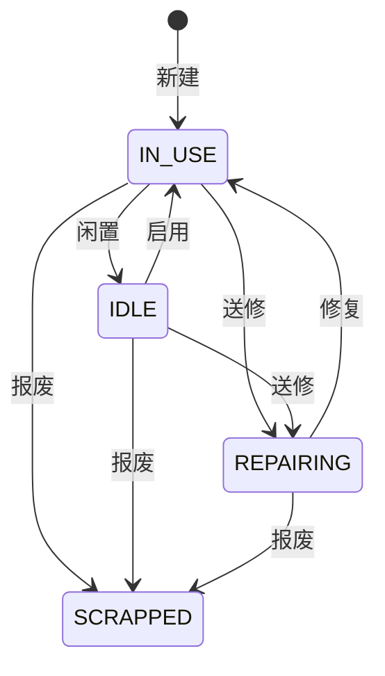

# 15 固定资产（总览）

## 1. 模块定位

按《编码规则管理制度》LD-QA-MS-001 管理公司的固定资产台账：设备、仪器、工装、设施的建档、使用状态与报废，资产编码统一生成、终身唯一、报废后永久封存不复用。

纳入标准（制度 3.5）：单位价值 ≥ 2000 元、使用年限 ≥ 12 个月、可独立使用和盘点；精密检测仪器、成套专用工装单价不足 2000 元但长期重复使用的，同样按固定资产管理。录入时不满足标准仅提示，不阻止保存。

边界：折旧计提、资产卡片入账属于财务模块（后续通过事件对接）；生产工装的寿命与使用次数仍在研发工程「工装台账」管理。

## 2. 功能与页面清单

| 功能 | 页面 | 路由 | 菜单权限 | 优先级 |
|---|---|---|---|---|
| 资产台账 | 列表（T1）+ 新建 / 编辑弹窗（T2）+ 报废弹窗 | `/asset/assets` | `ast:asset:query` | P1 |

权限：`ast:asset:query` 查看、`ast:asset:create` 新建、`ast:asset:update` 编辑与状态变更、`ast:asset:scrap` 报废、`ast:asset:delete` 删除。

## 3. 资产编码（制度 5.4，五阶 18 位）

```
LD1 — PD — CPJ — 264 — 001
 │     │     │     │     └ 流水号 001～999（同一前缀内依次编号）
 │     │     │     └ 购置年月：年两位 + 月一位，10/11/12 月为 A/B/C
 │     │     └ 设备名称缩写：3 位大写字母，不足用 X 补位
 │     └ 分类（表 1）
 └ LD + 公司：1 广东蓝电锂能，0 东莞蓝电新能源（取工厂代码 sys_factory 末位：11 → 1，10 → 0）
```

示例：`LD1-PD-CPJ-264-001` 为 26 年 4 月购买的冲片机 001 号，归属生产部。

| 分类（字典 ast_asset_class） | 代码 | 说明 |
|---|---|---|
| 生产专用设备 | PD | 冲片机、制袋机、叠片机、点焊机、注液机、化成柜、分容柜、PACK 线；短路测试仪、内阻测试仪、卡尺等 |
| 品质专用设备与精密仪器 | QA | 充放电测试柜、高低温试验箱、冷热冲击箱、拉力试验机、震动台、二次元、水分测试仪等 |
| 动力/辅料/办公设备 | EN | 空压机、冷水机、干燥机、配电柜、中央空调；工装夹具、模具；电脑、打印机、服务器等 |
| 运输及仓储设备 | PU | 电动叉车、液压转运车、货架 |
| 行政用品 | HR | 办公家具、办公耗材 |
| 房屋及构筑物 | GM | 厂房、仓库、防爆墙体、基建配套设施 |
| 客户资产 | CU | 客户提供给蓝电的设备、模具等 |

编码由编码规则 `AST_ASSET`（前缀变量 `{asset}`，3 位流水，不允许手工）生成，按前缀独立计数。

## 4. 数据表

`ast_asset`：code（唯一）、company_no、asset_class、name、name_abbr、spec、purchase_date、dept_id、custodian_id、location、supplier_name、customer_name、original_value、useful_life_months、asset_status、scrapped_date、scrap_reason、remark。

## 5. 状态



状态变更与报废记录操作日志。

## 6. 业务规则

| 编号 | 时机 | 规则 | 提示 |
|---|---|---|---|
| AST-R01 | 新建 | 自动生成编码；名称缩写 1～3 位英文字母，转大写并用 X 补足 3 位；流水号超过 999 时不能生成 | `编码「{prefix}」的流水号已用完（001～999）` |
| AST-R02 | 修改 | 编码组成字段（所属公司、分类、名称缩写、购置年月）不能修改 | `资产编码已生成，所属公司、分类、名称缩写、购置日期不能修改` |
| AST-R03 | 保存 | 客户资产（CU）必须填写所属客户 | `客户资产请填写所属客户` |
| AST-R04 | 状态 | 按状态图流转；报废后不能恢复、不能修改 | `资产「{code}」当前状态为{状态}，不能{操作}` / `已报废的资产不能修改` |
| AST-R05 | 删除 | 仅用于纠正录入错误；删除、报废的编码不复用（流水号只增不减） | — |

## 7. 接口

| 方法 | 路径 | 权限 |
|---|---|---|
| GET | /asset/assets | `ast:asset:query`（分页：keyword、assetClass、companyNo、assetStatus、deptId） |
| GET | /asset/assets/{id} | `ast:asset:query` |
| GET | /asset/assets/code-preview?companyNo=&assetClass=&nameAbbr=&purchaseDate= | create / update（不占用流水号） |
| POST / PUT | /asset/assets[/{id}] | create / update |
| POST | /asset/assets/{id}/status `{op: IDLE/USE/REPAIR/REPAIR_END}` | update |
| POST | /asset/assets/{id}/scrap `{scrappedDate, reason}` | `ast:asset:scrap` |
| DELETE | /asset/assets/{id} | `ast:asset:delete` |

错误码号段 1_015。

## 8. 验收用例

| 编号 | 场景 | 预期 |
|---|---|---|
| AST-T01 | 广东蓝电、PD、缩写 CPJ、2026-04-15 新建两台 | LD1-PD-CPJ-264-001、LD1-PD-CPJ-264-002 |
| AST-T02 | 东莞蓝电、QA、缩写 AB、2026-10-01 | LD0-QA-ABX-26A-001 |
| AST-T03 | 修改已建资产的分类 | 提示 R02 |
| AST-T04 | 维修中执行闲置；报废后启用 | 提示 R04 |
